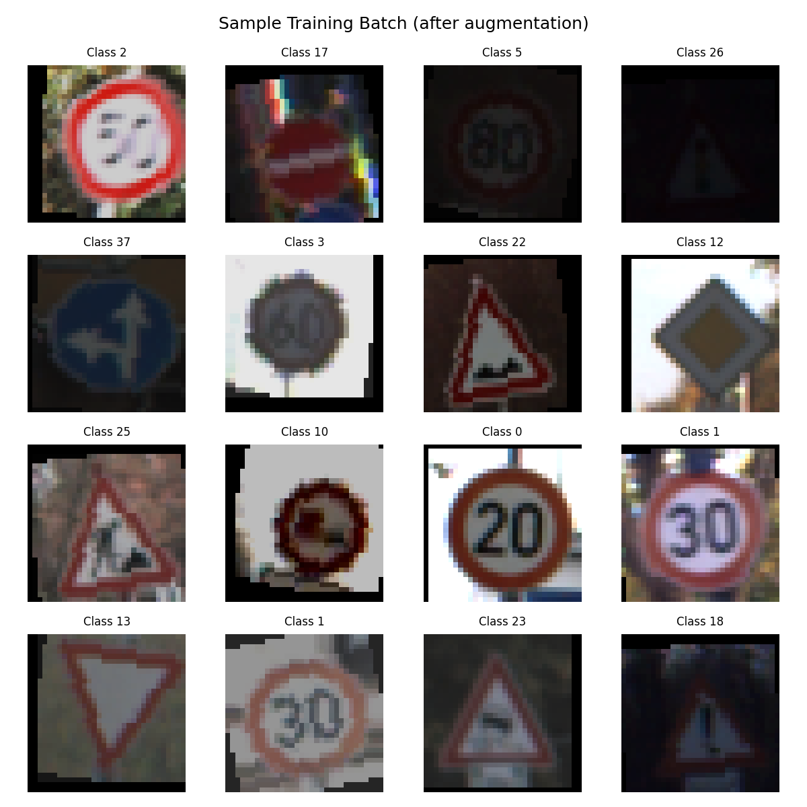

<!-- _class: title -->
<!-- _paginate: false -->

Deep Learning Project · KLU 2026 · Shayan Razi & John Schlotfeldt

# Deep Learning for Traffic Sign Classification

## Building and evaluating a CNN-based classifier on GTSRB

German Traffic Sign Recognition Benchmark · 43 classes · deep learning evaluation

<!--
Good morning everyone. This project is about applying deep learning to traffic sign classification on the GTSRB benchmark. I will first introduce the dataset and the classification task, then explain how we build a CNN-based baseline and evaluate its performance. From there, the presentation gradually moves toward model design choices, evaluation stability, and the limitations we found under degraded inputs.
-->

---

<!-- _class: divider -->
<!-- _paginate: false -->

# Background & Dataset

What is the task, why does it matter, and what makes GTSRB a challenging benchmark.

  

    
    
  

<!--
The dataset we used is GTSRB (the German Traffic Sign Recognition Benchmark), collected by Ruhr University Bochum. One important thing to note upfront: all images are already cropped to the sign boundary, so we are solving a pure classification problem, not a detection problem.
-->

---

## Traffic sign classification: a core task in driver assistance systems

Background

  

    
<strong>What is the task?</strong>

    
Given a cropped image of a traffic sign, assign it to one of a fixed set of categories: speed limits, prohibitory signs, warnings, mandatory directions.

  

  

    
<strong>Why does it matter?</strong>

    
Reliable sign recognition is a building block for driver assistance and autonomous systems. A model that misreads a speed limit or stop sign in real traffic has direct safety implications.

  

<strong>This project:</strong> we compare five CNN architectures on GTSRB, a standard benchmark for this task, to understand which design choices actually matter and how stable the results are.

<!--
We start with the basic task: the model receives a cropped image of a traffic sign and has to assign it to one of 43 categories. This matters because traffic signs communicate safety-relevant instructions, such as speed limits, warnings, and mandatory directions. In a driver assistance context, misreading one of these signs could lead to a wrong driving decision. That is why GTSRB is a useful benchmark for this project: it lets us compare classification approaches on a controlled, safety-relevant task.
-->

---

## GTSRB: a real-world classification benchmark with structural challenges

Dataset

39,209 labelled images across 43 classes, captured from a car-mounted camera on real German roads.

  

39,209

labelled images

  

43

sign classes

  

10.7×

max class imbalance

  
Scope Images are pre-cropped to the sign boundary. This is therefore a pure classification task, not a detection task in full-scene images.

  
Reference The reported human recognition rate on GTSRB is <strong>98.84%</strong>. We use this as a broad performance reference, not a direct comparison target.

<!--
The dataset has 39,209 images across 43 classes, all captured from a moving vehicle on real German roads. The reported human recognition rate of 98.84 percent gives useful context for interpreting our results, but since we use our own internal split rather than the official test set, it is a reference point, not a direct comparison target.
-->

---

## Three dataset properties shape the evaluation strategy

Problem structure

  

    <h3>Class imbalance</h3>
    
The most frequent class has <strong>2,250</strong> images. The rarest have <strong>210</strong>. After our 70/15/15 split, the rarest classes train on roughly <strong>147 examples</strong> each.

  

  

    <h3>Visual ambiguity</h3>
    
Many classes share shape and colour. This makes class-level error analysis necessary, especially for signs with small internal details.

  

  

    <h3>Within-class variation</h3>
    
Lighting, blur, contrast, and camera angle vary within each class. The model must generalise across these conditions from limited training data.

  

<strong>Implication:</strong> overall accuracy alone is not enough. Class imbalance motivates frequency-bias analysis, visual ambiguity motivates error analysis, and input variation motivates robustness testing.

<!--
Before looking at individual examples, we should separate the three dataset properties that shape the rest of our evaluation. First, class imbalance means that high overall accuracy could still hide weaker performance on rare traffic signs, so we later compare frequent and rare classes explicitly. Second, visual ambiguity means that some classes share shape and colour and differ only in small internal details, which is why we later look at error patterns and misclassified examples. Third, within-class variation means that the same sign can appear under different lighting, blur, contrast, and viewing angles, which motivates the robustness tests later in the presentation. So the key message is: overall accuracy alone is not enough for evaluating this model properly.
-->

---

## Zoom-in: many signs differ only in small internal details

Visual ambiguity · original dataset images

Many signs share the same outer shape, so the decisive information is often a small numeral or symbol.

<strong>Key challenge:</strong> signs such as speed limit 30 and 80 share the same red circular frame — the only difference is the numeral inside. The model must learn to distinguish classes based on fine internal detail.

<!--
After the general dataset challenges, we zoom in on the visual ambiguity problem. Speed limit signs are a good example: they share the same red circular frame, and the only difference is the numeral inside. The model has to separate classes based on that fine internal detail alone — there is no shape or colour difference to rely on. This is why visually similar classes show up again later in the error analysis.
-->

---

## Class imbalance motivates the frequency-bias analysis

Class distribution

<strong>Key implication:</strong> the rarest classes have only 210 images before splitting and roughly 147 training examples after the 70/15/15 split. This is why we later check whether rare classes perform worse than frequent ones.

<!--
This plot makes the class imbalance visible. Some classes, such as Speed limit 50, have thousands of examples, while the rarest classes have only 210 images before the split. After the 70, 15, 15 split, those rare classes contribute only about 147 training images. This matters because high overall accuracy could still hide weaker performance on rare signs, which is why we later include a frequency-bias analysis.
-->

---

<!-- _class: divider -->
<!-- _paginate: false -->

# Our Approach

From preprocessing to a compact CNN baseline under controlled conditions.

<!--
Now that the dataset challenges are clear, we can move to the modelling approach. I will first show how the raw images are turned into fixed model inputs, because preprocessing defines what every model actually sees. After that, I introduce the compact CNN baseline as the reference model for the rest of the experiment.
-->

---

## Preprocessing pipeline: from raw image to model input

Training only · augmentation simulates real-world variation

  

    1
    <h3>Resize</h3>
    
32×32 px originals: 25–243 px

  

  

    2
    <h3>Rotation</h3>
    
±15° tilted camera angles

  

  

    3
    <h3>ColorJitter</h3>
    
brightness, contrast, saturation lighting &amp; weather

  

  

    4
    <h3>Translate</h3>
    
±10% shift off-centre sign

  

  

    5
    <h3>Normalize</h3>
    
GTSRB mean &amp; std zero mean, unit variance

  

  

    <strong>Val / Test:</strong> Resize + Normalize only — no random transforms, identical input every run.
  

  

    <strong>Split (seed 42):</strong> 70 / 15 / 15 → 27,447 train · 5,881 val · 5,881 test images.
  

<!--
Before any model sees the data, every image goes through the same preprocessing pipeline. The resize to 32 by 32 is our choice, not a dataset property — originals range from 25 to 243 pixels. Augmentation is applied only to training images to simulate real-world conditions: slight rotation for camera angle, color jitter for lighting and weather, and a small translation for off-centre signs. Validation and test images receive only resize and normalise, with no randomness, so evaluation results are reproducible across runs.
-->

---

<!-- _class: image-focus -->

## What augmented training images look like

16 training samples after augmentation · 32×32 px

  

    
  

  

    <strong>Training input:</strong> each image has already been resized, rotated, colour-jittered, and translated. This is the exact augmented input the model learns from.
  

<!--
This grid shows 16 real training images after all augmentation steps have been applied. The effect is visible: images appear at slightly different angles, with varying brightness and contrast. This is what the model actually learns from — not the clean originals.
-->

---

## The baseline processes images in three hierarchical stages

Baseline architecture · 629K parameters

Each stage learns increasingly abstract representations from the input image.

  

    <h3>Stage 1 Low-level features</h3>
    
32 filters learn edges, colour boundaries, and brightness gradients. Spatial resolution is reduced via pooling.

  

  

    <h3>Stage 2 Structural patterns</h3>
    
64 filters combine earlier features into corners, curves, and sign contours. Resolution is reduced again.

  

  

    <h3>Stage 3 Sign representations</h3>
    
128 filters learn sign-level patterns such as numerals in circles and symbols in triangles. Output: a 2,048-value feature representation.

  

<strong>Classifier:</strong> after the three feature stages, the model compresses the image into a 2,048-value representation and maps it to one of 43 traffic sign classes. The full model is trained end to end on GTSRB.

<!--
The baseline model processes images in three hierarchical stages. The first stage learns basic visual patterns such as edges and colour boundaries, the second combines these into shapes and contours, and the third builds more sign-specific representations such as numerals inside circles. After these stages, the model compresses the image into a 2,048-value feature representation and uses it to predict one of the 43 classes. With 629,000 parameters and training from scratch on GTSRB, this is our reference point for everything that follows.
-->

---

## The baseline already reaches 99.49%. Where is the room to improve?

Baseline result · seed 42

  

99.49%

test accuracy

  

30

wrong / 5,881

  

629K

parameters

<strong>Interpretation:</strong> the compact baseline already performs extremely well on clean, pre-cropped GTSRB images. The remaining errors make it meaningful to test whether specific architectural choices can improve this already strong reference point.

<!--
The baseline reaches 99.49 percent on the internal test split, with only 30 wrong predictions out of 5,881 images. It does this with 629K parameters, so it is already a strong and relatively compact reference model. That raises the central question for the next part: if the baseline is already this good, can specific architectural changes still improve it in a meaningful way? This is what motivates the variants on the next slide.
-->

---

## The baseline leaves four architectural questions

From baseline to variants

The baseline is already strong, so each variant tests one architectural hypothesis for improving or stabilising performance.

  

    <h3>Depth</h3>
    
Are three feature extraction stages enough to separate fine numerals and small symbols?

  

  

    <h3>Transfer learning</h3>
    
Does pretrained visual knowledge help in a narrow but visually structured domain?

  

  

    <h3>Activation</h3>
    
Does the activation function affect training stability?

  

  

    <h3>Downsampling</h3>
    
Does fixed pooling discard spatial detail that matters for small symbols?

  

<strong>Design logic:</strong> the variants are not chosen randomly. Each one tests a specific architectural hypothesis motivated by the baseline result.

<!--
At this point, the baseline gives us a strong reference point, but it also raises the question of what could still be improved. We therefore define four architectural hypotheses rather than selecting variants randomly. More depth might help with fine visual details, transfer learning might provide useful visual features, the activation function might affect training stability, and learned downsampling might preserve spatial information better than fixed pooling. The next slide maps these four questions to the concrete model variants we tested.
-->

---

## Each variant maps one hypothesis to one model change

From questions to model variants

| Hypothesis | Variant | Main change |
|---|---|---|
| 3 stages may not resolve fine details at 32×32 input size | **Deep CNN** | Adds one extra feature extraction stage |
| Pretrained features may transfer to traffic signs | **MobileNetV2** | Uses an ImageNet-pretrained model |
| Activation choice may affect training stability | **LeakyReLU CNN** | Keeps small gradients for negative activations |
| Fixed pooling may lose relevant spatial detail | **Stride CNN** | Replaces fixed pooling with learned downsampling |

<strong>Design logic:</strong> the four variants translate the previous architectural questions into concrete model changes. The next slide shows how we keep the training and evaluation setup fixed across all models.

<!--
The previous slide introduced the four architectural questions. Here, each question is mapped to the model variant that tests it. Deep CNN tests additional depth, MobileNetV2 tests transfer learning, LeakyReLU tests activation choice, and Stride CNN tests learned downsampling. These are not random alternatives, but targeted variants around one main design aspect. The next step is to make sure all of them are trained and evaluated under the same conditions.
-->

---

## Controlled training setup makes the model comparison interpretable

Training setup · fixed across all five models

  

    
<strong>Augmentation: training set only</strong>

    <ul>
      <li>Rotation ±15° simulates tilted camera angle</li>
      <li>Brightness and contrast variation</li>
      <li>Small translation shifts</li>
      <li>Validation and test: resize and normalise only, with no random transforms</li>
    </ul>
  

  

    
<strong>Fixed across all models</strong>

    <ul>
      <li>Optimiser: Adam, lr = 0.001</li>
      <li>Split: 70 / 15 / 15, seed 42</li>
      <li>Max 20 epochs with early stopping</li>
      <li>Test set: 5,881 images, fixed order</li>
    </ul>
  

<strong>Controlled setup:</strong> because data split, augmentation, training settings, and evaluation protocol are fixed, performance differences can be interpreted primarily as model-design effects, while still considering parameter count and training time.

<!--
The comparison is only meaningful because the training and evaluation setup is fixed across all five models. Augmentation is applied only to the training set, while validation and test images are resized and normalised without random transforms. Early stopping monitors validation loss and halts training once it stops improving — this prevents overfitting and means models that converge faster simply finish earlier rather than continuing to train on noise. This means performance differences can be interpreted mainly through model design, while still considering parameter count, training time, and seed variation. The goal is a controlled architectural comparison rather than a tournament between unrelated models.
-->

---

<!-- _class: divider -->
<!-- _paginate: false -->

# Model Comparison

All models exceed 99% on the internal split. Multi-seed validation gives the more reliable ranking.

<!--
With the setup clear, we can move to the model results. I first show the canonical single-run comparison under seed 42, because it gives an initial signal about which architecture looks strongest. Then I move to the multi-seed analysis across three seeds, which is the more reliable basis for drawing conclusions when all models are already above 99 percent.
-->

---

## Single-run results point to Deep CNN, but this is only the first signal

Canonical comparison · one training run, seed 42

| Model | Test Accuracy | Wrong / 5,881 | Parameters | Training Time |
|---|---:|---:|---:|---:|
| Baseline CNN | 99.49% | 30 | 629K | 275.6 s |
| **Deep CNN** | **99.81%** | **11** | **936K** | **284.0 s** |
| MobileNetV2 | 99.66% | 20 | 2.56M | 518.7 s |
| LeakyReLU CNN | 99.46% | 32 | 629K | 271.5 s |
| Stride CNN | 99.52% | 28 | 823K | 236.9 s |

<strong>First signal:</strong> Deep CNN has the strongest single-run result, reducing errors from <strong>30 to 11</strong> compared with the baseline. But all models are above 99%, so small margins correspond to only a few images and need multi-seed validation.

<!--
Deep CNN comes out on top in this single run with 99.81 percent and only 11 wrong predictions out of 5,881 images. Compared with the baseline, that reduces the error count from 30 to 11, so depth looks like the strongest first signal. However, all five models are above 99 percent, and the gap between first and last is still less than 0.4 percentage points. At this level, a few images can change the ranking, which is why the next step is the multi-seed analysis.
-->

---

## Multi-seed validation gives the more reliable ranking

3 seeds × 5 models = 15 training runs

| Rank | Model | Test Acc (mean ± std) | Parameters | Train Time |
|---:|---|---:|---:|---:|
| 1 | **Deep CNN** | **99.69% ± 0.17%** | 936K | 266 s |
| 2 | **LeakyReLU CNN** | **99.67% ± 0.03%** | 629K | 597 s |
| 3 | Baseline CNN | 99.51% ± 0.22% | 629K | 261 s |
| 4 | Stride CNN | 99.45% ± 0.12% | 823K | 268 s |
| 5 | MobileNetV2 | 99.43% ± 0.19% | 2.56M | 529 s |

<strong>Key message:</strong> Deep CNN remains strongest on average. LeakyReLU is almost as accurate and very stable, but slower. MobileNetV2 shows no stable advantage despite higher cost.

<!--
Across three seeds, Deep CNN maintains the strongest average at 99.69 percent. The bigger story is LeakyReLU CNN: it looked weak in the single-run result, but averaged across seeds it is second-best and extremely stable, with a standard deviation of only 0.03 percent. MobileNetV2 drops to last place on average despite being more than four times larger than the baseline. The rankings you draw from a single run can be genuinely misleading. With Deep CNN confirmed as the strongest model on average, the next section takes a closer look at what its remaining errors actually look like.
-->

---

<!-- _class: divider -->
<!-- _paginate: false -->

# Deep CNN Evaluation

Selected for detailed analysis because it offers the strongest average accuracy-cost tradeoff.

<!--
After the model comparison, we now focus on the selected Deep CNN. It has the strongest average accuracy-cost tradeoff, so it is the most relevant model to analyse in detail. The goal here is to understand not just how accurate it is, but where it still makes mistakes, whether those mistakes follow a pattern, and whether the model appears to focus on sign-relevant regions.
-->

---

## Error profile: remaining mistakes cluster around visually similar classes

Deep CNN · test set (seed 42, 5,881 images)

| Class | Per-class accuracy | Why it is hard |
|---|:---:|---|
| Pedestrians (class 27) | 97.62% | Near-identical triangular silhouette to Bicycles crossing |
| Bicycles crossing (class 29) | 97.62% | Same shape as Pedestrians at our 32×32 input size |
| Speed limit 120 km/h (class 8) | 99.10% | "120" vs. "100" differ by only a few pixels |

<strong>Pattern:</strong> remaining errors cluster around class boundaries where the distinguishing feature, such as a numeral or small symbol, occupies only a handful of pixels.

<!--
The Deep CNN makes only 11 errors on the test set, so we can look at the remaining mistakes quite concretely. The weaker classes shown here are visually difficult cases: pedestrians and bicycles share a similar triangular layout, and speed limit 120 can be close to speed limit 100 after resizing. The pattern suggests that the model is not failing broadly, but mainly struggles where small visual details are close to the resolution limit.
-->

---

<!-- _class: image-focus -->

## Misclassified examples make the error pattern visible

**Representative examples of the 11 errors: mostly speed limits differing by one digit and warning triangles with very similar silhouettes.**

<!--
Looking at the actual misclassified images makes the error pattern easier to understand. Most examples involve speed limit signs differing by a small numeral, or warning signs with very similar triangular silhouettes. These are exactly the kinds of cases where resizing to 32 by 32 can make the decisive details difficult to resolve. A natural follow-up would be to test whether a higher input resolution reduces these errors.
-->

---

## Errors are rare and concentrated, not randomly distributed

Confusion matrix · Deep CNN

  

    
  

  

    

      The strong diagonal shows that most classes are predicted correctly.
    

    

      <strong>Interpretation:</strong> the few off-diagonal entries are sparse and align with visually similar signs, rather than being randomly spread across all 43 classes.
    

    

      Top-5 accuracy: <strong>99.98%</strong>. The correct class appeared in the model's top 5 predictions in all but one of 5,881 test cases.
    

  

<!--
After looking at individual examples, the confusion matrix gives the class-level view. The strong diagonal shows that errors are rare overall, and the few off-diagonal entries are not spread randomly across the class space. Instead, they mostly align with the visually similar sign groups we already discussed. The Top-5 accuracy of 99.98 percent also shows that even when the top prediction is wrong, the correct class is almost always still among the model's most likely alternatives.
-->

---

## Frequency bias appears limited in this run

Frequency bias · Deep CNN

  

99.87%

mean accuracy, 10 most frequent classes

  

99.52%

mean accuracy, 10 rarest classes

  

0.34 pp

gap

<strong>Interpretation:</strong> despite a 10.7× data imbalance, the accuracy gap between frequent and rare classes is only 0.34 pp in this run. This suggests no strong class-frequency bias under this setup. However, rare classes have few test images, so the result should be interpreted cautiously.

<!--
After looking at where the errors occur, we now ask a different question: is the model systematically worse on rare classes? One concern with any imbalanced dataset is that high overall accuracy could hide weak performance on underrepresented signs. In this run, the gap between the 10 most frequent and 10 rarest classes is only 0.34 percentage points, which suggests no strong class-frequency bias under this setup. However, rare classes have few test images, so this result should be interpreted cautiously.
-->

---

<!-- _class: image-focus -->

## Grad-CAM suggests that predictions rely on sign-relevant regions

**Activation maps concentrate on the sign shape and internal symbol, consistent with task-relevant feature learning.**

<!--
After checking error concentration and class-frequency effects, Grad-CAM gives us a qualitative look at what image regions influence the model. The activation maps mostly concentrate on the sign shape and internal symbol, rather than on obvious background areas. This does not prove the full decision process, but it supports the interpretation that the model is using task-relevant visual information. That is useful because background shortcuts would be a concern for generalisation.
-->

---

<!-- _class: divider -->
<!-- _paginate: false -->

# Robustness

The Deep CNN performs well under controlled conditions, but real traffic images are not always clean.

<!--
So far, the Deep CNN looked very strong on clean, pre-cropped benchmark images. The next question is whether that performance still holds when the input becomes less ideal. This matters because real camera images can contain blur, sensor noise, exposure changes, or weather effects. So here we deliberately degrade the test images and check how much performance drops without retraining the model.
-->

---

## Gaussian noise causes a 27.80 pp accuracy drop, the main robustness limitation

Robustness test · no retraining

  

99.81%

clean test images

  

97.01%

Gaussian blur −2.80 pp

  

72.01%

Gaussian noise −27.80 pp

 

The model handles moderate blur reasonably well. Under Gaussian noise, accuracy drops from **99.81%** to **72.01%**, corresponding to roughly **1,650 additional errors** on the same 5,881 test images.

<strong>Cause:</strong> this is a distribution shift failure. The model was trained on clean images and was not exposed to noisy inputs during training. The clean benchmark result therefore does not fully describe performance under degraded real-world conditions.

<!--
The clean result is the reference point: 99.81 percent accuracy on the original test images. With Gaussian blur, accuracy remains relatively high at 97.01 percent, so moderate blur does not destroy performance. Gaussian noise is very different: accuracy falls to 72.01 percent, which means roughly 1,650 additional errors on the same test set. The most likely explanation is distribution shift, because the model was trained on clean images and never learned to handle this kind of noisy input.
-->

---

## This work is a controlled first step: three directions for improvement

Limitations and next steps

  

    
<strong>Constraints to keep in mind</strong>

    <ul>
      <li>Pre-cropped images: the model classifies signs but does not locate them</li>
      <li>We resized all images to 32×32 px; higher resolutions are feasible but require more compute</li>
      <li>Clean benchmark conditions: robustness to noise and weather remains limited</li>
      <li>German roads only: generalisation to other sign systems is untested</li>
    </ul>
  

  

    
<strong>Next steps</strong>

    <ul>
      <li><strong>Short term:</strong> add noise and blur augmentation to the baseline model to address the robustness gap</li>
      <li><strong>Medium term:</strong> validate across independent data splits to confirm ranking stability</li>
      <li><strong>Longer term (object detection):</strong> move from classifying pre-cropped signs to finding and recognising them in a live camera stream</li>
    </ul>
  

This classifier is a building block. The path to a deployable system requires robustness to real conditions and the ability to detect signs before classifying them.

<!--
This slide puts the results into perspective. The current model is a strong classifier for cropped GTSRB signs, but it is not yet a full road-scene recognition system. The most direct next step is robustness training, especially adding noise and blur augmentation, because that targets the weakness we just saw. A second step is stronger validation across independent splits, since the model rankings are based on one split and three seeds. Longer term, object detection is necessary, because a real system must first find traffic signs in a live camera frame before it can classify them.
-->

---

<!-- _class: divider -->
<!-- _paginate: false -->

# Conclusion

Depth was strongest in the single run. LeakyReLU surprised in multi-seed evaluation. Robustness remains open.

<!--
To conclude, there are three main takeaways from this project. First, compact CNNs already perform extremely well on clean, cropped GTSRB images. Second, architectural choices do matter, but the multi-seed analysis showed that a single run can be misleading when the differences are very small. Third, the most important limitation is robustness: the selected model performs very well under clean benchmark conditions, but noise causes a large drop. That is the key gap between a strong benchmark classifier and a more realistic traffic-sign recognition system.
-->

---

## Three findings from this experiment

Summary

  

    <h3>Compact CNNs are sufficient here</h3>
    
A 629K-parameter baseline trained from scratch reaches <strong>99.49%</strong> on this internal split in the same broad performance range as the reported human benchmark of 98.84%.

  

  

    <h3>Architecture matters, but so does validation</h3>
    
Depth reduced errors from <strong>30 to 11</strong> in the single run at near-zero cost. Multi-seed analysis then showed LeakyReLU CNN as second-best overall, so the single-run last place was a misleading outlier.

  

  

    <h3>Robustness is the open problem</h3>
    
A <strong>27.80 pp</strong> drop under Gaussian noise shows that clean benchmark accuracy does not reflect degraded-input performance. Distribution shift is the primary unresolved challenge.

  

<strong>The benchmark result is strong on clean images. Multi-seed evaluation is essential to draw reliable conclusions from small accuracy differences. Extending robustness to degraded inputs is the most important next step.</strong>

<!--
First, we saw that a compact CNN already performs very strongly for this cropped benchmark task. Second, the model comparison illustrated why both architectural choices and repeated evaluation are important for drawing reliable conclusions. Third, the biggest open problem remains robustness to degraded inputs, particularly in the presence of Gaussian noise.
-->

---

<!-- _class: title -->
<!-- _paginate: false -->

# Thank You

## Questions?

<!--
Thank you for your attention. I am happy to answer any questions about the models, the results from different seeds, or the robustness experiments. If you are interested in further details, I also have backup slides covering topics like the autoencoder, hyperparameter search, individual seed runs, and limitations.
-->

---

<!-- _class: divider -->
<!-- _paginate: false -->

# Backup Slides

---

## Backup: Anomaly Detection via Autoencoder

Extension · proof of concept

A standard classifier always assigns one of its 43 known classes, even for inputs it has never seen.

  

    
<strong>Approach</strong>

    
A compression autoencoder learns to reconstruct known traffic signs via a 128-dimensional bottleneck. Inputs that do not match the learned reconstruction pattern may produce elevated reconstruction error, which can be used as a candidate anomaly signal.

     
    
<strong>Threshold</strong>

    
Set at the 95th percentile of validation reconstruction errors (1.091). By construction, this flags 5% of in-distribution validation images.

  

  

    
<strong>Results on the validation set</strong>

    <table>
      <tr><th>Metric</th><th>Value</th></tr>
      <tr><td>Latent size</td><td>128 dimensions</td></tr>
      <tr><td>Final reconstruction loss</td><td>0.5118</td></tr>
      <tr><td>Anomaly threshold (95th pct.)</td><td>1.091</td></tr>
      <tr><td>Images flagged</td><td>294 / 5,881 (5%)</td></tr>
    </table>
     
    
No true out-of-distribution test set was available. The method is implementable; its real-world detection performance is not yet validated.

  

<!--
This backup slide shows the autoencoder as a proof of concept rather than a validated anomaly detector. The idea is to use reconstruction error as a candidate anomaly score: images that are harder to reconstruct receive a higher error. The threshold is set at the 95th percentile of validation errors, so 5 percent of normal validation images are flagged by construction. Since no true out-of-distribution test set was used, the actual detection performance remains unvalidated.
-->

---

## Backup: Hyperparameter Sensitivity (Optuna)

Extension · 30-trial Bayesian search

**Goal:** verify that manually chosen training settings are not fragile.

| Hyperparameter | Search range | Best value found |
|---|---|:---:|
| Learning rate | 0.0001 – 0.01 | **0.00124** |
| Dropout rate | 0.2 – 0.6 | **0.274** |
| Batch size | 32, 64, 128 | **32** |
| Optimiser | Adam / SGD | **Adam** |
| Weight decay | 1×10⁻⁵ – 1×10⁻² | **0.000698** |

**Best trial (trial 6):** 99.91% validation accuracy

- Adam appeared in all top-5 trials in this search
- Best learning rate (0.00124) is close to our default (0.001)
- Best dropout (0.274) is lower than our default (0.5)

<strong>Sensitivity check:</strong> the manual defaults appear to be in a reasonable region of the search space, but this was not a full hyperparameter study.

<!--
This slide is a sensitivity check, not a full hyperparameter study. Optuna searched 30 configurations for the Stride CNN, with each trial limited to 10 epochs. The best learning rate was close to our default, and Adam appeared in all top-5 trials. This supports the idea that our default settings were reasonable, but it does not prove global optimality.
-->

---

## Backup: Multi-Seed Per-Run Results

All 15 training runs · seeds 42, 123, 2026

| Seed | Model | Test Acc | Test Loss | Train Time | Epochs |
|---:|---|---:|---:|---:|---:|
| 42 | Baseline CNN | 99.20% | 0.0323 | 225 s | 16 |
| 42 | Deep CNN | 99.78% | 0.0077 | 293 s | 20 |
| 42 | LeakyReLU CNN | 99.63% | 0.0105 | 505 s | 20 |
| 42 | MobileNetV2 | 99.44% | 0.0197 | 530 s | 20 |
| 42 | Stride CNN | 99.46% | 0.0178 | 295 s | 20 |
| 123 | Baseline CNN | 99.64% | 0.0104 | 276 s | 20 |
| 123 | Deep CNN | 99.83% | 0.0075 | 289 s | 20 |
| 123 | LeakyReLU CNN | 99.69% | 0.0114 | 642 s | 20 |
| 123 | MobileNetV2 | 99.66% | 0.0105 | 529 s | 20 |
| 123 | Stride CNN | 99.30% | 0.0253 | 208 s | 14 |
| 2026 | Baseline CNN | 99.69% | 0.0118 | 281 s | 20 |
| 2026 | Deep CNN | 99.46% | 0.0190 | 216 s | 15 |
| 2026 | LeakyReLU CNN | 99.68% | 0.0124 | 645 s | 20 |
| 2026 | MobileNetV2 | 99.20% | 0.0299 | 529 s | 20 |
| 2026 | Stride CNN | 99.59% | 0.0120 | 300 s | 20 |

<!--
This slide shows the raw runs behind the aggregated multi-seed table. It is useful if someone asks why the mean ranking differs from the canonical single-run ranking. For example, Deep CNN drops under seed 2026, which shows why its advantage should be interpreted as an average effect rather than a guaranteed win in every run. LeakyReLU, by contrast, stays very stable across all three seeds, which explains its strong multi-seed ranking.
-->

---

## Backup: Full Limitations

| Limitation | Impact |
|---|---|
| Internal hold-out split only | Not directly comparable to official GTSRB leaderboard |
| Pre-cropped images | Cannot locate signs; classification only, not detection |
| Three-seed validation, no independent splits | Ranking is more reliable than a single run, but still split-dependent |
| Input resized to 32×32 px (preprocessing choice) | Fine details (numerals, symbols) may be partially lost; higher resolution is feasible |
| No noise or blur augmentation during training | Model not robust to degraded inputs |
| GTSRB: German roads, single camera, controlled weather | Limited generalisation to other regions, conditions, or sign standards |
| Rare classes have few test images | A single missed prediction shifts per-class accuracy significantly |

<!--
This slide collects the main methodological limitations. The most important points are the internal hold-out split, the cropped-image scope, the limited number of seeds, and the 32 by 32 input resolution. The robustness gap is also important, because the model was not trained with noise or blur augmentation. These limitations do not invalidate the results, but they define what would need to be tested before moving toward a more realistic system.
-->

---

<!-- _class: image-focus -->

## Backup: t-SNE Feature Space (Deep CNN)

**2,000 validation samples projected to 2D from the Deep CNN's 512-dimensional internal feature space (perplexity = 30).**

Most classes form distinct clusters. Overlap concentrates among speed limit signs and visually similar warning triangles, consistent with the per-class error pattern.

<!--
This slide visualises the Deep CNN feature space by projecting 2,000 validation samples from 512 dimensions down to two dimensions with t-SNE. Most classes form visually separated clusters, which supports the interpretation that the model learned class-relevant representations. The overlap is mainly visible among speed limit signs and similar warning signs, which is consistent with the error analysis. Since t-SNE is only a projection, this should be treated as supporting visual evidence rather than a formal proof.
-->

---

## Backup: Timing Plan

| Slide | Topic | Time |
|---|---|:---:|
| 1 | Title | 0:20 |
| 2 | Divider: Dataset | 0:10 |
| 3 | Task motivation | 0:40 |
| 4 | Dataset overview | 0:45 |
| 5 | Three dataset properties | 0:45 |
| 6 | Visual ambiguity zoom-in | 0:35 |
| 7 | Class imbalance visual | 0:30 |
| 8 | Divider: Our Approach | 0:10 |
| 9 | Baseline architecture | 0:50 |
| 10 | Baseline result | 0:35 |
| 11 | Architectural questions | 0:45 |
| 12 | Variant mapping | 0:45 |
| 13 | Controlled training setup | 0:40 |
| 14 | Divider: Model Comparison | 0:10 |
| 15 | Single-run results table | 0:45 |
| 16 | Multi-seed validation | 1:00 |
| 17 | Divider: Deep CNN Evaluation | 0:10 |
| 18 | Error profile | 0:40 |
| 19 | Misclassified examples | 0:30 |
| 20 | Confusion matrix | 0:25 |
| 21 | Frequency bias analysis | 0:40 |
| 22 | Grad-CAM | 0:25 |
| 23 | Divider: Robustness | 0:10 |
| 24 | Robustness results | 0:50 |
| 25 | Limitations and next steps | 0:50 |
| 26 | Divider: Conclusion | 0:10 |
| 27 | Summary | 0:50 |
| 28 | Thank You | n/a |
| **Total** | | **~14:45** |

<!--
Use this as a rough guide to stay within 15 minutes. The two highest-risk sections for running over time are Model Comparison and Deep CNN Evaluation, because these are the most technical parts of the presentation. If time is tight, the confusion matrix and Grad-CAM slides can be covered briefly. Backup slides are purely for questions; do not cover them unless someone specifically asks.
-->