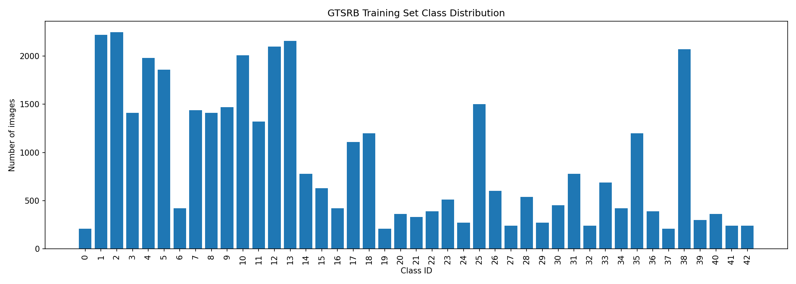
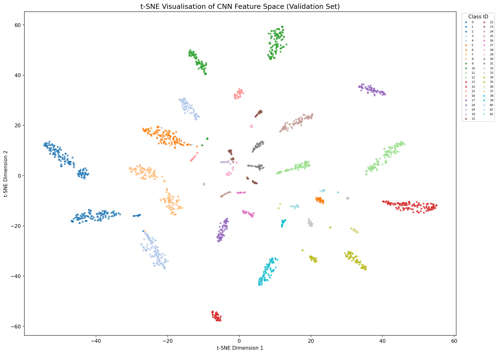

<!-- _class: title -->
<!-- _paginate: false -->

Machine Learning Project · KLU 2026

# Compact CNN Architectures for Traffic Sign Classification

## An experimental comparison on GTSRB

German Traffic Sign Recognition Benchmark · 43 classes · 39,209 images

<!--
This project compares five CNN architectures for traffic sign classification on GTSRB. We will cover the problem structure, our experimental setup, the single-run and multi-seed results, and where the key limitations are.
-->

---

<!-- _class: divider -->
<!-- _paginate: false -->

# The Problem

A large real-world dataset with two structural challenges built in.

<!--
GTSRB — the German Traffic Sign Recognition Benchmark — was published by Stallkamp et al. in 2012 and collected from a forward-facing car-mounted camera on real German roads. Images are already cropped to the sign bounding box, which means the model only needs to classify — not locate — a sign. That makes the dataset well-suited for controlled architectural comparisons.

For context: the dataset was used in the IJCNN 2011 competition, where the best submitted system — a CNN committee — reached 99.46% on the official test set. Stallkamp et al. also tested 30 human participants on the same set and reported 98.84% recognition rate. That figure is the one we cite as a broad reference. We cannot compare to it directly because we use a different internal split.

Before the approach, the next slides set up two structural properties of the data that directly motivated our design choices: class imbalance and visual similarity between classes.
-->

---

## GTSRB: a real-world classification benchmark with structural challenges

Dataset

39,209 labelled images across 43 classes — captured from a car-mounted camera on real German roads.

  

39,209

labelled images

  

43

sign classes

  

10.7×

max class imbalance

  
Scope Images are pre-cropped to the sign boundary. This is a pure classification task — not detection.

  
Reference The reported human recognition rate on GTSRB is <strong>98.84%</strong>. We use this as a broad performance reference, not a direct comparison target.

<!--
The dataset contains 39,209 images from the official GTSRB training partition across 43 classes. Image sizes vary widely — from 25×25 up to 243×225 pixels — and are resized to a uniform 32×32 for all models.

Our split: 70% training (27,447 images), 15% validation (5,881), 15% test (5,881). The split uses a fixed seed (42) and is reproducible but not stratified. At this dataset size the class proportions in all three splits stay close to the original distribution.

The 43 classes cover the main European sign categories: speed limits, prohibitory signs, mandatory direction signs, warning triangles, and right-of-way signs.

The human recognition rate of 98.84% is from Stallkamp et al. 2012, measured on the official test set of 12,630 images. We use an internal split with no official test labels, so the figure is only an order-of-magnitude reference. Even so: a baseline reaching 99.49% on our internal split is in the same broad performance range, which confirms that a compact CNN is already sufficient for this task under clean benchmark conditions.
-->

---

## Two structural challenges compound the difficulty of this task

Problem structure

  

    <h3>Class imbalance</h3>
    
The most frequent class has <strong>2,250</strong> images. The rarest have <strong>210</strong>. After our 70/15/15 split, the rarest classes train on roughly <strong>147 examples</strong> each.

  

  

    <h3>Visual ambiguity</h3>
    
Speed limit signs share the same circular shape and differ only by numeral. At 32×32 pixels, "80" and "30" are nearly indistinguishable.

  

  

    <h3>Within-class variation</h3>
    
Lighting, blur, contrast, and camera angle vary within each class. The model must generalise across these conditions from limited training data.

  

<strong>Implication:</strong> high accuracy on a clean benchmark is a necessary condition but not a sufficient one. The harder problems are rare-class performance, visual ambiguity at low resolution, and input degradation.

<!--
On class imbalance: the most frequent class — Speed limit 50 — has 2,250 images in the original dataset, giving roughly 1,575 training images after our 70% split. The three rarest classes — Speed limit 20, Dangerous curve left, Go straight or left — have only 210 images each in total, leaving about 147 training images per class. That is a 10.7:1 ratio between the extremes. 147 training images is genuinely limited for a CNN without augmentation. We apply random rotation, colour jitter, and affine shifts to artificially extend the rare classes. Whether this is sufficient we test explicitly in the bias analysis — the result is a 0.34 pp gap, which is smaller than one might expect.

On visual ambiguity: at 32×32 pixels the entire sign region covers roughly 700–800 pixels. For a speed limit sign, only a small portion of those pixels contains the numeral. "80" and "30" then differ in only a few dozen pixels. The same applies to warning triangles: Pedestrians (class 27) and Bicycles crossing (class 29) have nearly identical silhouettes at this resolution. These specific class pairs appear directly in the error analysis later.

On within-class variation: because images were captured from a moving car in real traffic, lighting, focus, viewing angle, and partial occlusion vary considerably within a single class. The model must generalise — not memorise a clean template. This is the main reason augmentation is beneficial even though the dataset already contains over 39,000 images.
-->

---

## 43 classes — many share the same shape and differ only in a small internal symbol or numeral

**Class IDs 0–42, left to right. Speed limit signs (classes 0–8) share the same red circular frame — the only distinguishing feature is the numeral inside.**

<strong>Key challenge:</strong> at 32×32 pixels, "30" and "80" differ by only a handful of pixels. The model must classify based on fine detail that is already near the resolution limit — without any additional context from the surrounding scene.

<!--
This sample grid shows one representative image per class after preprocessing. Two challenges are immediately visible.

First, intra-class variation: within the same class, images vary considerably in brightness, contrast, viewing angle, and blur. The model must learn to ignore this variation and still classify correctly.

Second, inter-class similarity: all speed limit signs (classes 0–8) share the same red circular border — the only difference is the numeral. At 32×32 pixels, "80" and "30", or "100" and "120", occupy only a handful of pixels. The same applies to warning triangles: Pedestrians (class 27) and Bicycles crossing (class 29) have nearly identical silhouettes at this resolution.

This is not noise in the dataset — it is a structural property of the signs themselves. Signs are deliberately standardised, which makes them fast to read for humans. For a model at low resolution, that same standardisation is a challenge because different classes can look nearly identical.
-->

---

## A 10.7× class imbalance built into the dataset

Class distribution

  <strong>Speed limit 50:</strong> 2,250 images. <strong>Three rarest classes:</strong> 210 images each — a <strong>10.7× ratio</strong>. The 70/15/15 split inherits these proportions: the rarest classes train on only ≈147 images each.

<!--
The chart shows the raw class distribution across all 39,209 images. Speed limit 50 dominates; the rare classes on the right have a fraction of that. This reflects the actual frequency of signs in real German traffic — it is not a data collection artefact.

The 70/15/15 split is not stratified, but at this dataset size the proportions stay close to the original distribution. Even 70% of the rarest class gives only about 147 training images.

The practical consequence: we apply augmentation — rotation, colour jitter, affine shifts — specifically to extend the rare classes. Whether this is sufficient we test in the bias analysis later. The result is a 0.34 pp accuracy gap between the most and least frequent classes, which is smaller than the 10.7× data difference might suggest.
-->

---

<!-- _class: divider -->
<!-- _paginate: false -->

# Our Approach

One strong baseline. Four targeted architectural hypotheses.

<!--
The key design principle: isolate one architectural variable per experiment so that every result is directly interpretable.
-->

---

## The baseline processes images in three hierarchical stages

Baseline architecture — 629K parameters

Each stage extracts increasingly abstract representations from the input image.

  

    <h3>Stage 1 Low-level features</h3>
    
32 filters detect edges, colour boundaries, and brightness gradients. Spatial resolution halved via pooling.

  

  

    <h3>Stage 2 Structural patterns</h3>
    
64 filters combine Stage 1 outputs into corners, curves, and sign contours. Resolution halved again.

  

  

    <h3>Stage 3 Sign representations</h3>
    
128 filters assemble sign-level features — numerals in circles, symbols in triangles. Output: a 2,048-value feature vector.

  

<strong>Classifier:</strong> the 2,048-value vector is passed to a fully connected layer that maps it to one of 43 classes. The full pipeline is trained end to end on GTSRB.

<!--
Three convolutional stages build progressively abstract representations — from raw pixel gradients to sign-level features. The 2,048-dimensional output vector is then classified. This is the reference architecture that all four variants modify.
-->

---

## The baseline already reaches 99.49% — so where is the room to improve?

Baseline result — seed 42

  

99.49%

test accuracy

  

30

wrong / 5,881

  

629K

parameters

<strong>Interpretation:</strong> the compact baseline already performs extremely well on clean, pre-cropped GTSRB images. The remaining errors motivate targeted architectural variants: more depth, transfer learning, alternative activation, and learned downsampling.

<!--
The baseline result is already strong — 99.49% with only 629K parameters and a short training time. But 30 errors remain, and inspection of those errors shows they cluster around visually similar class pairs. That is the motivation for testing whether more depth, pretraining, or different architectural choices can push further.
-->
---

## The baseline leaves four architectural questions

From baseline to variants

The baseline is already strong, so each variant tests one plausible explanation for the remaining errors.

  

    <h3>Depth</h3>
    
Are three feature extraction stages enough to separate fine numerals and small symbols?

  

  

    <h3>Transfer learning</h3>
    
Does pretrained visual knowledge help in a narrow but visually structured domain?

  

  

    <h3>Activation</h3>
    
Does the activation function affect training stability across different seeds?

  

  

    <h3>Downsampling</h3>
    
Does fixed pooling discard spatial detail that matters for small symbols?

  

<strong>Design logic:</strong> the variants are not chosen randomly. Each one targets a specific architectural question raised by the baseline result.

---

## Each variant maps one hypothesis to one model change

Controlled architectural comparison

| Hypothesis | Variant | Main change |
|---|---|---|
| 3 stages may not resolve fine details at 32×32 | **Deep CNN** | Adds one extra feature extraction stage |
| Pretrained features may transfer to traffic signs | **MobileNetV2** | Uses an ImageNet-pretrained model |
| Activation choice may affect training stability | **LeakyReLU CNN** | Keeps small gradients for negative activations |
| Fixed pooling may lose relevant spatial detail | **Stride CNN** | Replaces fixed pooling with learned downsampling |

<strong>Controlled comparison:</strong> optimiser, split, augmentation, and evaluation protocol are identical across all five models — differences in accuracy are interpreted as architecture-driven.

<!--
This is a controlled ablation study. The baseline is the reference point. Each variant isolates one design variable — depth, pretraining, activation function, or downsampling. If Deep CNN outperforms the baseline, we know it is specifically because of the additional depth, not because of a different optimizer or more training time.

A null result is equally informative: it tells us the baseline already handles that aspect well enough. The table replaces the previous card overview — same questions, but now paired directly with the concrete change made.
-->

---

## Identical training conditions make the architectural comparison as fair as possible

Training setup — fixed across all five models

  

    
<strong>Augmentation — training set only</strong>

    <ul>
      <li>Rotation ±15° — simulates tilted camera angle</li>
      <li>Brightness and contrast variation</li>
      <li>Small translation shifts</li>
      <li>Val and test: resize and normalise only — no random transforms</li>
    </ul>
  

  

    
<strong>Fixed across all models</strong>

    <ul>
      <li>Optimiser: Adam, lr = 0.001</li>
      <li>Split: 70 / 15 / 15, seed 42</li>
      <li>Max 20 epochs with early stopping</li>
      <li>Test set: 5,881 images, fixed order</li>
    </ul>
  

Any accuracy difference between models is attributable to architecture — not to different training conditions, data, or evaluation protocols.

<!--
Identical training conditions are what make the architectural comparison valid. Any accuracy difference between models is attributable to architecture alone. Augmentation is applied to training only — evaluation conditions are fixed and reproducible.
-->

---

<!-- _class: divider -->
<!-- _paginate: false -->

# Model Comparison

All models exceed 99% on the internal split. Multi-seed analysis revised two of the initial rankings.

<!--
Here are the results. I will first show the canonical single-run comparison, then what multi-seed validation added to the picture.
-->

---

## Single-run results point to Deep CNN — but this is only the first signal

Canonical comparison — one training run, seed 42

| Model | Test Accuracy | Wrong / 5,881 | Parameters | Training Time |
|---|---:|---:|---:|---:|
| Baseline CNN | 99.49% | 30 | 629K | 275.6 s |
| **Deep CNN** | **99.81%** | **11** | **936K** | **284.0 s** |
| MobileNetV2 | 99.66% | 20 | 2.56M | 518.7 s |
| LeakyReLU CNN | 99.46% | 32 | 629K | 271.5 s |
| Stride CNN | 99.52% | 28 | 823K | 236.9 s |

<strong>First signal:</strong> Deep CNN has the strongest single-run result. But all models are above 99%, so small margins correspond to only a few images and need multi-seed validation.

<!--
Every model exceeds 99% — the task is tractable for compact CNNs on this benchmark. Differences are small in absolute terms. The single-run ranking is a starting point; multi-seed validation shows which of these differences are reproducible.
-->

---

<!-- _class: centered -->

## Additional depth produced the strongest single-run improvement

Deep CNN — single-run result (seed 42)

  

99.81%

test accuracy

  

11

wrong / 5,881

  

+8 s

training time vs. baseline

<strong>Single-run signal:</strong> adding one feature extraction stage reduced errors from <strong>30 to 11</strong>, a <strong>63% reduction</strong>, with only moderate parameter growth. The next slide checks whether this result remains stable across seeds.

<!--
The 63% error reduction from one additional stage is the strongest signal in the results. The cost is negligible. Multi-seed analysis confirms Deep CNN as the best model on average — but the advantage is not consistent in every single seed.
-->

---

## Multi-seed validation gives the more reliable ranking

3 seeds × 5 models = 15 training runs

| Rank | Model | Test Acc (mean ± std) | Parameters | Train Time |
|---:|---|---:|---:|---:|
| 1 | **Deep CNN** | **99.69% ± 0.17%** | 936K | 266 s |
| 2 | **LeakyReLU CNN** | **99.67% ± 0.03%** | 629K | 597 s |
| 3 | Baseline CNN | 99.51% ± 0.22% | 629K | 261 s |
| 4 | Stride CNN | 99.45% ± 0.12% | 823K | 268 s |
| 5 | MobileNetV2 | 99.43% ± 0.19% | 2.56M | 529 s |

<strong>Key message:</strong> Deep CNN remains strongest on average. LeakyReLU is almost as accurate and very stable, but slower. MobileNetV2 shows no stable advantage despite higher cost.

<!--
Multi-seed validation is the methodological backbone of this project. Two models changed their story: LeakyReLU improved substantially; MobileNetV2 declined. Deep CNN's advantage held on average. The LeakyReLU reversal — from last to second — is the strongest argument for why single-run comparisons need to be interpreted with caution.
-->

---

<!-- _class: divider -->
<!-- _paginate: false -->

# Deep CNN Evaluation

Selected for detailed analysis: strongest average accuracy with moderate parameter growth and near-baseline training cost.

<!--
With only 11 errors, we could inspect each one individually. Here is what they show.
-->

---

## Error profile — all 11 errors involve visually similar class pairs

Deep CNN — test set (seed 42, 5,881 images)

| Class | Per-class accuracy | Why it is hard |
|---|:---:|---|
| Pedestrians (class 27) | 97.62% | Near-identical triangular silhouette to Bicycles crossing |
| Bicycles crossing (class 29) | 97.62% | Same shape as Pedestrians at 32×32 resolution |
| Speed limit 120 km/h (class 8) | 99.10% | "120" vs. "100" differ by only a few pixels |

<strong>Pattern:</strong> every error occurs at a class boundary where the distinguishing feature — a numeral or small symbol — occupies only a handful of pixels. Top-5 accuracy of <strong>99.98%</strong> confirms the correct class is almost always within the model's top predictions.

<!--
Every error involves a class pair that looks nearly identical at 32×32. This is consistent with a resolution limitation rather than systematic model bias. Top-5 accuracy of 99.98% supports this interpretation — the correct answer was almost always among the model's most confident predictions.
-->

---

<!-- _class: image-focus -->

## Misclassified examples — all involve visually similar class pairs

**All 11 errors involve class pairs that are nearly indistinguishable at 32×32 resolution — speed limits differing by one digit, or warning triangles with similar silhouettes.**

<!--
These are the actual misclassified examples. The pattern is consistent: every wrong prediction involves a class pair that shares the same basic shape at this resolution. This is a resolution constraint, not a model capacity problem — the correct class almost always appears in the top-5.
-->

---

<!-- _class: image-focus -->

## The confusion matrix shows near-perfect diagonal with minimal off-diagonal activity

**Top-5 accuracy: 99.98% — the correct class appeared in the model's top 5 predictions in all but one of 5,881 test cases.**

<!--
The strong diagonal confirms accurate classification across almost all classes. The few off-diagonal values cluster around visually similar pairs — consistent with the error pattern discussed on the previous slide.
-->

---

## Frequency bias analysis — the 10.7× imbalance produced only a 0.34 pp accuracy gap

Frequency bias — Deep CNN

  

99.87%

mean accuracy — 10 most frequent classes

  

99.52%

mean accuracy — 10 rarest classes

  

0.34 pp

gap

<strong>Interpretation:</strong> despite a 10.7× data imbalance, the accuracy gap between frequent and rare classes is only 0.34 pp. Several rare classes even reach <strong>100%</strong> — augmentation appears to have partially compensated for the data shortage. This result is indicative; rare classes have too few test images for a conclusive estimate.

<!--
An 11-fold data imbalance produced only a 0.34 pp accuracy gap. This is a positive signal, but the caveat matters: rare classes have too few test images for a stable estimate. The result suggests no strong frequency bias — but further validation with independent splits would be needed to confirm it.
-->

---

<!-- _class: image-focus -->

## Grad-CAM indicates that predictions are driven by the sign region, not background context

**Activation maps concentrate on the sign shape and internal symbol — consistent with task-relevant feature learning.**

<!--
Grad-CAM highlights which image regions most influenced each prediction. Activations concentrate on the sign itself rather than the surrounding scene. This is consistent with the model learning task-relevant features — though Grad-CAM provides supportive evidence, not a formal proof of interpretability.
-->

---

<!-- _class: divider -->
<!-- _paginate: false -->

# Robustness

The Deep CNN performs well under controlled conditions — but real traffic images are not always clean.

<!--
The results so far describe performance on clean, well-cropped test images. Here is what changes when that condition does not hold.
-->

---

## Gaussian noise causes a 27.95 pp accuracy drop — the main robustness limitation

Robustness test — no retraining

  

99.81%

clean test images

  

97.01%

Gaussian blur — −2.80 pp

  

71.86%

Gaussian noise — −27.95 pp

 

The model handles moderate blur reasonably well. Under Gaussian noise, accuracy drops from **99.81%** to **71.86%** — roughly **1,600 additional errors** on the same 5,881 test images.

<strong>Cause:</strong> this is a distribution shift failure. The model was trained on clean images and was not exposed to noisy inputs during training. The clean benchmark result therefore does not fully describe performance under degraded real-world conditions.

<!--
Blur tolerance is actually encouraging — the model has learned features that are not entirely dependent on sharp pixel boundaries. The noise result is the key limitation: a 27.95 pp drop is large enough to matter in any real application. The cause is not model capacity — it is that noise was absent from the training distribution.
-->

---

## This work is a controlled first step — three directions lead further

Limitations and next steps

  

    
<strong>Constraints to keep in mind</strong>

    <ul>
      <li>Pre-cropped images — the model classifies, it does not locate signs</li>
      <li>Clean benchmark conditions — robustness to noise and weather is limited</li>
      <li>German roads only — generalisation to other sign systems is untested</li>
    </ul>
  

  

    
<strong>Next steps</strong>

    <ul>
      <li><strong>Short term:</strong> add noise and blur augmentation — direct fix for the robustness gap</li>
      <li><strong>Medium term:</strong> validate across independent data splits to confirm ranking stability</li>
      <li><strong>Longer term: object detection</strong> — move from classifying pre-cropped signs to finding and recognising them in a live camera stream</li>
    </ul>
  

This classifier is a building block. The path to a deployable system requires robustness to real conditions and the ability to detect signs before classifying them.

<!--
The most actionable limitation is the noise result — augmentation training directly addresses it. The longer-term direction is object detection: moving from a controlled benchmark task to a system that works in real traffic conditions with uncropped images.
-->

---

<!-- _class: divider -->
<!-- _paginate: false -->

# Conclusion

Depth was strongest. LeakyReLU surprised in multi-seed evaluation. Robustness remains open.

<!--
Three findings to close with.
-->

---

## Three findings from this experiment

Summary

  

    <h3>Compact CNNs are sufficient here</h3>
    
A 629K-parameter baseline trained from scratch reaches <strong>99.49%</strong> on this internal split — in the same broad performance range as the reported human benchmark of 98.84%.

  

  

    <h3>Architecture matters, but so does validation</h3>
    
Depth reduced errors by <strong>63%</strong> at near-zero cost — the strongest single change. Multi-seed analysis showed LeakyReLU CNN as second-best overall: the single-run result (last place) was a misleading outlier.

  

  

    <h3>Robustness is the open problem</h3>
    
A <strong>27.95 pp</strong> drop under Gaussian noise shows that clean benchmark accuracy does not reflect degraded-input performance. Distribution shift is the primary unresolved challenge.

  

<strong>The benchmark result is strong on clean images. Multi-seed evaluation is essential to draw reliable conclusions from small accuracy differences. Extending robustness to degraded inputs is the most important next step.</strong>

<!--
Compact CNNs work well on GTSRB under controlled conditions. Depth was the most effective architectural change. The LeakyReLU reversal demonstrates that multi-seed evaluation is not optional when differences are small. The noise result defines what this architecture still cannot do, and points directly to where future work should focus.
-->

---

<!-- _class: title -->
<!-- _paginate: false -->

# Thank You

## Questions?

<!--
Thank you. Backup slides are available on the autoencoder extension, hyperparameter sensitivity analysis, full per-run multi-seed table, and t-SNE feature space visualisation.
-->

---

<!-- _class: divider -->
<!-- _paginate: false -->

# Backup Slides

---

## Backup: Anomaly Detection via Autoencoder

Extension — proof of concept

A standard classifier always assigns one of its 43 known classes — even for inputs it has never seen.

  

    
<strong>Approach</strong>

    
A compression autoencoder learns to reconstruct known traffic signs via a 128-dimensional bottleneck. Unfamiliar inputs do not fit the learned compression pattern — they reconstruct poorly, producing elevated reconstruction error as an anomaly signal.

     
    
<strong>Threshold</strong>

    
Set at the 95th percentile of validation reconstruction errors (1.091). This defines a 5% false positive rate on in-distribution data.

  

  

    
<strong>Results on the validation set</strong>

    <table>
      <tr><th>Metric</th><th>Value</th></tr>
      <tr><td>Latent size</td><td>128 dimensions</td></tr>
      <tr><td>Final reconstruction loss</td><td>0.5118</td></tr>
      <tr><td>Anomaly threshold (95th pct.)</td><td>1.091</td></tr>
      <tr><td>Images flagged</td><td>294 / 5,881 (5%)</td></tr>
    </table>
     
    
No true out-of-distribution test set was available. The method is implementable — its real-world detection performance is not yet validated.

  

<!--
The autoencoder adds an "I don't know" capability alongside the classifier. The method works in principle but remains unvalidated without a real OOD test set. This is a proof of concept, not a production-ready component.
-->

---

## Backup: Hyperparameter Sensitivity (Optuna)

Extension — 30-trial Bayesian search

**Goal:** verify that manually chosen training settings are not fragile.

| Hyperparameter | Search range | Best value found |
|---|---|:---:|
| Learning rate | 0.0001 – 0.01 | **0.00124** |
| Dropout rate | 0.2 – 0.6 | **0.274** |
| Batch size | 32, 64, 128 | **32** |
| Optimiser | Adam / SGD | **Adam** |
| Weight decay | 1×10⁻⁵ – 1×10⁻² | **0.000698** |

**Best trial (trial 6):** 99.91% validation accuracy

- Adam dominated all top-5 trials — SGD was not competitive on this task
- Best learning rate (0.00124) is close to our default (0.001)
- Optimal dropout (0.274) is lower than our default (0.5)

<strong>Our default settings sit in a robust region of the search space.</strong>

<!--
Optuna uses earlier trial results to guide subsequent ones. The key finding: our manual defaults were not fragile. The optimal learning rate is very close to our choice. The one notable gap is dropout — lower regularisation appears preferable for the Stride CNN architecture.
-->

---

## Backup: Multi-Seed Per-Run Results

All 15 training runs — seeds 42, 123, 2026

| Seed | Model | Test Acc | Test Loss | Train Time | Epochs |
|---:|---|---:|---:|---:|---:|
| 42 | Baseline CNN | 99.20% | 0.0323 | 225 s | 16 |
| 42 | Deep CNN | 99.78% | 0.0077 | 293 s | 20 |
| 42 | LeakyReLU CNN | 99.63% | 0.0105 | 505 s | 20 |
| 42 | MobileNetV2 | 99.44% | 0.0197 | 530 s | 20 |
| 42 | Stride CNN | 99.46% | 0.0178 | 295 s | 20 |
| 123 | Baseline CNN | 99.64% | 0.0104 | 276 s | 20 |
| 123 | Deep CNN | 99.83% | 0.0075 | 289 s | 20 |
| 123 | LeakyReLU CNN | 99.69% | 0.0114 | 642 s | 20 |
| 123 | MobileNetV2 | 99.66% | 0.0105 | 529 s | 20 |
| 123 | Stride CNN | 99.30% | 0.0253 | 208 s | 14 |
| 2026 | Baseline CNN | 99.69% | 0.0118 | 281 s | 20 |
| 2026 | Deep CNN | 99.46% | 0.0190 | 216 s | 15 |
| 2026 | LeakyReLU CNN | 99.68% | 0.0124 | 645 s | 20 |
| 2026 | MobileNetV2 | 99.20% | 0.0299 | 529 s | 20 |
| 2026 | Stride CNN | 99.59% | 0.0120 | 300 s | 20 |

<!--
Use this slide if the professor asks for the raw per-run data behind the aggregated multi-seed table in the main deck. Seed 2026 for Deep CNN shows one example where Baseline outperformed Deep CNN — this is why the 0.18 pp mean advantage should be read as an average, not a guarantee.
-->

---

## Backup: Full Limitations

| Limitation | Impact |
|---|---|
| Internal hold-out split only | Not directly comparable to official GTSRB leaderboard |
| Pre-cropped images | Cannot locate signs — classification only, not detection |
| Three-seed validation, no independent splits | Relative ranking confirmed on average; cross-validation not performed |
| 32×32 input resolution | Fine details (numerals, symbols) may be partially lost |
| No noise or blur augmentation during training | Model not robust to degraded inputs |
| GTSRB: German roads, single camera, controlled weather | Limited generalisation to other regions, conditions, or sign standards |
| Rare classes have few test images | A single missed prediction shifts per-class accuracy significantly |

<!--
Use this slide for detailed questions about methodology. The most actionable limitations for follow-up work are noise augmentation, independent split validation, and higher resolution.
-->

---

<!-- _class: image-focus -->

## Backup: t-SNE Feature Space (Deep CNN)

**2,000 validation samples projected to 2D from the Deep CNN's 512-dimensional internal feature space (perplexity = 30).**

Most classes form distinct clusters. Overlap concentrates among speed limit signs and visually similar warning triangles — consistent with the per-class error pattern.

<!--
Distinct clusters indicate that the model has learned to separate classes in its internal representation space. The overlapping speed limit cluster directly explains where the remaining errors originate.
-->

---

## Backup: Timing Plan

| Slide | Topic | Time |
|---|---|:---:|
| 1 | Title | 0:20 |
| 2 | Divider — The Problem | 0:10 |
| 3 | Dataset overview | 0:50 |
| 4 | Two structural challenges | 0:45 |
| 5 | Class distribution (visual) | 0:20 |
| 6 | Divider — Our Approach | 0:10 |
| 7 | Experimental design | 0:45 |
| 8 | Baseline architecture | 0:50 |
| 9 | Four variants | 1:00 |
| 10 | Training conditions | 0:40 |
| 11 | Divider — Results | 0:10 |
| 12 | Single-run results table | 0:40 |
| 13 | Main finding: Deep CNN | 0:50 |
| 14 | Multi-seed stability | 1:05 |
| 15 | Divider — Error Analysis | 0:10 |
| 16 | Error pattern | 0:45 |
| 17 | Confusion matrix (visual) | 0:25 |
| 18 | Bias analysis | 0:45 |
| 19 | Grad-CAM (visual) | 0:25 |
| 20 | Divider — Robustness | 0:10 |
| 21 | Robustness results | 0:50 |
| 22 | Limitations and next steps | 0:50 |
| 23 | Divider — Conclusion | 0:10 |
| 24 | Summary | 0:55 |
| 25 | Thank You | — |
| **Total** | | **~14:40** |
