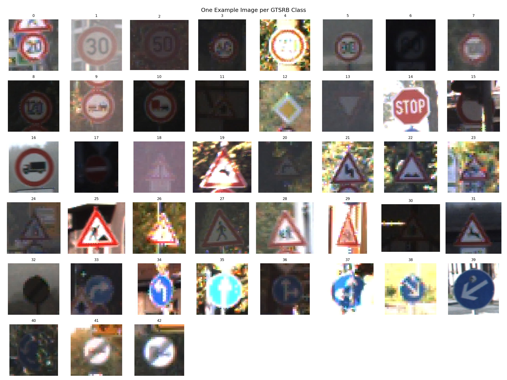
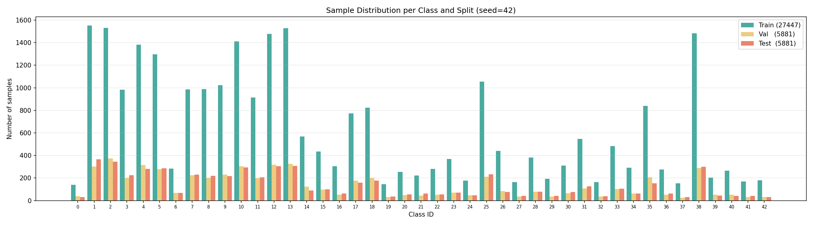
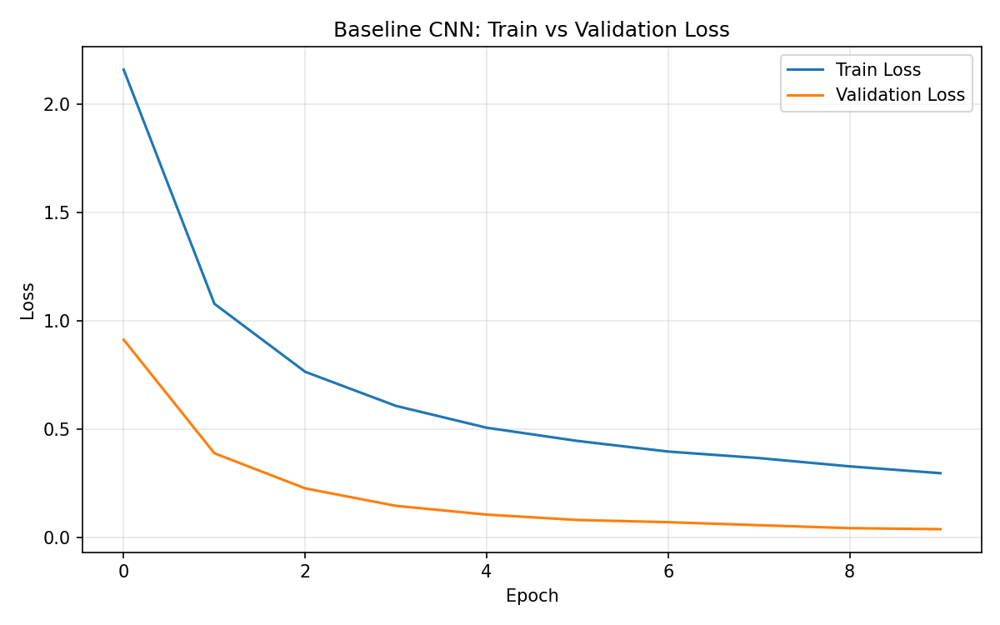
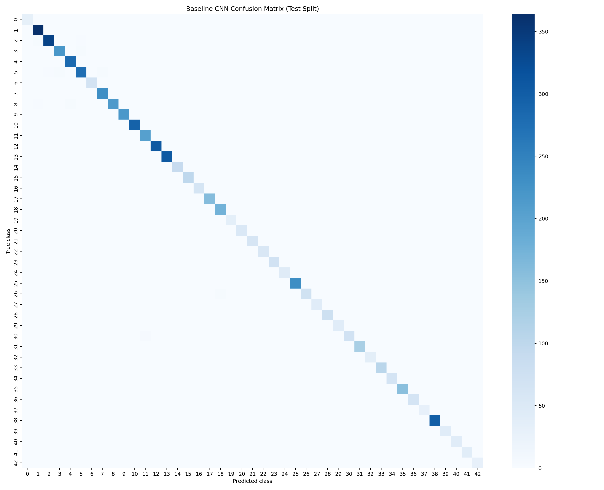
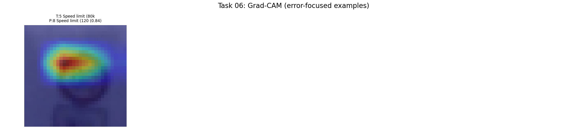

<!-- _paginate: false -->

# GTSRB Project Results (Tasks 01-06)
## A simple, non-technical walkthrough

Machine Learning KLU 2026

---

## What we built

We built a full traffic sign recognition pipeline: from data setup to model evaluation and explainability.

Goal: classify 43 German traffic sign classes from images.

Dataset size: <strong>39,209</strong> labeled images.

---

## Project roadmap (Tasks 01-06)

1. **Task 01-02**: Setup, data loading, reproducibility
2. **Task 03**: Preprocessing and train/validation/test split
3. **Task 04**: Baseline CNN model
4. **Task 05**: Improved models + multi-seed validation
5. **Task 06**: Final evaluation (robustness, fairness, explainability)

---

## Task 01-02: Setup and data loading

### What went well

1. One-command project setup (`setup_project.sh`)
2. Verified dataset downloads with SHA-256 checksums
3. Clean repository hygiene for large files
4. Automatic dataset inspection outputs

### Why this matters

Reproducibility was solved early, so all later results are easier to trust and compare.

---

<!-- _class: image-slide -->

## Task 02 result: class imbalance is real

**Most frequent class has 2,250 images; rarest classes have 210 (about 10.7x gap).**

---

<!-- _class: image-slide -->

## Task 02 result: sample images

**Many classes look visually similar, especially speed-limit signs.**

---

## Task 03: preprocessing decisions

1. Resize all images to **32x32**
2. Normalize color values
3. Augment training images (rotation, color jitter, small shifts)
4. Fixed split with seed 42

| Split | Images |
|---|---:|
| Train | 27,447 |
| Validation | 5,881 |
| Test | 5,881 |

---

<!-- _class: image-slide -->

## Task 03 result: split and pipeline checks

**All splits are prepared consistently for fair model comparison.**

---

## Task 04: baseline model performance

Baseline CNN was trained with multiple seeds.

| Seed | Test Accuracy | Test Loss |
|---:|---:|---:|
| 42 | 98.55% | 0.0621 |
| 123 | **99.29%** | **0.0451** |
| 2026 | 98.16% | 0.0642 |

Baseline already performed strongly and gave us a solid benchmark.

---

<!-- _class: image-slide -->

## Task 04 learning behavior

**Loss decreases smoothly, showing stable training.**

---

<!-- _class: image-slide -->

## Task 04 error analysis

**Most predictions are on the diagonal (correct classes).**

---

## Task 05: single-run model comparison

| Model | Test Accuracy | Wrong (of 5,881) | Params | Train Time |
|---|---:|---:|---:|---:|
| Baseline CNN | 99.49% | 30 | 629K | 275.6s |
| **Deep CNN** | **99.81%** | **11** | 936K | 284.0s |
| MobileNetV2 | 99.66% | 20 | 2.56M | 518.7s |
| LeakyReLU CNN | 99.46% | 32 | 629K | 271.5s |
| Stride CNN | 99.52% | 28 | 823K | **236.9s** |

Single-run winner on clean data: Deep CNN.

---

## Task 05: multi-seed comparison (more reliable)

Average over 3 seeds (`42, 123, 2026`):

| Model | Mean Test Accuracy | Std Dev | Mean Train Time |
|---|---:|---:|---:|
| **Deep CNN** | **99.69%** | 0.17% | 266.0s |
| Baseline CNN | 99.51% | 0.22% | 260.5s |
| Stride CNN | 99.45% | 0.12% | 267.6s |
| MobileNetV2 | 99.43% | 0.19% | 529.1s |

Deep CNN remained best on average, not just in one lucky run.

---

<!-- _class: image-slide -->

## Task 05 trade-off chart

**More parameters did not always mean better accuracy.**

---

## Task 06: final evaluation across all models

### Clean test accuracy (Top-1)
- Best: **Deep CNN (99.81%)**

### Robustness under Gaussian noise
- Best: **Stride CNN (81.14%)**
- Deep CNN: 71.86%
- Baseline CNN: 61.62%

### Robustness under Gaussian blur
- Best: **MobileNetV2 (98.33%)**

Different models are best for different real-world conditions.

---

## Task 06: fairness / class-balance check

Bias analysis compared frequent vs rare classes.

| Model | Accuracy Gap (Frequent vs Rare) |
|---|---:|
| Baseline CNN | 0.66 pp |
| Deep CNN | **0.34 pp** |
| MobileNetV2 | **0.04 pp** |
| LeakyReLU CNN | 0.60 pp |
| Stride CNN | 0.86 pp |

All gaps are small, so no strong class-frequency bias was observed.

---

<!-- _class: image-slide -->

## Task 06: explainability (Grad-CAM)

**The model focuses on the traffic sign itself, not mainly on background pixels.**

---

## Overall assessment of all tasks

1. **Engineering quality**: strong reproducibility and clean pipeline
2. **Accuracy**: very high on clean benchmark data
3. **Model selection insight**:
   - Best clean accuracy: **Deep CNN**
   - Best noise robustness: **Stride CNN**
4. **Main remaining risk**: performance drops under noisy inputs

---

## Practical recommendation

### If your priority is maximum clean accuracy:
Use **Deep CNN**

### If your priority is robustness in noisy environments:
Use **Stride CNN**

### Best next improvement:
Train with explicit noise augmentation and re-run multi-seed evaluation.

---

## Final takeaway

The project is successful end-to-end: strong data pipeline, strong baseline, strong improved models, and clear evidence about what still needs work for real-world robustness.

Thank you

