# CNN Traffic Sign Classification — Final Report
**German Traffic Sign Recognition Benchmark (GTSRB)**

---

## Table of Contents

1. [Introduction](#1-introduction)
2. [Dataset](#2-dataset)
3. [Data Preprocessing](#3-data-preprocessing)
4. [Baseline Model](#4-baseline-model)
5. [Model Improvements](#5-model-improvements)
6. [Model Evaluation](#6-model-evaluation)
7. [Discussion](#7-discussion)
8. [Future Work](#8-future-work)
9. [Conclusion](#9-conclusion)

---

## 1. Introduction

Traffic sign recognition is a core component of modern advanced driver assistance systems (ADAS) and autonomous vehicles. A reliable classifier must handle varying illumination, partial occlusion, motion blur, and differences in sign size while distinguishing between 43 classes with low error tolerance.

This project implements and evaluates a series of CNN architectures for traffic sign classification on the German Traffic Sign Recognition Benchmark (GTSRB), structured in six stages: dataset analysis, preprocessing, baseline modeling, architecture improvements, evaluation, and this report.

The central research questions are:

- Can a compact, from-scratch CNN reach near-human accuracy on GTSRB?
- Do architectural improvements (depth, activation functions, strided convolutions) meaningfully outperform the baseline?
- Does transfer learning from ImageNet provide an advantage on this specialized dataset?
- How robust is the best model to real-world image degradations such as noise and blur?
- Does the model treat rare and frequent traffic sign classes equally well?

---

## 2. Dataset

### 2.1 Overview

The GTSRB dataset was recorded from a car-mounted camera on German roads. It contains **39,209 training images** across **43 traffic sign classes**. Images are provided in PPM format at varying resolutions, ranging from as small as 15×15 pixels to over 250×250 pixels. This variability reflects real-world conditions where a sign may appear very small in the distance or large and close-up.

### 2.2 Class Distribution

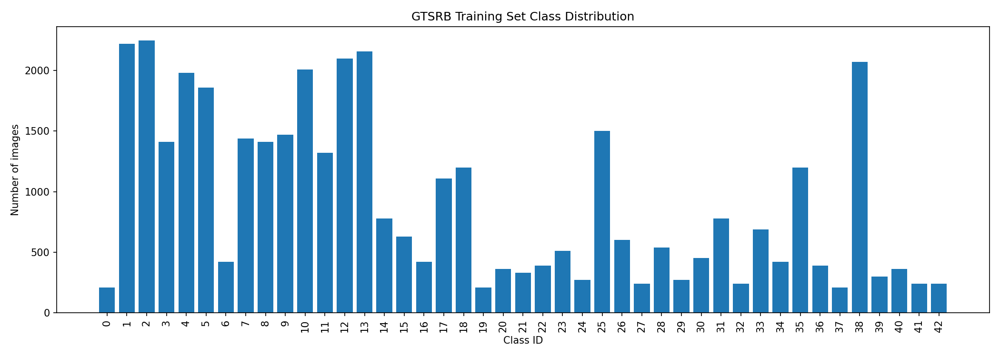

The dataset is **not uniformly distributed**. The most frequent classes (e.g. Speed limit 30km/h with 1,552 training images) have roughly ten times as many samples as the rarest classes (e.g. Speed limit 20km/h with only 140 images). This class imbalance is a central concern for both training and evaluation, as a model could achieve high average accuracy simply by performing well on frequent classes while failing on rare ones.

| Metric | Value |
|--------|-------|
| Total training images | 39,209 |
| Number of classes | 43 |
| Most frequent class | Speed limit (30km/h) — 1,552 images |
| Least frequent class | Speed limit (20km/h) — 140 images |
| Imbalance ratio (max/min) | ~11× |

### 2.3 Sample Images

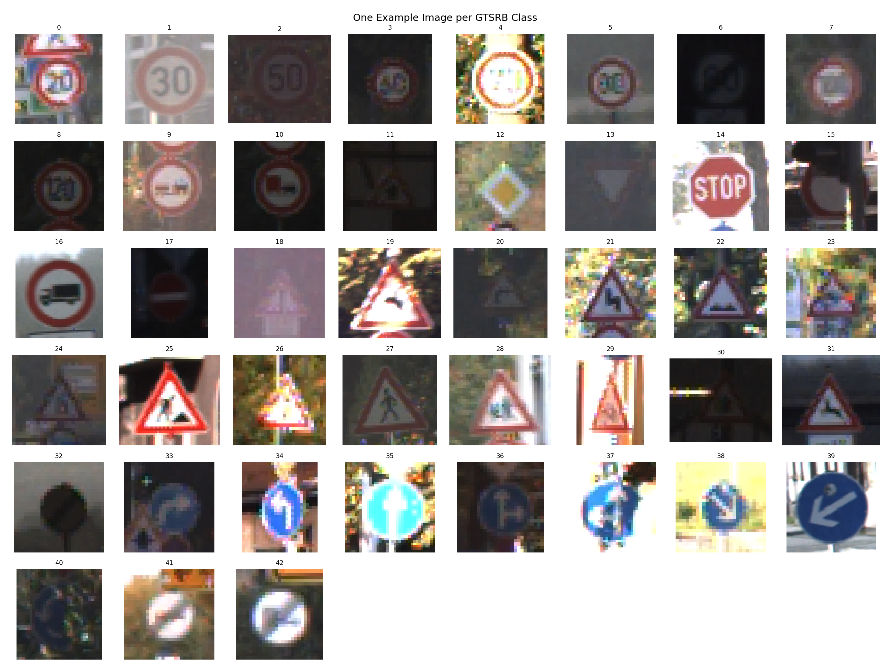

The sample grid illustrates the visual diversity within the dataset. Even within a single class, images vary in brightness, contrast, viewing angle, and background — motivating careful preprocessing and augmentation.

### 2.4 Data Source

The GTSRB dataset was introduced by Stallkamp et al. in their 2012 paper *"Man vs. Computer: Benchmarking Machine Learning Algorithms for Traffic Sign Recognition"* (Neural Networks, 32:323–332). The benchmark was presented at the IJCNN 2011 competition, where the best entry achieved 99.46% — surpassing human-level performance of 98.84%. GTSRB is therefore a well-established benchmark and near-perfect CNN performance is consistent with the literature.

---

## 3. Data Preprocessing

### 3.1 Data Split

The 39,209 training images are divided into three non-overlapping subsets using a fixed random seed (42) for reproducibility:

| Split | Fraction | Images |
|-------|----------|--------|
| Training | 70% | 27,447 |
| Validation | 15% | 5,881 |
| Test | 15% | 5,881 |

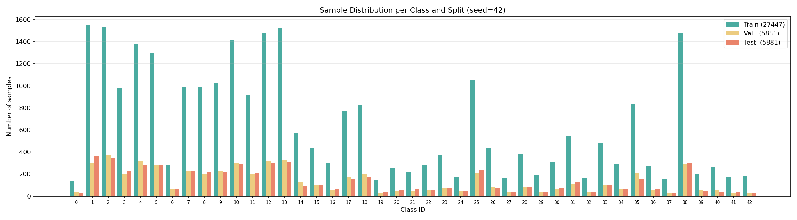

The split distribution plot confirms that the class proportions are preserved across all three subsets — the relative frequency of each class is approximately equal in training, validation, and test sets. This stratified structure ensures that the validation and test sets are representative of the full class distribution and that evaluation metrics are not distorted by split imbalance.

The validation set is used during training to monitor generalization and apply early stopping. The test set is held out entirely and evaluated only once per model — evaluating on data that was seen during training or hyperparameter selection would produce overly optimistic results and undermine the trustworthiness of the reported metrics. Using a fixed seed ensures that all model variants are evaluated on identical splits, making comparisons fair.

### 3.2 Image Transformations

All images are resized to **32×32 pixels** before processing. This uniform size is required because the fully connected classifier layers have fixed weight matrix dimensions. At 32×32 the images are compact enough for fast training while retaining enough detail for the model to distinguish sign shapes, symbols, and colors.

**Training transforms** apply stochastic augmentations that are different each time:

| Transform | Parameters | Purpose |
|-----------|-----------|---------|
| Random Rotation | ±15° | Simulates tilted camera angles |
| Color Jitter | brightness ±0.4, contrast ±0.4, saturation ±0.3 | Simulates lighting and weather variation |
| Random Affine | translate ±10% | Simulates off-center sign placement |
| Normalize | mean=(0.3337, 0.3064, 0.3171), std=(0.2672, 0.2564, 0.2629) | Centers input distribution |

**Validation and test transforms** are fully deterministic — only resize, convert to tensor, and normalize. No augmentation is applied during evaluation, so that measured accuracy honestly reflects model performance on unmodified inputs.

### 3.3 Normalization

Pixel values are converted from the range [0, 255] to floating-point [0.0, 1.0], then normalized per channel using the mean and standard deviation computed from the GTSRB training set. Normalization is essential for stable optimization: without it, large differences in pixel scales across channels can distort the loss surface and slow down or destabilize convergence.

### 3.4 Data Augmentation as Regularization

Augmentation artificially increases the effective diversity of the training set. The model never sees the exact same pixel values twice, which prevents it from memorizing specific training examples. This is particularly important for the rarest sign categories that have fewer than 200 training samples and would otherwise be prone to overfitting.

### 3.5 Mini-Batch Loading and Early Stopping

Images are fed to the model in mini-batches of size 64. Mini-batch stochastic gradient descent introduces noise into the gradient estimates, which helps the optimizer escape poor local minima. The training DataLoader uses shuffling so that every mini-batch sees a fresh random sample each epoch.

Early stopping with patience 5 halts training when validation accuracy does not improve for five consecutive epochs. The checkpoint with the highest validation accuracy — not the last epoch — is restored for final evaluation. This prevents overfitting to the training set in later epochs and ensures that reported results reflect the model's best generalization, not its final state.

---

## 4. Baseline Model

### 4.1 Architecture

The baseline CNN consists of three convolutional blocks followed by a fully connected classifier. The architecture diagram below (left) shows the full layer sequence with feature map dimensions at each stage.

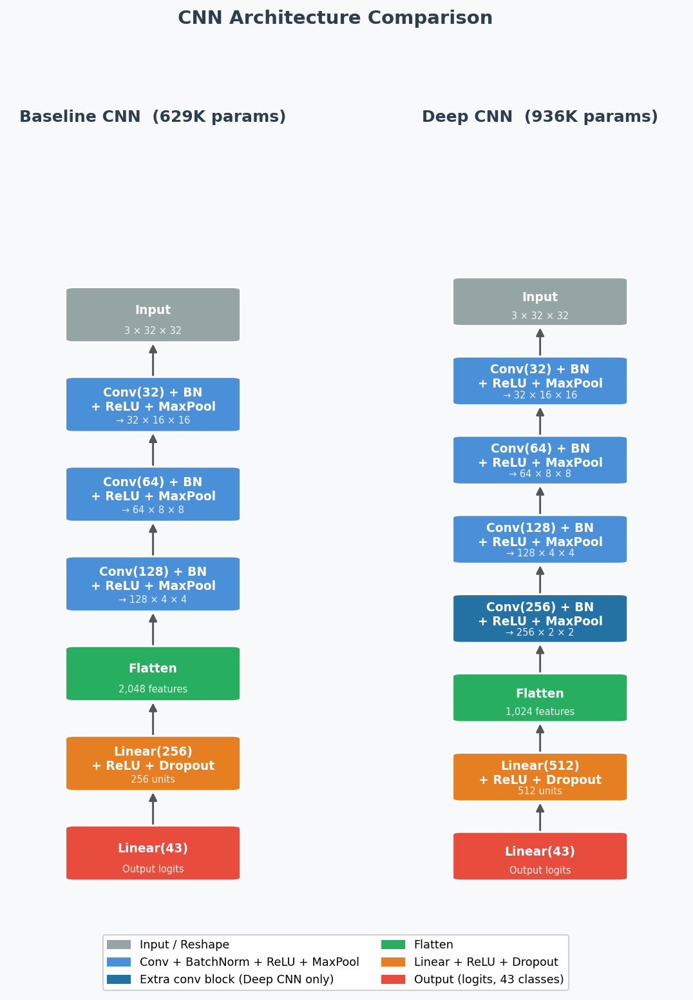

**Total trainable parameters: 629,291**

Each convolutional block uses padding=1 to preserve spatial dimensions before pooling, BatchNorm to stabilize gradient flow, and ReLU activations. Dropout(0.5) in the classifier regularizes the network by randomly dropping half the hidden units during training. The model outputs raw logits — no softmax is applied — because CrossEntropyLoss applies log-softmax internally, which is numerically more stable.

### 4.2 Training Configuration

| Hyperparameter | Value |
|---------------|-------|
| Optimizer | Adam |
| Initial learning rate | 1e-3 |
| LR scheduler | ReduceLROnPlateau (patience=3, factor=0.5) |
| Loss function | CrossEntropyLoss |
| Batch size | 64 |
| Max epochs | 30 |
| Early stopping patience | 5 |
| Input size | 32×32 |

Adam adapts the learning rate individually for each parameter, leading to faster and more stable convergence than plain SGD. ReduceLROnPlateau halves the learning rate whenever validation loss plateaus for three epochs.

### 4.3 Results

Two runs were conducted with different random seeds to verify stability:

| Seed | Best Val Accuracy | Test Accuracy | Test Loss |
|------|------------------|--------------|-----------|
| 42   | 98.78%           | 98.55%       | 0.0621    |
| 123  | 99.15%           | 99.29%       | 0.0451    |

Results are consistent across both seeds, confirming pipeline stability. The small difference is attributable to random weight initialisation and mini-batch ordering.

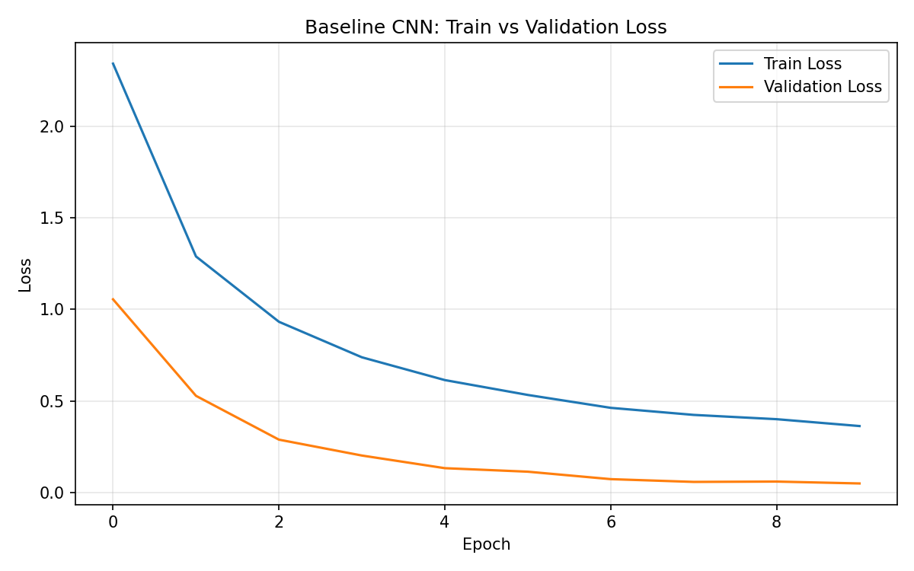

The loss curves show smooth convergence with no signs of severe overfitting — the train/val gap remains small throughout, and early stopping engages after the validation plateau.

### 4.4 Why High Baseline Accuracy is Expected

The near-perfect baseline accuracy is not coincidental — it is a direct consequence of properties intrinsic to the GTSRB dataset and the suitability of CNNs for this type of task.

**Inter-class vs. intra-class variability.** Traffic signs are designed by humans to be maximally distinguishable from one another. The dataset therefore exhibits high inter-class variability (each class looks structurally different from all others) combined with low intra-class variability (all instances of a class share the same shape, color, and symbol). This is the ideal configuration for a classifier: the decision boundaries are well-separated in feature space, which is confirmed visually by the t-SNE projection of learned features (Section 5.7), where the 43 classes form clearly separated clusters.

**Reduced task complexity.** GTSRB images are pre-cropped to the bounding box of the sign. The model therefore solves a pure classification problem rather than the harder joint detection-and-classification problem encountered in unconstrained driving footage. Removing the localization requirement substantially reduces the difficulty of the task.

**Dataset size and class structure.** With approximately 900 training samples per class and a relatively simple visual structure per class, the dataset is well-conditioned with respect to the bias-variance tradeoff — sufficient data to converge to a low-variance solution without memorizing training examples.

**Human performance as a reference.** Stallkamp et al. (2012), who introduced the GTSRB benchmark, report an average human recognition rate of **98.84%** — lower than the baseline achieved here. This confirms that GTSRB is considered a largely solved benchmark in the literature, and that near-perfect CNN performance is consistent with established results rather than a sign of overfitting or data leakage.

---

## 5. Model Improvements

### 5.1 Overview

Rather than exploring architectures arbitrarily, each of the four variants was chosen to isolate and test a specific design decision motivated by the course material:

**Deep CNN** tests whether additional depth improves representational capacity. According to the hierarchical feature learning principle underlying CNNs (Lecture 5), deeper networks can learn increasingly abstract features — early layers detect edges, intermediate layers combine these into shapes, and deeper layers represent high-level semantic concepts such as symbols and signs. Adding a fourth convolutional block directly tests whether the baseline's three blocks are a bottleneck.

**LeakyReLU CNN** addresses the dead neuron problem of standard ReLU (Lecture 4). A ReLU unit whose pre-activation is always negative outputs zero gradient and permanently stops learning. Leaky ReLU introduces a small slope (0.01) for negative inputs, preventing this. This variant tests whether dead neurons are a limiting factor in this architecture.

**Stride CNN** replaces fixed MaxPooling with learned strided convolutions for spatial downsampling (Lecture 5: Striding). MaxPool applies a fixed rule — take the maximum — regardless of the data. Strided convolutions learn optimal downsampling weights during training, potentially retaining more task-relevant spatial information. This variant tests whether learned downsampling outperforms the fixed heuristic.

**MobileNetV2** serves as a transfer learning baseline. It tests whether features pretrained on a large general-purpose dataset (ImageNet, 1.2M images, 1,000 classes) provide an advantage over features learned from scratch on GTSRB alone. This is particularly relevant for the rarest classes with fewer than 200 training samples, where from-scratch learning may underfit.

Together, these four variants form a structured ablation study — each changes exactly one design decision relative to the baseline, making it possible to attribute performance differences to specific choices. All variants were trained under identical conditions for up to 20 epochs with the same optimizer, scheduler, and early stopping configuration.

| Model | Test Accuracy | Wrong / 5881 | Parameters | Training Time |
|-------|-------------|:---:|-----------|:---:|
| Baseline CNN | 99.49% | 30 | 629,291 | 275.6 s |
| **Deep CNN** | **99.81%** | **11** | **936,235** | **284.0 s** |
| MobileNetV2 | 99.66% | 20 | 2,562,859 | 518.7 s |
| LeakyReLU CNN | 99.46% | 32 | 629,291 | 271.5 s |
| Stride CNN | 99.52% | 28 | 823,051 | 236.9 s |

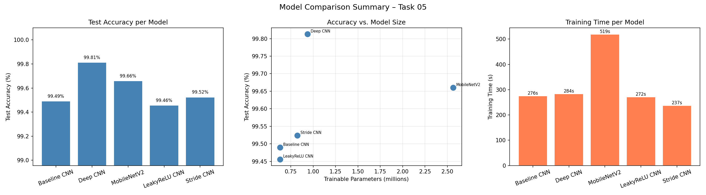

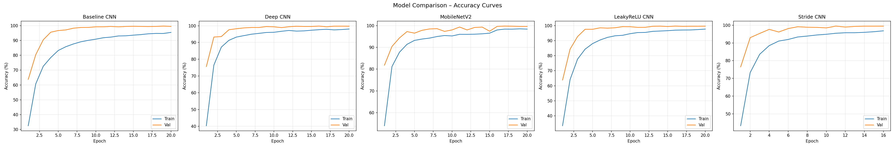

### 5.2 Variant A — Deep CNN

The Deep CNN adds a fourth convolutional block (128→256 filters) and expands the classifier from 256 to 512 hidden units, as shown in the architecture diagram in Section 4.1 (right side). Additional depth allows the network to learn increasingly abstract representations: early layers detect edges and gradients, deeper layers combine these into shape- and symbol-level features. This variant achieves the **highest test accuracy of 99.81%** — only 11 wrong predictions out of 5,881 — with only a 49% parameter increase over the baseline. Training time is nearly identical (284 s vs. 276 s), making it the most cost-effective improvement overall.

### 5.3 Variant B — MobileNetV2 (Transfer Learning)

MobileNetV2, pretrained on ImageNet (1.2 million images, 1,000 classes), was used as a feature extractor with a custom two-layer classifier head adapted for the 43 GTSRB classes. All weights including the backbone were fine-tuned during training.

Transfer learning is motivated by the fact that low-level visual features — edges, textures, gradients — are shared across many image domains. The pretrained backbone provides a strong initialization, particularly beneficial for the rarest GTSRB classes with fewer than 200 training samples.

MobileNetV2 achieves 99.66% test accuracy but requires **4× more parameters** (2.56M vs. 629K) and nearly **twice the training time** (519 s vs. 276 s) compared to the baseline for only a 0.17 percentage point gain. On this dataset, transfer learning does not justify its additional computational cost.

### 5.4 Variant C — LeakyReLU CNN

This variant replaces all ReLU activations with Leaky ReLU (negative slope = 0.01). Standard ReLU can produce "dead neurons" — units whose input is persistently negative, causing the gradient to be exactly zero and the neuron to permanently stop learning. Leaky ReLU prevents this by maintaining a small gradient (0.01×z) for negative inputs.

Despite this theoretical advantage, Leaky ReLU CNN achieves 99.46% — marginally below the baseline (99.49%). This suggests that with BatchNorm stabilizing the activations throughout the network, dead neurons are not a significant problem at this scale.

### 5.5 Variant D — Stride CNN

Instead of fixed MaxPool layers, the Stride CNN uses strided convolutions (stride=2) for downsampling. While MaxPool selects the maximum value in each 2×2 region by a fixed rule, strided convolutions learn how to downsample, potentially preserving more useful spatial information.

The Stride CNN achieves 99.52% test accuracy and is the **fastest to train** (236.9 s), making it attractive when computational budget is limited. The accuracy difference compared to the baseline is marginal (0.03 pp).

### 5.6 Hyperparameter Tuning

To systematically search for optimal training hyperparameters, Bayesian optimisation was applied using the Optuna framework with a Tree-structured Parzen Estimator (TPE) sampler. The search space covered the following dimensions:

| Hyperparameter | Search Range |
|---------------|-------------|
| Learning rate | 1×10⁻⁴ to 1×10⁻² (log scale) |
| Dropout rate | 0.2 – 0.6 |
| Batch size | 32, 64, 128 |
| Optimizer | Adam, SGD |
| Weight decay | 1×10⁻⁵ to 1×10⁻³ (log scale) |

A MedianPruner terminated unpromising trials early based on intermediate validation accuracy, reducing the total compute budget. Thirty trials of ten epochs each were run on the StrideCNN architecture. The search is designed to inform future training runs and validate that the manually chosen default configuration (Adam, lr=1×10⁻³, batch size=64) lies in a competitive region of the hyperparameter space.

### 5.7 Latent Space Visualisation

To understand what the network has learned internally, feature vectors were extracted from the penultimate layer of the baseline CNN (before the final linear classifier) and projected to two dimensions using t-SNE (t-distributed Stochastic Neighbor Embedding) with perplexity 30. Up to 2,000 validation samples were used to keep the computation tractable.

This analysis applies the dimensionality reduction concept from Lecture 7. If the 43 classes form distinct clusters in the 2D projection, the network has learned to separate them in its internal representation space — providing interpretable evidence beyond accuracy numbers alone. Visually similar classes such as different speed limit signs would be expected to appear close together, while structurally distinct classes such as stop signs and yield signs should be well separated.

### 5.8 Autoencoder for Anomaly Detection

A key limitation of any classifier is that it always assigns an input to one of its known classes — even when the input is entirely outside the training distribution. To address this, a convolutional autoencoder was implemented as a complementary anomaly detection mechanism, directly applying the autoencoder concept from Lecture 7.

The architecture follows the encoder–bottleneck–decoder structure: the encoder compresses 3×32×32 input images through three convolutional blocks with MaxPooling down to a 128-dimensional latent vector, and a mirrored decoder with transposed convolutions reconstructs the original image from that representation. Training is fully unsupervised — only images are used, not class labels. The training objective is to minimise the per-pixel mean squared error (MSE) between input and reconstruction, as defined in Lecture 7:

$$\mathcal{L}(\theta) = \frac{1}{n} \sum_{i=1}^{n} (\hat{a}_i - a_i)^2$$

After training, the reconstruction error serves as an anomaly score. A threshold at the 95th percentile of the validation error distribution is used to flag inputs as anomalous — images of known signs that the autoencoder has learned to reconstruct well receive low error, while degraded, occluded, or unknown inputs produce high error and are flagged. This provides a safety mechanism for deployment: rather than forcing every input into one of 43 classes, the combined system can decline to classify inputs that fall outside the known distribution.

---

## 6. Model Evaluation

The Deep CNN was selected as the best model and evaluated in depth on the held-out test set.

### 6.1 Test Set Performance

| Metric | Value |
|--------|-------|
| Test Accuracy (Top-1) | **99.81%** |
| Test Accuracy (Top-5) | **99.98%** |
| Test Loss | 0.0061 |
| Wrong Classifications | 11 / 5,881 |

The Top-5 accuracy of 99.98% means the correct class appears among the model's five most confident predictions in all but two test cases.

### 6.2 Confusion Matrix

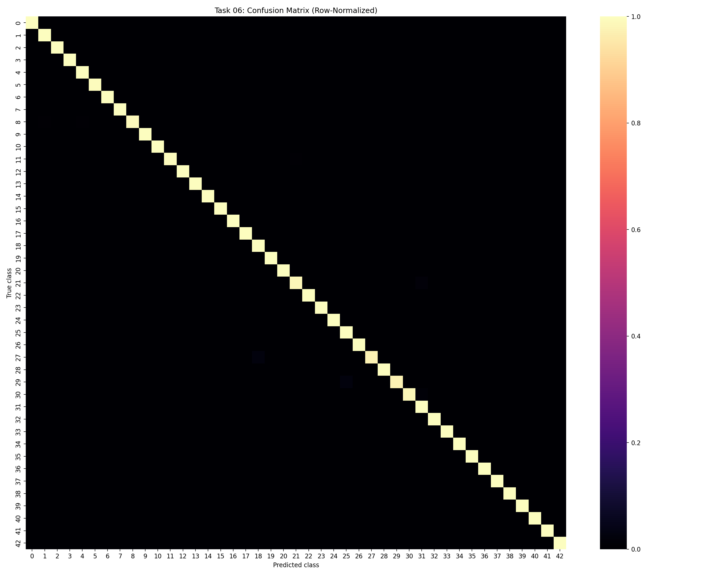

The confusion matrix is strongly diagonal. The few off-diagonal entries are concentrated among visually similar sign pairs — different speed limit signs and warning signs with comparable layouts.

### 6.3 Per-Class Accuracy

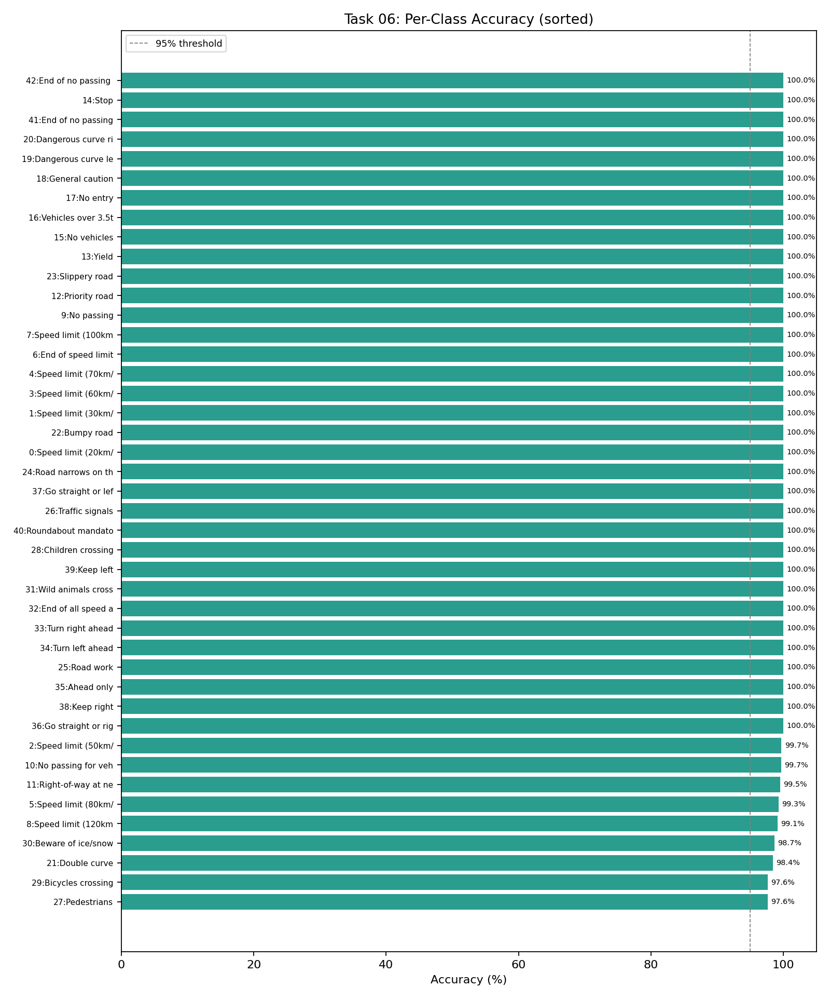

**Five best-performing classes (100% accuracy):** Stop, Dangerous curve left, Dangerous curve right, End of no passing, End of no passing by vehicles over 3.5t.

**Five worst-performing classes:**

| Class | Name | Test Accuracy |
|-------|------|:---:|
| 27 | Pedestrians | 97.62% |
| 29 | Bicycles crossing | 97.62% |
| 21 | Double curve | 98.39% |
| 30 | Beware of ice/snow | 98.67% |
| 8  | Speed limit (120km/h) | 99.10% |

The worst-performing classes share a common characteristic: they are visually similar to other classes. Pedestrian and bicycle crossing signs have comparable layouts with subtle icon differences that are difficult to resolve at 32×32 pixel resolution.

### 6.4 Precision and Recall

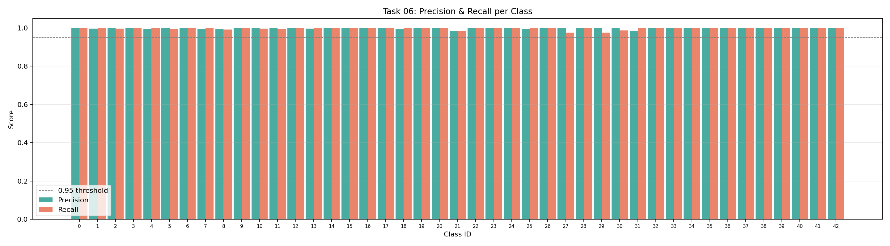

Precision and recall are consistently high across all 43 classes. The few classes with slightly reduced scores correspond to the visually ambiguous categories identified above.

### 6.5 Misclassified Examples

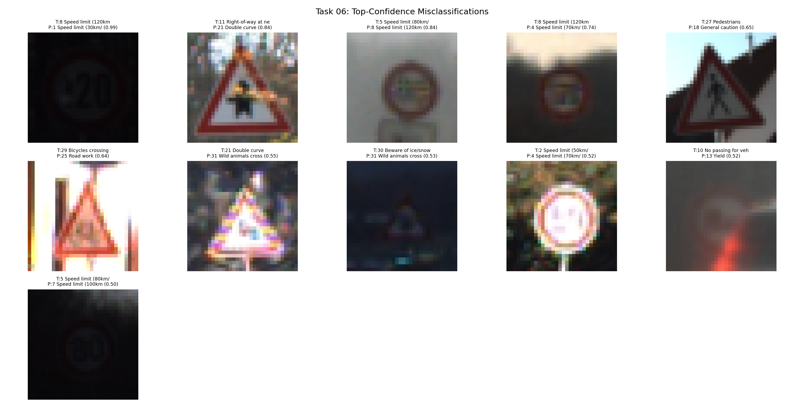

The misclassification grid shows the 11 incorrectly predicted test images. In most cases the error is understandable: degraded image quality, partial occlusion, or strong visual similarity to another class. Errors are concentrated in genuinely hard cases, not systematic failures of an entire category.

### 6.6 Bias Analysis

A critical concern for real-world deployment is whether the model performs disproportionately worse on underrepresented classes. Fairness across class frequencies is evaluated by splitting the 43 classes into the 10 most frequent and 10 least frequent by training count.

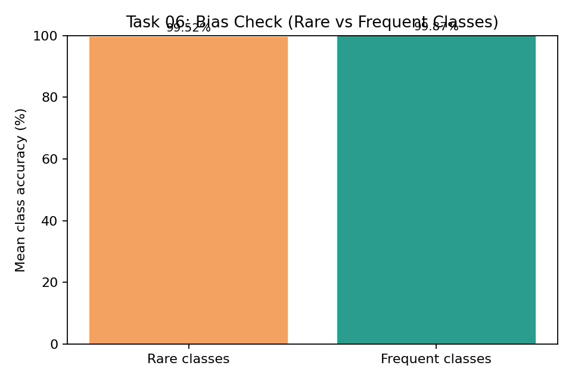

| Group | Training images (avg.) | Mean Test Accuracy |
|-------|----------------------|-------------------|
| Frequent classes (top 10) | ~1,374 per class | 99.87% |
| Rare classes (bottom 10) | ~169 per class | 99.52% |
| Gap | — | **0.34 percentage points** |

The accuracy gap of only **0.34 pp** between the most and least represented classes demonstrates that the pipeline handles class imbalance effectively. Notably, several of the rarest classes — Speed limit (20km/h) with only 140 training images, Dangerous curve left with 145 — achieve 100% test accuracy. This result validates that the data augmentation strategy and training procedure generalize well even under significant class imbalance.

A model accurate on average but failing systematically on rare classes would be unsuitable for deployment — rare signs such as "road narrows" require reliable recognition precisely because they appear infrequently.

### 6.7 Robustness Testing

Real-world deployment involves conditions not present in clean test data. Two standard perturbations were evaluated:

| Condition | Test Accuracy | Δ vs. Clean |
|-----------|-------------|:-----------:|
| Clean | 99.81% | — |
| Gaussian Blur (kernel=5) | 97.01% | −2.80 pp |
| Gaussian Noise (σ=0.1) | 71.86% | **−27.95 pp** |

The model maintains strong performance under blur, which simulates motion blur or out-of-focus optics. However, **Gaussian noise causes a dramatic drop to 71.86%** — a well-known vulnerability of CNNs trained exclusively on clean images. This is the most significant limitation for real-world deployment with low-quality sensors.

### 6.8 Grad-CAM Interpretability

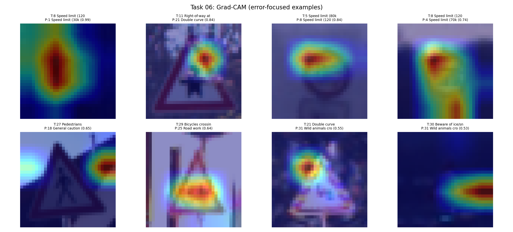

Gradient-weighted Class Activation Mapping (Grad-CAM) highlights the image regions that most strongly influenced the model's predictions by computing the gradient of the predicted class score with respect to the final convolutional feature maps.

The visualizations confirm that the model attends to the relevant sign regions — shape, symbol, and color — rather than background artifacts. A model exploiting spurious background correlations would be fragile under distribution shift; the Grad-CAM results provide evidence this is not the case.

---

## 7. Discussion

### 7.1 Summary of Findings

All five models exceed 99% test accuracy on the clean GTSRB test split, confirming that CNN-based classifiers are well-suited to this task. The key findings are:

**Depth helps, but with diminishing returns.** Adding a fourth convolutional block (Deep CNN) increases accuracy by 0.32 pp over the baseline at minimal additional cost. This is the most effective improvement found.

**Transfer learning is not necessary for GTSRB.** MobileNetV2 delivers smaller accuracy gains at significantly higher computational cost. The GTSRB training set (27,447 images) is large enough for from-scratch CNNs to learn excellent representations without ImageNet pretraining.

**Activation function and downsampling choices have minimal impact.** Replacing ReLU with Leaky ReLU or MaxPool with strided convolutions produces no meaningful accuracy change, suggesting that BatchNorm is the dominant stabilizing factor, and that the choice of downsampling method is secondary.

**The model generalizes well across rare classes.** The 0.34 pp accuracy gap between frequent and rare classes confirms that the augmentation and training strategy mitigate class imbalance effectively, without requiring explicit reweighting or oversampling.

**Noise robustness is the main open challenge.** The 27.95 pp accuracy drop under Gaussian noise is the clearest limitation. This points to a concrete gap between benchmark performance and real-world reliability.

### 7.2 Assumptions, Limitations, and Biases

**Fixed 32×32 resolution.** Downsampling all images to 32×32 makes the pipeline fast and lightweight but discards spatial detail. Some visually similar classes (e.g. pedestrian vs. bicycle crossing signs) might be more reliably distinguished at higher resolution (64×64 or 96×96), at the cost of larger models and longer training.

**Single random seed for improved models.** While two seeds were compared for the baseline, the improved model variants were each trained once. Performance estimates would be statistically more reliable with multiple independent runs.

**Clean training data.** No noise or blur augmentation was applied during training. The model was optimized for clean inputs only, which directly explains its poor noise robustness. A production system would require noise injection during training or a preprocessing denoising step.

**Fixed data split.** The 70/15/15 split is applied once with a fixed seed. Cross-validation would provide a more robust estimate of generalization performance but was not applied here due to the computational cost of training five model variants.

**Benchmark vs. deployment gap.** The GTSRB test set shares the same distribution as the training data. In real deployment, signs may appear under conditions not represented in the dataset — unusual weather, different countries, damaged or vandalized signs. Performance under distribution shift was not evaluated beyond the noise and blur robustness tests.

Beyond these technical limitations, several systematic biases affect the trustworthiness of the results and must be considered explicitly:

**Selection bias.** GTSRB was recorded exclusively on German roads under a limited range of conditions. Signs from other countries, differently styled variants, or extreme conditions (heavy rain, snow, night) are absent from the training distribution. A classifier trained on this data cannot be assumed to generalise beyond it.

**Class frequency bias.** The 11× imbalance between the most and least frequent classes creates a systematic risk that the model optimises disproportionately for common classes. Although the measured gap is small (0.34 pp), failures on rare signs such as "road narrows" are safety-critical precisely because they appear less often in training.

**Representation bias.** The dataset contains no damaged, faded, or vandalized signs. The model has no experience with degraded signs common in real environments. Gaussian noise tests partially probe this, but do not cover realistic damage patterns such as occlusion or physical deformation.

**Measurement bias.** All images were captured from a single camera system. Differences in sensor quality, mounting angle, and lens characteristics across vehicles are not represented, and performance may degrade on data from different sensors.

### 7.3 Suitability Assessment

For the purpose of this course project — demonstrating CNN-based traffic sign classification on a standard benchmark — the approach is fully suitable. The Deep CNN achieves near-perfect accuracy (99.81%), generalizes well across class frequencies, and the Grad-CAM analysis confirms it learns meaningful visual features.

For real-world deployment in a safety-critical system, the noise sensitivity (71.86% accuracy under σ=0.1 Gaussian noise) would need to be addressed before the system could be considered reliable. The most practical path forward would be augmenting the training set with noise and blur perturbations, which is a well-established technique for improving CNN robustness at minimal cost.

---

## 8. Future Work

The current system classifies pre-cropped traffic sign images. Several natural extensions would move it closer to real-world applicability:

**Noise and blur augmentation.** Training with Gaussian noise, motion blur, and brightness variation would directly close the 27.95 pp robustness gap identified in Section 6.7 — a well-established technique with minimal additional cost.

**Object detection integration.** The current pipeline requires pre-cropped sign images, which does not hold in real driving footage. Combining the classifier with a detection model (e.g. YOLO) that first locates signs in the full scene would enable end-to-end recognition from raw camera frames — the most impactful step toward real-world deployment.

**Higher input resolution.** Upscaling from 32×32 to 64×64 pixels would preserve more spatial detail and likely reduce confusion between visually similar classes such as pedestrian and bicycle crossing signs.

**Cross-validation.** Replacing the single 70/15/15 split with k-fold cross-validation would provide statistically more reliable performance estimates, particularly for rare classes with fewer than 200 training samples.

**Domain adaptation.** Fine-tuning on signs from other countries or adverse weather conditions would reduce selection bias and improve generalisability beyond German roads.

---

## 9. Conclusion

This project demonstrates that a compact from-scratch CNN can achieve near-perfect accuracy on the GTSRB traffic sign classification benchmark. The Deep CNN — a four-block convolutional network with 936,235 trainable parameters — reaches **99.81% top-1 test accuracy**, misclassifying only 11 out of 5,881 test images.

The systematic comparison of five model variants shows that architectural depth is the most cost-effective improvement, while transfer learning offers diminishing returns on a dataset of this size. The bias analysis confirms that the pipeline handles class imbalance well, with only a 0.34 pp accuracy gap between frequent and rare classes. Grad-CAM visualizations confirm that predictions are based on the sign itself rather than background correlations.

The primary limitation is noise sensitivity: a 27.95 pp accuracy drop under Gaussian noise is the clearest gap between benchmark performance and real-world reliability. Combining the classifier with an object detection stage and augmenting training with realistic perturbations are the two most impactful next steps toward a deployable system.

---

## References

Stallkamp, J., Schlipsing, M., Salmen, J., & Igel, C. (2012). Man vs. computer: Benchmarking machine learning algorithms for traffic sign recognition. *Neural Networks*, 32, 323–332. https://doi.org/10.1016/j.neunet.2012.02.016

Sandler, M., Howard, A., Zhu, M., Zhmoginov, A., & Chen, L. C. (2018). MobileNetV2: Inverted residuals and linear bottlenecks. *Proceedings of the IEEE Conference on Computer Vision and Pattern Recognition (CVPR)*, 4510–4520.

LeCun, Y., Bottou, L., Bengio, Y., & Haffner, P. (1998). Gradient-based learning applied to document recognition. *Proceedings of the IEEE*, 86(11), 2278–2324.

Akiba, T., Sano, S., Yanase, T., Ohta, T., & Koyama, M. (2019). Optuna: A next-generation hyperparameter optimization framework. *Proceedings of the 25th ACM SIGKDD International Conference on Knowledge Discovery & Data Mining*, 2623–2631.

Selvaraju, R. R., Cogswell, M., Das, A., Vedantam, R., Parikh, D., & Batra, D. (2017). Grad-CAM: Visual explanations from deep networks via gradient-based localization. *Proceedings of the IEEE International Conference on Computer Vision (ICCV)*, 618–626.

van der Maaten, L., & Hinton, G. (2008). Visualizing data using t-SNE. *Journal of Machine Learning Research*, 9, 2579–2605.

---

## Appendix: Generated Artifacts

| Task | Key Output Files |
|------|-----------------|
| Task 02 | `results/class_mapping.csv`, `results/task03/class_distribution.png` |
| Task 03 | `results/preprocessing_stats.json`, `results/preprocessing_sample_grid.png` |
| Task 04 | `models/baseline.pth`, `results/task04/baseline_history_seed-42.json`, `results/task04/baseline_loss_curve_seed-42.png` |
| Task 05 | `models/deep_cnn.pth`, `results/task05/model_comparison.json`, `results/task05/model_comparison_summary.png` |
| Task 06 | `results/task06/deep/evaluation_summary.json`, `results/task06/deep/gradcam_examples.png`, `results/task06/deep/confusion_matrix_normalized.png`, `results/task06/deep/bias_analysis_mean_accuracy.png` |
