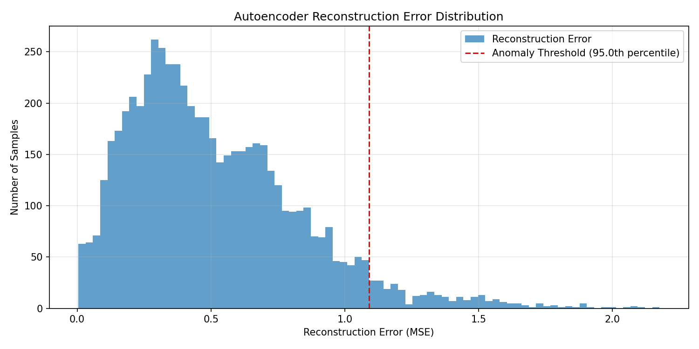

# CNN Traffic Sign Classification: Final Report - "STILL WORKING ON IT, NOT THE FINAL VERSION"
**German Traffic Sign Recognition Benchmark (GTSRB)**

---

## Table of Contents

1. [Introduction](#1-introduction)
2. [Data and Preprocessing](#2-data-and-preprocessing)
3. [Baseline Model](#3-baseline-model)
4. [Model Improvements and Extensions](#4-model-improvements-and-extensions)
5. [Results and Discussion](#5-results-and-discussion)
6. [Conclusion and Future Work](#6-conclusion-and-future-work)
7. [References](#references)
8. [Appendix](#appendix)

---

## 1. Introduction 

### 1.1 Problem Context and Motivation

Traffic sign recognition is an important component of modern driver assistance systems and autonomous driving pipelines. In real-world applications, a classifier must recognize signs under changing illumination, partial occlusion, motion blur, and different viewing distances. Because traffic signs communicate legally and safety-relevant instructions, misclassifying a speed limit, priority sign, or stop sign could lead to incorrect driving decisions, making reliable classification both a technical and a safety-relevant challenge.

To study this problem in a controlled and reproducible way, this project uses the German Traffic Sign Recognition Benchmark (GTSRB), a widely used dataset for traffic sign classification. A detailed description of the dataset and preprocessing pipeline is provided in Section 2.

### 1.2 Project Approach

This project investigates how far compact convolutional neural networks can be pushed on the GTSRB classification task before comparing them with a pretrained model. We trained CNNs from scratch first because the dataset structure supports it: GTSRB images are already cropped to the sign bounding box, the visual domain is narrow, and the classes follow standardised colour and shape patterns. Under these conditions, a purpose-built CNN may achieve strong performance with lower computational cost than transfer learning.

The project compares a baseline CNN with four model variants, each targeting one main design decision: network depth, activation function, downsampling strategy, and transfer learning. This controlled setup makes it easier to relate performance differences to specific architectural choices.

### 1.3 Goal of the Project

The goal of this project is to systematically evaluate how different CNN architectures perform on the GTSRB traffic sign classification task and to identify which design decisions drive performance improvements. This includes assessing generalisation across all 43 sign classes, bias toward frequent versus rare classes, and robustness under simulated image degradations such as noise and blur. Beyond raw accuracy, the evaluation uses Grad-CAM visualisations and latent space analysis to provide interpretable evidence for model behaviour.

### 1.4 Assumptions

This project operates under several scope-defining assumptions. All GTSRB images are pre-cropped to the sign bounding box, so the models perform pure image classification and are never required to locate a sign within a larger scene. Because the official GTSRB test labels were not available in our pipeline, all accuracy figures are computed on an internal 15% hold-out split and are not directly comparable to the official competition leaderboard. The comparison between the baseline and the four model variants remains valid because all models are evaluated under identical conditions on the same internal split. Each image is assumed to contain exactly one sign belonging to one of the 43 mutually exclusive GTSRB classes, and the provided labels are assumed to be correct. Finally, the GTSRB training data is treated as representative of the classification task, though this assumption is limited: the dataset was recorded exclusively on German roads from a single camera system under normal weather conditions, which constrains generalisability to other real-world scenarios.

---

## 2. Data and Preprocessing 

### 2.1 Dataset Overview

The GTSRB dataset (Stallkamp et al., 2012) was recorded from a car-mounted camera on German roads and contains **39,209 labelled images from the official training set** across **43 traffic sign classes** (IDs 0–42). Image dimensions vary widely, from 25×25 to 243×225 pixels, with a mean of approximately 50×50 pixels. The dataset covers speed limit signs, prohibitory signs, mandatory direction signs, warning signs, and right-of-way signs. Many classes share the same basic shape and differ only in a small internal detail, such as the numeral on a speed limit sign or the icon inside a warning triangle, making inter-class similarity one of the primary classification challenges.

### 2.2 Class Distribution and Visual Challenges

*The x-axis shows class IDs 0–42. The full class-ID-to-name mapping is provided in Appendix B.*

The dataset is not uniformly distributed. The most frequent class is Speed limit (50 km/h) (class ID 2) with **2,250 images**, while Speed limit (20 km/h) (class ID 0), Dangerous curve left (ID 19), and Go straight or left (ID 37) are the rarest, each with **210 images**, giving an imbalance ratio of approximately **10.7×**. After the 70% training split, the rarest classes contribute roughly 147 training images each. This imbalance risks weaker generalisation on underrepresented classes and motivates the per-class accuracy analysis in Section 5.

*IDs 0–42, left to right.*

The sample grid illustrates two complementary challenges. Within each class, images vary considerably in brightness, contrast, and viewing angle (intra-class variation the model must learn to ignore). Across classes, many signs share the same shape and differ only in one small detail (inter-class similarity that is the primary source of potential misclassification).

### 2.3 Benchmark Context and Evaluation Setup

GTSRB was used in the IJCNN 2011 competition, where participants were evaluated on a separate official test set of **12,630 images**. The best submitted system, a committee of CNNs, reached **99.46% accuracy**, surpassing the reported human recognition rate of **98.84%** (Stallkamp et al., 2012). Because the official test labels were not available in our pipeline, all accuracy figures in this report are computed on an internal 15% hold-out split and are not directly comparable to the competition leaderboard. They are valid for comparing the five evaluated models because all are evaluated under identical conditions on the same internal split.

### 2.4 Data Split

The 39,209 labelled images are divided into three non-overlapping subsets:

| Split | Fraction | Images |
|-------|----------|--------|
| Training | 70% | 27,447 |
| Validation | 15% | 5,881 |
| Test | 15% | 5,881 |

The training set is used to update model weights; the validation set monitors generalisation during training; the test set is reserved for final model evaluation. The split is performed with `torch.utils.data.random_split` and a fixed seed of 42, making it reproducible but not stratified. Exact class proportions across subsets are not guaranteed, but at this dataset size they are expected to remain close to the original distribution.

*The x-axis shows class IDs 0–42. Each bar group shows the image count per class per split.*

### 2.5 Preprocessing and Augmentation

All images are resized to **32×32 pixels** to provide a uniform input size. For the training set, random augmentations are applied on each pass; for validation and test, transforms are fully deterministic.

| Transform | Applied to | Parameters |
|-----------|------------|------------|
| Resize | All splits | 32×32 px |
| Random Rotation | Train only | ±15° |
| Color Jitter | Train only | brightness=0.4, contrast=0.4, saturation=0.3 |
| Random Affine | Train only | translate=±10% |
| ToTensor | All splits | Converts PIL image to float tensor |
| Normalize | All splits | mean=(0.3337, 0.3064, 0.3171), std=(0.2672, 0.2564, 0.2629) |

Each augmentation simulates a real-world variation: rotation accounts for tilted camera angles, color jitter for changing illumination and color conditions, and affine translation for off-center framing. Because augmentations are sampled independently on each epoch, the model is unlikely to encounter the exact same pixel pattern twice, which acts as a regularisation mechanism and is particularly beneficial for the rarest classes with approximately 147 training images each. Normalization subtracts the per-channel mean and divides by the per-channel standard deviation, centering inputs near zero for stable gradient flow. Both statistics were computed from the official GTSRB training set and applied identically to the internal training, validation, and test splits. Validation and test images receive only the deterministic transforms (resize, ToTensor, normalize), ensuring that evaluation reflects performance on images that have not been randomly distorted.

---

## 3. Baseline Model

### 3.1 Architecture and Design Decisions

Traffic signs are spatial visual objects, making a Convolutional Neural Network the appropriate model class. CNNs learn spatially local patterns through small filters and build up increasingly abstract representations layer by layer, making them more parameter-efficient and better suited to image classification than fully connected networks.

The baseline is a compact three-block CNN with **629,291 trainable parameters**.

Three convolutional blocks provide a compact and interpretable starting point for 32×32 inputs: after three 2×2 MaxPool operations the spatial dimensions reduce to 4×4, providing enough compression to capture global structure while retaining sufficient detail for classification. Each block follows the pattern: 3×3 convolution with padding 1 (to preserve spatial dimensions before pooling), Batch Normalization to stabilize activations, ReLU, and 2×2 MaxPooling to halve spatial resolution. The filter count increases from 32 in Block 1 to 64 in Block 2 and 128 in Block 3: later layers combine more primitive features into increasingly abstract representations and therefore require more channels as spatial dimensions shrink.

After the three blocks, the feature maps are flattened to a 2,048-dimensional vector and passed through a fully connected classifier: Linear(2,048 to 256), ReLU, Dropout(0.5), and Linear(256 to 43). Dropout regularizes the classifier by randomly zeroing half its activations during training. The final layer produces 43 raw logits, one per traffic sign class. CrossEntropyLoss handles the softmax conversion internally during training.

### 3.2 Forward Pass: From Image to Prediction

A single 32×32 RGB image enters as a 3×32×32 tensor and passes through the following stages:

| Stage | Output Shape | Representation |
|-------|-------------|----------------|
| Input | 3 × 32 × 32 | Raw pixel values |
| After Block 1 | 32 × 16 × 16 | Edges, colour gradients, simple textures |
| After Block 2 | 64 × 8 × 8 | Corners, curves, colour regions |
| After Block 3 | 128 × 4 × 4 | Shapes, symbols, structural patterns |
| After Flatten | 2,048 | Full feature summary |
| After FC1 | 256 | Compressed, class-discriminative representation |
| After FC2 | 43 | One confidence score per traffic sign class |

Spatial resolution decreases while channel count increases at every stage. By the time the representation reaches the classifier, the 2,048-dimensional vector encodes a compact summary of the features the network learned to use for class separation.

### 3.3 Training Configuration

| Hyperparameter | Value | Notes |
|---------------|-------|-------|
| Optimizer | Adam | Adapts learning rate per parameter using past gradients and their variance; more stable and less sensitive to initial learning rate than plain SGD |
| Initial learning rate | 1×10⁻³ | Standard Adam default; close to the best learning rate found in the hyperparameter search |
| LR scheduler | ReduceLROnPlateau (patience=3, factor=0.5) | Halves the learning rate when validation loss does not improve for 3 consecutive epochs, allowing finer updates near convergence |
| Loss function | CrossEntropyLoss | Standard multi-class classification loss; handles softmax internally |
| Batch size | 64 | Balances gradient stability, memory usage, and training speed |
| Max epochs | 20 | Upper bound for the model comparison; the Stride CNN was the only model to trigger early stopping (epoch 16) |
| Early stopping patience | 5 | Stops training after 5 epochs without validation accuracy improvement |

Images are processed in mini-batches of 64, with model weights updated after each batch. Stochastic mini-batch updates introduce controlled noise into the optimization that helps avoid poor local minima. Early stopping monitors validation accuracy and halts training if it does not improve for five consecutive epochs, restoring the best-performing checkpoint for final evaluation.

### 3.4 Baseline Results and Interpretation

**Why high accuracy is expected on GTSRB.** Traffic signs are designed for fast reliable recognition using standardized shapes, bold colors, and unambiguous symbols. All images are pre-cropped to the sign bounding box, so the model performs pure classification of well-framed images rather than detection. Under these conditions a compact CNN is expected to achieve strong performance.

**Two-seed stability runs.** The baseline was trained twice with different random seeds to verify stability. Both runs used a maximum of 10 epochs:

| Seed | Best Val Accuracy | Test Accuracy | Test Loss |
|------|------------------|--------------|-----------|
| 42   | 98.78%           | 98.55%       | 0.0621    |
| 123  | 99.15%           | 99.29%       | 0.0451    |

Both seeds produce comparable accuracy, confirming that results are not dependent on a particular random initialization or mini-batch ordering. The training curves indicate that performance was still improving near epoch 10, suggesting that these models had not yet fully converged; the 10-epoch cap was a practical constraint for this exploratory run.

The seed-42 training curves show training and validation loss decreasing steadily, with both curves tracking closely throughout. There is no clear divergence between training and validation loss, suggesting no strong overfitting during this run.

**Canonical baseline for model comparison.** The model comparison in Section 4 uses a separate run in which all five evaluated models were trained under identical conditions with a maximum of 20 epochs. In that run the baseline reached **99.49% test accuracy** (30 wrong out of 5,881 test images). This is the canonical figure for all model comparisons. The two seed runs above serve only to confirm stability.

Stallkamp et al. (2012) report an average human recognition rate of 98.84% on the official GTSRB benchmark. Baseline accuracies around 99% on our internal split are therefore not surprising, although the figures are not directly comparable because they are based on different evaluation sets.

---

## 4. Model Improvements and Extensions

### 4.1 Overview and Expectations

After establishing the baseline, we designed four architectural variants, each targeting one main design aspect. This controlled setup makes it easier to relate performance differences to the respective architectural change rather than to multiple changes at once. Beyond the four variants, this section also covers a hyperparameter sensitivity analysis, a latent space visualisation, and a convolutional autoencoder for anomaly detection.

We expected the Deep CNN to show the largest improvement, as additional depth should allow the network to learn more abstract and discriminative features, particularly for classes that differ only in small symbolic details. We expected Leaky ReLU to have little effect, since Batch Normalization already stabilizes activations and reduces the risk of dead neurons. Replacing MaxPool with strided convolutions was expected to have negligible accuracy impact but potentially faster training. MobileNetV2 was expected to perform competitively due to ImageNet pretraining, especially on rare classes, but at a higher computational cost.

All variants were trained under identical conditions: Adam (lr=1×10⁻³), ReduceLROnPlateau scheduler, identical data augmentation, and the same 70/15/15 split, capped at 20 epochs with early stopping (patience=5).

| Model | Test Accuracy | Wrong / 5,881 | Parameters | Training Time | Epochs |
|-------|-------------|:---:|-----------|:---:|:---:|
| Baseline CNN | 99.49% | 30 | 629,291 | 275.6 s | 20 |
| **Deep CNN** | **99.81%** | **11** | **936,235** | **284.0 s** | **20** |
| MobileNetV2 | 99.66% | 20 | 2,562,859 | 518.7 s | 20 |
| LeakyReLU CNN | 99.46% | 32 | 629,291 | 271.5 s | 20 |
| Stride CNN | 99.52% | 28 | 823,051 | 236.9 s | 16 |

The Stride CNN stopped at epoch 16 because early stopping triggered before the 20-epoch cap. Since the test set contains 5,881 images, a difference of 0.1 percentage points corresponds to approximately six samples; differences at or below this threshold should not be interpreted as meaningful.

### 4.2 Variant A: Deep CNN

The Deep CNN extends the baseline by adding a fourth convolutional block (128→256 channels) and expanding the fully connected hidden layer from 256 to 512 units. After four MaxPool operations on a 32×32 input, the spatial dimensions reduce to 2×2, giving a flattened size of 1,024 before the classifier. All other design choices remain identical to the baseline.

The additional depth allows the network to compress spatial information further and represent it in a higher-dimensional feature space, which can improve separability between classes that differ only in fine symbolic details. The Deep CNN achieves 99.81% test accuracy, reducing errors from 30 to 11. This gain is substantial relative to the small absolute error count and comes at only a modest increase in parameters (629K to 936K) and virtually unchanged training time. Among all tested variants, this is the most effective modification.

### 4.3 Variant B: MobileNetV2 (Transfer Learning)

This variant uses MobileNetV2 pretrained on ImageNet, with a custom two-layer classifier head replacing the original output layer. The full network is fine-tuned on GTSRB. The motivation is that low-level visual features such as edges, textures, and colour gradients are largely transferable across image domains, which could benefit classes with fewer training examples.

In practice, MobileNetV2 achieves 99.66% test accuracy, improving over the baseline but falling short of the Deep CNN. It requires four times as many parameters (2.56M vs. 629K) and nearly twice the training time (518.7 s vs. 275.6 s). GTSRB is sufficiently large and visually structured for compact CNNs to learn effectively from scratch, so transfer learning does not provide a clear efficiency advantage in this setting.

### 4.4 Variant C: LeakyReLU CNN

This variant replaces all ReLU activations with Leaky ReLU, which passes a small scaled gradient for negative inputs to prevent neurons from becoming permanently inactive. Standard ReLU sets all negative activations to zero, which can cause some neurons to stop contributing to learning. Leaky ReLU avoids this by allowing a small slope (0.01 by default) for negative values.

In this architecture, however, Batch Normalization already keeps activations well-scaled and centered, which largely mitigates the dead neuron problem. As expected, the change produces no improvement: the LeakyReLU CNN reaches 99.46%, marginally below the baseline and within the noise range. The activation function choice appears secondary when Batch Normalization is present.

### 4.5 Variant D: Stride CNN

This variant replaces each MaxPool layer with a strided convolution (stride=2), making the downsampling operation learnable rather than fixed. In principle, this allows the network to retain more task-relevant spatial information during compression.

The Stride CNN achieves 99.52% test accuracy, which is within the noise threshold of the baseline (a difference of approximately 2 images on 5,881). It also has the fastest training time (236.9 s) and stopped at epoch 16 via early stopping. The accuracy difference relative to the baseline is not meaningful, suggesting that fixed MaxPool is already an effective downsampling strategy for this task and that learned downsampling provides no measurable benefit here.

### 4.6 Parameter Sensitivity

To assess whether our manually chosen hyperparameters fall in a robust region of the search space, we used Optuna with a Tree-structured Parzen Estimator (TPE) to search over five hyperparameters on the Stride CNN architecture. The search ran 30 trials with a maximum of 10 epochs per trial.

| Hyperparameter | Search Range |
|---------------|-------------|
| Learning rate | 1×10⁻⁴ to 1×10⁻² (log scale) |
| Dropout rate | 0.2 to 0.6 |
| Batch size | 32, 64, 128 |
| Optimizer | Adam, SGD |
| Weight decay | 1×10⁻⁵ to 1×10⁻³ (log scale) |

The best trial (trial 6) reached **99.91% validation accuracy** with the following configuration (note: each trial used a maximum of 10 epochs, so this figure reflects shorter training than the 20-epoch comparison runs):

| Hyperparameter | Best Value |
|---------------|-----------|
| Learning rate | 1.24×10⁻³ |
| Dropout | 0.274 |
| Batch size | 32 |
| Optimizer | Adam |
| Weight decay | 6.98×10⁻⁴ |

The top 5 trials all used Adam and batch size 32. The main takeaways are qualitative: Adam consistently outperformed SGD across all top-performing trials. The optimal learning rate (1.24×10⁻³) is close to our default of 1×10⁻³, confirming that the default was already in a reasonable range. The best dropout (0.274) is lower than our default of 0.5, suggesting that the Stride CNN architecture requires less regularization than the baseline, possibly because this architecture was less prone to overfitting under the tested settings. Batch size 32 was consistently preferred over 64 or 128, likely because smaller batches provide noisier but more frequent gradient updates, which appears beneficial for this architecture. These results support the conclusion that the manually chosen training defaults are reasonable and that the reported results are unlikely to be the product of an especially lucky configuration.

### 4.7 Latent Space Visualisation

To examine what the Deep CNN has learned internally, 512-dimensional feature vectors were extracted from the penultimate fully connected layer for 2,000 validation samples and projected to two dimensions using t-SNE (perplexity 30).

The projection shows largely well-separated class clusters, indicating that the network has learned class-discriminative internal representations. Most of the 43 classes occupy distinct regions of the feature space. The remaining overlap appears mainly among visually similar sign groups, particularly speed limit signs (which share the same circular shape and differ only in the numeral) and warning signs with similar triangular layouts. This pattern is consistent with the confusion cases identified in the per-class accuracy analysis in Section 5.3.

### 4.8 Autoencoder for Anomaly Detection

Any classifier always assigns an input to one of its known classes, even when the input lies outside the training distribution. To provide a complementary mechanism for flagging such cases, we trained a convolutional autoencoder as an auxiliary anomaly detector.

The encoder compresses each 3×32×32 image through three convolutional blocks to a flattened 2,048-dimensional representation, then projects it to a 128-dimensional latent vector. The decoder mirrors this path using transposed convolutions to reconstruct the original image. Training minimizes the mean squared reconstruction error:

$$\mathcal{L}(\theta) = \frac{1}{n} \sum_{i=1}^{n} (\hat{x}_i - x_i)^2$$

The anomaly threshold is set at the 95th percentile of validation reconstruction errors, so approximately 5% of in-distribution images are flagged by construction.

The model trained for all 30 epochs without early stopping. Both losses decreased steadily, with the final validation loss converging to **0.5118**.

| Metric | Value |
|--------|-------|
| Mean reconstruction error | 0.5118 |
| Std deviation | 0.3220 |
| Min / Max error | 0.0048 / 2.1755 |
| Anomaly threshold (95th percentile) | 1.0910 |
| Flagged as anomalous (validation set) | 294 / 5,881 (5.0%) |

The error distribution has a long right tail: most known signs are reconstructed with low error, while a small subset produces substantially higher errors. This tail motivates using high reconstruction error as a candidate anomaly signal.

The reconstruction grid shows that the autoencoder captures the general structure of traffic signs: shapes, colors, and boundaries are reproduced reasonably well. Fine details such as numerals and symbols are blurred, which is expected at 128-dimensional compression. Because no true out-of-distribution test set was available, the anomaly detection capability was not validated beyond the in-distribution false-positive rate. This component should be understood as a proof of concept rather than a validated deployment-ready anomaly filter.

---

## 5. Results and Discussion

The Deep CNN was selected as the best model and evaluated in more detail on the held-out test set.

### 5.1 Test Set Performance

| Metric | Value | Meaning |
|--------|-------|---------|
| Test Accuracy (Top-1) | **99.81%** | Share of test images where the model's first prediction is correct |
| Test Accuracy (Top-5) | **99.98%** | Share where the correct class appears in the top-5 predictions |
| Test Loss | 0.0061 | Average cross-entropy loss (lower is better; reflects prediction confidence) |
| Wrong Classifications | 11 / 5,881 | Absolute number of incorrect predictions on the test set |

The Top-5 accuracy of 99.98% means that the correct class appears among the model's five most confident predictions in all but one test case. This helps distinguish serious mistakes from near-misses. Still, Top-1 accuracy is the more important metric for a real traffic sign classifier because the system ultimately has to make one final decision.

### 5.2 Confusion Matrix

A confusion matrix shows where the model makes mistakes. The rows represent the true classes, and the columns represent the predicted classes. A perfect classifier would only have values on the diagonal, because every image would be assigned to its correct class.

The confusion matrix is strongly diagonal, so the model is correct in almost all cases. The few visible errors mostly happen between visually similar signs, for example different speed limits that share the same circular shape and differ only in the number, or warning signs with similar triangular layouts. This is expected at 32×32 resolution, where small symbols or numbers may only cover a few pixels.

### 5.3 Per-Class Accuracy

**Five best-performing classes (100% accuracy):** Stop, Dangerous curve left, Dangerous curve right, End of no passing, End of no passing by vehicles over 3.5t.

**Five worst-performing classes:**

| Class ID | Name | Test Accuracy | Likely Reason |
|----------|------|:---:|---------------|
| 27 | Pedestrians | 97.62% | Similar layout to class 18 (General caution) and class 26 (Traffic signals) |
| 29 | Bicycles crossing | 97.62% | Icon very similar to Pedestrians sign (class 27) |
| 21 | Double curve | 98.39% | Resembles single curve warning signs at low resolution |
| 30 | Beware of ice/snow | 98.67% | Snowflake detail difficult to resolve at 32×32 |
| 8  | Speed limit (120 km/h) | 99.10% | "120" can be confused with "100" (class 7) at small sizes |

The pattern is clear: the weaker classes are visually similar to other classes. Pedestrians and Bicycles crossing (classes 27 and 29) are especially easy to confuse because both are triangular warning signs with a human-like silhouette. At 32×32 pixels, the difference between a pedestrian and a cyclist can be very small. This points more to a resolution limitation than to a general model failure.

### 5.4 Precision and Recall

**Precision** tells us how reliable a prediction is. If the model predicts class *X*, precision measures how often that prediction is actually correct. Low precision means the model produces many false positives for that class.

**Recall** tells us how many true examples of a class the model finds. If an image really belongs to class *X*, recall measures how often the model correctly identifies it. Low recall means the model misses many examples of that class.

Both metrics matter for traffic sign recognition. A model with high recall but low precision may detect all stop signs but also wrongly label other signs as stop signs. A model with high precision but low recall may avoid false alarms but miss real signs.

The Deep CNN shows high precision and recall across all 43 classes. The few weaker scores match the visually ambiguous classes from Section 5.3. This means the remaining errors are concentrated in genuinely difficult cases rather than spread randomly across the dataset.

### 5.5 Misclassified Examples

The misclassification grid shows the 11 wrongly predicted test images, sorted by the model's confidence in the wrong class. Most errors are understandable: the images are degraded, partially occluded, or very similar to another class. The errors do not suggest that the model completely fails on any one category.

### 5.6 Class Frequency Bias Analysis

A practical concern is whether the model performs worse on rare classes. In this report, bias analysis means class-frequency bias: rare traffic sign classes might receive lower accuracy because they have fewer training examples. To test this, we compare the 10 most frequent classes with the 10 least frequent classes.

*Blue bars (left): the 10 most frequent classes, each with 1,000+ training images. Orange bars (right): the 10 rarest classes, each with fewer than 210 training images. The dashed lines show the mean accuracy for each group. Training counts (n=...) are shown inside each bar label.*

| Group | Training images (avg.) | Mean Test Accuracy |
|-------|----------------------|-------------------|
| Frequent classes (top 10) | ~1,374 per class | 99.87% |
| Rare classes (bottom 10) | ~169 per class | 99.52% |
| Gap | N/A | **0.34 percentage points** |

The gap between frequent and rare classes is only 0.34 pp, which is small given the roughly 11-fold imbalance in the dataset. Some rare classes, such as Speed limit (20 km/h) and Dangerous curve left, even reach 100% test accuracy. This suggests that augmentation and training worked well for rare classes too. However, this result should be interpreted carefully. It comes from one training run and one random split, and rare classes also have fewer test examples. A single mistake can therefore change their accuracy more strongly. Overall, we do not see a strong class-frequency bias here, but repeated runs would be needed for a more reliable estimate.

### 5.7 Robustness Testing

In real-world use, camera images are rarely as clean as the GTSRB images. We tested the Deep CNN with two common image distortions at inference time. The model was not retrained with these distortions, so this test shows how well a clean-trained model handles degraded inputs.

| Condition | Test Accuracy | Δ vs. Clean | What this simulates |
|-----------|-------------|:-----------:|---------------------|
| Clean | 99.81% | baseline | Ideal conditions |
| Gaussian Blur (kernel=5) | 97.01% | −2.80 pp | Motion blur, out-of-focus optics, reduced sharpness |
| Gaussian Noise (σ=0.1) | 71.86% | **−27.95 pp** | Low-quality sensors, compression artifacts |

The model handles blur fairly well: accuracy drops by only 2.80 pp. This suggests that the model does not fully depend on perfectly sharp details. Gaussian noise is much more problematic. Accuracy drops by 27.95 pp under moderate noise (σ=0.1 on normalized [0,1] pixel values). This shows that strong clean-test accuracy does not automatically mean the model is robust in less ideal conditions. The main issue is distribution shift: the model was trained on clean images and never learned to handle noisy ones. The most direct next step is to add noise augmentation during training and test whether robustness improves without hurting clean accuracy.

### 5.8 Grad-CAM Interpretability

Gradient-weighted Class Activation Mapping (Grad-CAM) highlights which regions of an input image contributed most to the model's prediction. It does this by computing the gradient of the predicted class score with respect to the activations in the final convolutional layer and using them as spatial importance weights.

The visualisations suggest that the model mainly focuses on relevant sign regions, such as shape, symbol, and colour, instead of background elements like sky, road, or nearby objects. This is useful because a model that relies on background patterns would likely fail when the scene changes. Grad-CAM does not prove exactly how the model reasons, but it supports the idea that the model learned sign-relevant features.

### 5.9 Discussion

All five models reach more than 99% test accuracy, which shows that CNNs work very well on GTSRB under clean, pre-cropped benchmark conditions. The results mostly matched our expectations. The Deep CNN was the strongest model, improving test accuracy by 0.32 pp over the baseline while keeping training time almost unchanged. The likely reason is that the extra convolutional block helps the model learn more abstract features for visually similar signs. MobileNetV2 improved over the baseline, but the gain was smaller and came with many more parameters and almost twice the training time. Leaky ReLU and strided convolutions did not lead to meaningful improvements, so we treat them as neutral changes in this setup.

The class-frequency bias analysis shows only a 0.34 pp accuracy gap between frequent and rare classes, despite the roughly 11-fold imbalance. Since this is based on one training run and one random split, it should not be treated as a precise estimate. It only suggests that there is no strong class-frequency bias in this experiment. The Grad-CAM results also support that predictions are mostly based on sign-relevant features. The biggest practical weakness is robustness: accuracy drops by 27.95 pp under moderate Gaussian noise. This matters more than the small differences between clean-test accuracies because it shows where benchmark performance fails in more realistic conditions.

### 5.10 Limitations

There are several limitations. First, each improved model was trained only once with one random seed and one fixed split. Since the number of mistakes is very small, even a few images can change the reported accuracy slightly. Multiple runs or cross-validation would be needed for stronger statistical conclusions. Second, the 32×32 input resolution removes some visual detail, which likely contributes to confusion between similar classes such as Pedestrians and Bicycles crossing. Third, the model was not trained with noise or blur augmentation, which explains the robustness problem in Section 5.7. Finally, GTSRB itself is limited: it was recorded on German roads with one camera system and does not include many damaged signs, vandalised signs, unusual weather conditions, or non-German sign designs. These factors limit how well the results generalise to real-world deployment.

---

## 6. Conclusion and Future Work

### 6.1 Conclusion

This project evaluated different CNN architectures on the GTSRB traffic sign classification task and examined which design choices improve performance. Three main findings emerged.

First, a compact CNN trained from scratch is already strong enough for this task. The baseline model, with 629K parameters, reaches 99.49% test accuracy on our internal hold-out split. Stallkamp et al. (2012) reported a human recognition rate of 98.84% on the official GTSRB test set. This is not directly comparable to our setup, but it shows that our baseline is in the same broad performance range. This result makes sense because traffic signs use standardized shapes and colors, and the GTSRB images are already cropped to the sign.

Second, increasing depth was the only architectural change that clearly improved performance in this experiment. Adding a fourth convolutional block raised test accuracy to 99.81% and reduced the number of wrong predictions from 30 to 11 out of 5,881. Leaky ReLU and strided convolutions changed accuracy only slightly, so they do not seem important for this dataset and training setup. MobileNetV2 improved over the baseline but did not match the Deep CNN, despite using many more parameters and almost twice the training time. This suggests that ImageNet pretraining offers no clear efficiency advantage in this setup, where the target domain is narrow and well represented in the training data.

Third, clean benchmark performance does not automatically mean real-world robustness. The class-frequency bias analysis did not show a large gap between frequent and rare classes, and Grad-CAM suggests that the model mainly focuses on relevant sign regions. However, accuracy drops by 27.95 pp under moderate Gaussian noise. The main remaining issue is therefore not clean-image classification, but robustness under distribution shift. A model trained only on clean images has not learned to handle noisy inputs.

From a software perspective, the current implementation can be extended toward a full detection-classification pipeline. The detailed class structure is shown in Appendix C.

### 6.2 Future Work

The limitations in Section 5.10 suggest several next steps. The most important one is to add Gaussian noise and blur augmentation during training, because noisy inputs were the largest weakness in this project. This should be tested carefully to make sure robustness improves without reducing clean-test accuracy. Another useful step is to increase the input resolution from 32×32 to 64×64 pixels, especially for visually similar classes such as Pedestrians and Bicycles crossing. The model comparison should also be repeated with multiple random seeds and ideally multiple data splits to check whether the Deep CNN advantage is stable. In the longer term, an object detection stage could extend the system from cropped benchmark images to full road images. Finally, testing and fine-tuning on traffic sign data from other countries, cameras, and weather conditions would give a more realistic view of deployment performance.

---

## References

Stallkamp, J., Schlipsing, M., Salmen, J., & Igel, C. (2012). Man vs. computer: Benchmarking machine learning algorithms for traffic sign recognition. *Neural Networks*, 32, 323–332. https://doi.org/10.1016/j.neunet.2012.02.016

---

## Appendix

### Appendix A: Generated Artifacts

| Task | Key Output Files |
|------|-----------------|
| Task 02 | `results/task03/class_mapping.csv`, `results/task03/class_distribution.png` |
| Task 03 | `results/preprocessing_stats.json`, `results/preprocessing_sample_grid.png` |
| Task 04 | `models/baseline.pth`, `results/task04/baseline_history_seed-42.json`, `results/task04/baseline_loss_curve_seed-42.png` |
| Task 05 | `models/deep_cnn.pth`, `results/task05/model_comparison.json`, `results/task05/model_comparison_summary.png` |
| Task 06 | `results/task06/deep/evaluation_summary.json`, `results/task06/deep/gradcam_examples.png`, `results/task06/deep/confusion_matrix_normalized.png`, `results/task06/deep/bias_analysis_mean_accuracy.png` |

---

### Appendix B: GTSRB Class ID Legend

| ID | Class Name | ID | Class Name | ID | Class Name | ID | Class Name |
|----|------------|----|------------|----|------------|----|------------|
| 0 | Speed limit (20 km/h) | 11 | Right-of-way at next intersection | 22 | Bumpy road | 33 | Turn right ahead |
| 1 | Speed limit (30 km/h) | 12 | Priority road | 23 | Slippery road | 34 | Turn left ahead |
| 2 | Speed limit (50 km/h) | 13 | Yield | 24 | Road narrows on the right | 35 | Ahead only |
| 3 | Speed limit (60 km/h) | 14 | Stop | 25 | Road work | 36 | Go straight or right |
| 4 | Speed limit (70 km/h) | 15 | No vehicles | 26 | Traffic signals | 37 | Go straight or left |
| 5 | Speed limit (80 km/h) | 16 | Vehicles over 3.5t prohibited | 27 | Pedestrians | 38 | Keep right |
| 6 | End of speed limit (80 km/h) | 17 | No entry | 28 | Children crossing | 39 | Keep left |
| 7 | Speed limit (100 km/h) | 18 | General caution | 29 | Bicycles crossing | 40 | Roundabout mandatory |
| 8 | Speed limit (120 km/h) | 19 | Dangerous curve left | 30 | Beware of ice/snow | 41 | End of no passing |
| 9 | No passing | 20 | Dangerous curve right | 31 | Wild animals crossing | 42 | End of no passing by vehicles over 3.5t |
| 10 | No passing for vehicles over 3.5t | 21 | Double curve | 32 | End of all speed and passing limits | | |

---

### Appendix C: Current Class Structure and Extension Points

All five classifier models share a common design: they inherit from PyTorch's `nn.Module` base class and expose a `features` extractor and a `classifier` head. The autoencoder follows the same base class but uses an encoder-decoder structure. The diagram below shows the current class hierarchy and marks the three components not yet implemented (tagged `future extension`):

```mermaid
classDiagram
    class nn_Module {
        <<PyTorch Base>>
        +forward(x) Tensor
    }

    class BaselineCNN {
        +features: Sequential
        +classifier: Sequential
        +forward(x) Tensor
    }

    class DeepCNN {
        +features: Sequential
        +classifier: Sequential
        +forward(x) Tensor
    }

    class LeakyReLUCNN {
        +features: Sequential
        +classifier: Sequential
        +forward(x) Tensor
    }

    class StrideCNN {
        +features: Sequential
        +classifier: Sequential
        +forward(x) Tensor
    }

    class MobileNetTransfer {
        +features: Sequential
        +classifier: Sequential
        +pool: AdaptiveAvgPool2d
        +forward(x) Tensor
    }

    class ConvAutoencoder {
        +encoder: Sequential
        +decoder: Sequential
        +threshold: float
        +forward(x) Tensor
        +is_anomaly(x) bool
    }

    class ObjectDetector {
        <<future extension>>
        +detect(frame) BoundingBoxes
    }

    class SignClassifier {
        <<future extension>>
        +model: nn_Module
        +classify(crop) ClassLabel
    }

    class FullPipeline {
        <<future extension>>
        +detector: ObjectDetector
        +classifier: SignClassifier
        +anomaly_filter: ConvAutoencoder
        +run(frame) Result
    }

    nn_Module <|-- BaselineCNN
    nn_Module <|-- DeepCNN
    nn_Module <|-- LeakyReLUCNN
    nn_Module <|-- StrideCNN
    nn_Module <|-- MobileNetTransfer
    nn_Module <|-- ConvAutoencoder
    nn_Module <|-- ObjectDetector
    FullPipeline o-- ObjectDetector
    FullPipeline o-- SignClassifier
    FullPipeline o-- ConvAutoencoder
    SignClassifier o-- nn_Module
```

`ObjectDetector` would wrap a detection model such as YOLO and locate sign bounding boxes in raw camera frames. `SignClassifier` would wrap any existing classifier and apply it to each detected crop. `FullPipeline` would compose all three components into a deployable system. Because all classifiers already share the same `forward(x)` interface, any of the five existing models can be plugged into `SignClassifier` without changes to the surrounding pipeline code.
