# CNN Traffic Sign Classification — Final Report
**German Traffic Sign Recognition Benchmark (GTSRB)**

---

## Table of Contents

1. [Introduction](#1-introduction)
2. [Dataset](#2-dataset)
3. [Data Preprocessing](#3-data-preprocessing)
4. [Baseline Model](#4-baseline-model)
5. [Model Improvements](#5-model-improvements)
6. [Model Evaluation](#6-model-evaluation)
7. [Discussion](#7-discussion)
8. [Future Work](#8-future-work)
9. [Conclusion](#9-conclusion)

---

## 1. Introduction

### 1.1 Problem Context and Dataset Challenges

Traffic sign recognition is an important component of modern driver assistance systems and autonomous driving pipelines. In real-world applications, a classifier must recognize signs under changing illumination, partial occlusion, motion blur, and different viewing distances. These conditions affect how much visual information is available in the image. For example, a sign captured from far away may occupy only a small number of pixels, while the same sign captured at close range may appear much larger and contain more detail. A reliable model therefore has to classify traffic signs correctly even when scale, image quality, and visibility vary.

This task is relevant because traffic signs communicate legally and safety-relevant instructions. Misclassifying a speed limit, priority sign, or stop sign could lead to incorrect driving decisions. Although this project does not evaluate a deployed autonomous driving system, the classification task is closely connected to road safety and therefore requires careful evaluation.

The German Traffic Sign Recognition Benchmark (GTSRB) is a widely used dataset for this task. It contains 39,209 labelled training images across 43 traffic sign classes. The dataset presents several concrete challenges. First, the images vary substantially in resolution, ranging from 15×15 to 250×250 pixels. Second, the class distribution is imbalanced, meaning that some traffic sign classes occur much more frequently than others. Third, several signs share similar shapes, colors, or layouts and can only be distinguished by small symbolic details. These properties make GTSRB a suitable benchmark for evaluating how well convolutional neural networks can learn robust visual features from compact traffic sign images.

### 1.2 Methodological Approach

This project investigates how far compact convolutional neural networks can be pushed on the GTSRB classification task before introducing large pretrained models as one of the experimental variants. Instead of starting directly with transfer learning, we first trained CNNs from scratch. This choice was motivated by the structure of the dataset: the images are already cropped around traffic signs, the visual domain is narrow, and the classes follow standardized color and shape patterns. Under these conditions, a purpose-built CNN may be sufficient to achieve strong performance with lower computational cost.

The project follows six main stages: dataset analysis, preprocessing, baseline model development, architectural experimentation, evaluation, and interpretation of results. The baseline model provides a reference point for later comparisons. The architectural variants then change selected design choices individually, including network depth, activation function, downsampling strategy, and transfer learning. This controlled setup makes it easier to interpret whether a performance difference is likely caused by a specific architectural change rather than by multiple changes at once.

### 1.3 Experimental Hypotheses

Before training, we expected the baseline CNN to achieve strong performance because GTSRB is a structured image classification task. The signs are pre-cropped, visually standardized, and represented by clear combinations of shapes, colors, and symbols. Data augmentation was also expected to improve robustness by exposing the model to variations in rotation, lighting, and position.

However, it was unclear how much each architectural modification would improve performance beyond the baseline. We expected increased depth to provide the largest benefit because deeper CNNs can learn more hierarchical features, progressing from simple edges and colors to more complex sign shapes and symbolic details. Transfer learning was expected to help especially with rare classes, where fewer training examples are available, but we did not expect it to dominate overall because the dataset is highly domain-specific and visually simpler than general image classification datasets. Changes to the activation function and downsampling method were expected to have smaller effects, since Batch Normalization already contributed to stable training. These expectations are revisited in the discussion section after comparing the experimental results.

---

## 2. Dataset

### 2.1 Overview

The GTSRB dataset was recorded from a car-mounted camera on German roads. It contains **39,209 training images** across **43 traffic sign classes** (class IDs 0 through 42). Images are provided in PPM format at varying resolutions, ranging from as small as 15×15 pixels to over 250×250 pixels. This variability reflects real-world conditions where a sign may appear very small in the distance or large and close-up.

### 2.2 Class Distribution

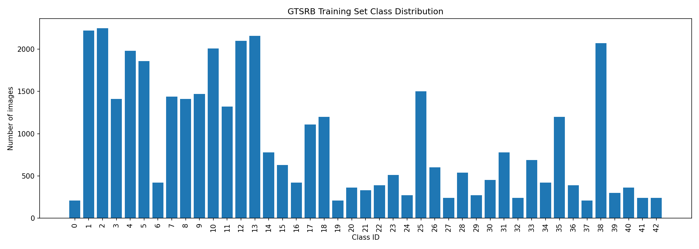

*The x-axis shows class IDs 0–42. A full mapping of ID to sign name is provided in `results/class_mapping.csv`. For reference: class 0 = Speed limit (20 km/h), class 14 = Stop, class 17 = No entry, class 38 = Keep right.*

The dataset is **not uniformly distributed**. The most frequent classes — for example Speed limit (30 km/h) with 1,552 training images — have roughly ten times as many samples as the rarest classes, such as Speed limit (20 km/h) with only 140 images.

| Metric | Value |
|--------|-------|
| Total training images | 39,209 |
| Number of classes | 43 |
| Most frequent class | Speed limit (30 km/h) — 1,552 images |
| Least frequent class | Speed limit (20 km/h) — 140 images |
| Imbalance ratio (max/min) | ~11× |

The **imbalance ratio of ~11×** means that the model sees roughly eleven times more examples of the most common sign than of the rarest one during training. In practice this creates a risk that the model learns to recognize frequent classes very reliably while rarely encountered classes receive insufficient training signal — potentially leading to worse performance on precisely the signs that appear infrequently in real traffic.

### 2.3 Sample Images

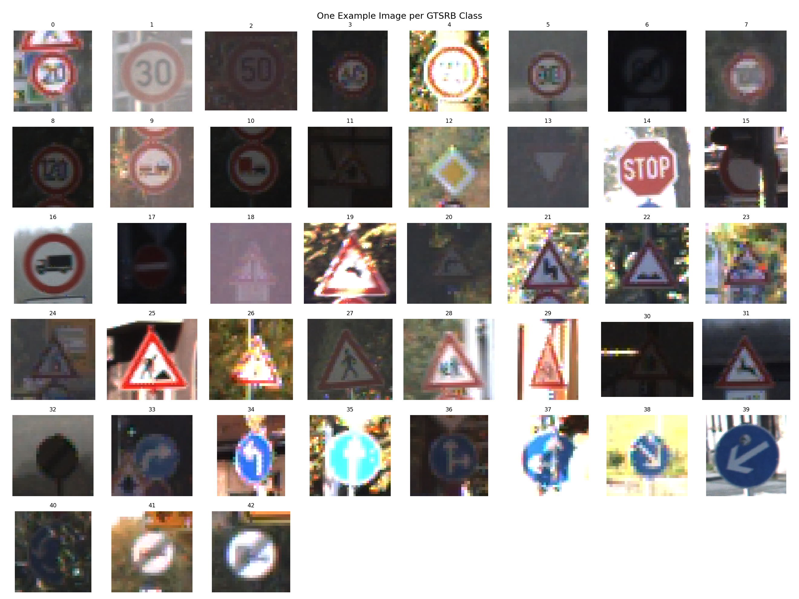

The sample grid shows one image per class (IDs 0–42, left to right, top to bottom). We verified the labels against the GTSRB class mapping — for example, the image at position 4 correctly shows a Speed limit (70 km/h) sign. The grid illustrates the visual diversity within the dataset: even within a single class, images vary in brightness, contrast, viewing angle, and background.

### 2.4 Data Source and Benchmark Context

The GTSRB dataset was introduced by Stallkamp et al. (2012) in their paper *"Man vs. Computer: Benchmarking Machine Learning Algorithms for Traffic Sign Recognition"* (Neural Networks, 32:323–332). The benchmark was run as a competition at the IJCNN 2011 conference.

The competition used a different evaluation setup from ours. Participants were given the full 39,209 labelled training images to train on, and were then evaluated on a separate official test set of 12,630 images whose labels were withheld until after submissions closed. The best-performing entry — a committee of CNNs — achieved **99.46%** on that official test set, surpassing the measured human recognition rate of **98.84%** on the same test set. These figures come from independent evaluations on the official held-out data.

In our project, we did not use the official test set (ground-truth labels were unavailable). Instead, we held out 15% of the 39,209 labelled images as our own test split. Our reported accuracy figures are therefore not directly comparable to the competition leaderboard, but the evaluation methodology is valid for comparing our five model variants against each other.

---

## 3. Data Preprocessing

### 3.1 Data Split

The 39,209 training images are divided into three non-overlapping subsets using a fixed random seed (42) for reproducibility:

| Split | Fraction | Images |
|-------|----------|--------|
| Training | 70% | 27,447 |
| Validation | 15% | 5,881 |
| Test | 15% | 5,881 |

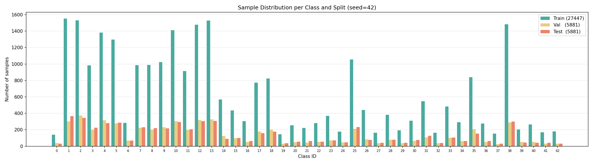

*The x-axis shows class IDs 0–42 (same mapping as Section 2.2: class 0 = Speed limit 20 km/h, class 14 = Stop, class 17 = No entry, class 38 = Keep right). Each bar group shows how many images of that class appear in each split.*

The split preserves the class proportions across all three subsets (stratified split) — the relative frequency of each class is approximately equal in training, validation, and test sets. This ensures that evaluation metrics are not distorted by split imbalance: a rare class with only 140 total images ends up with roughly 98 training, 21 validation, and 21 test images.

The validation set is used during training to monitor generalization and apply early stopping. The test set is held out entirely and evaluated only once per model. Using a fixed seed ensures that all model variants are evaluated on identical splits, making comparisons fair.

### 3.2 Image Transformations

All images are resized to **32×32 pixels** before processing. We chose this resolution as a deliberate tradeoff — it is compact enough for fast training on consumer hardware while retaining enough spatial detail for the model to distinguish sign shapes, symbols, and colors. Higher resolutions like 64×64 would increase computational cost substantially without guaranteed accuracy gains — a tradeoff we revisit in the Future Work section.

**Training transforms** apply stochastic augmentations to increase effective diversity:

| Transform | Parameters | Purpose |
|-----------|-----------|---------|
| Random Rotation | ±15° | Simulates tilted camera angles |
| Color Jitter | brightness ±0.4, contrast ±0.4, saturation ±0.3 | Simulates lighting and weather variation |
| Random Affine | translate ±10% | Simulates off-center sign placement |
| Normalize | mean=(0.3337, 0.3064, 0.3171), std=(0.2672, 0.2564, 0.2629) | Centers input distribution |

**Validation and test transforms** are fully deterministic — only resize, convert to tensor, and normalize. No augmentation is applied during evaluation, so measured accuracy honestly reflects model performance on unmodified inputs.

### 3.3 Normalization

Pixel values are converted from [0, 255] to floating-point [0.0, 1.0], then normalized per channel using the mean and standard deviation computed from the GTSRB training set. Without normalization, large differences in pixel scales across channels distort the loss surface and slow convergence.

### 3.4 Data Augmentation as Regularization

Augmentation artificially increases the effective diversity of the training set. The model never sees the exact same pixel values twice, which prevents memorization of specific training examples. This is particularly important for the rarest sign categories with fewer than 200 training samples.

### 3.5 Mini-Batch Loading and Early Stopping

Images are fed to the model in mini-batches of size 64. Mini-batch training introduces stochasticity into the optimization, which helps the optimizer escape poor local minima. Early stopping with patience 5 halts training when validation accuracy does not improve for five consecutive epochs, restoring the best-seen checkpoint for evaluation.

---

## 4. Baseline Model

### 4.1 Architecture

The baseline CNN consists of three convolutional blocks followed by a fully connected classifier.

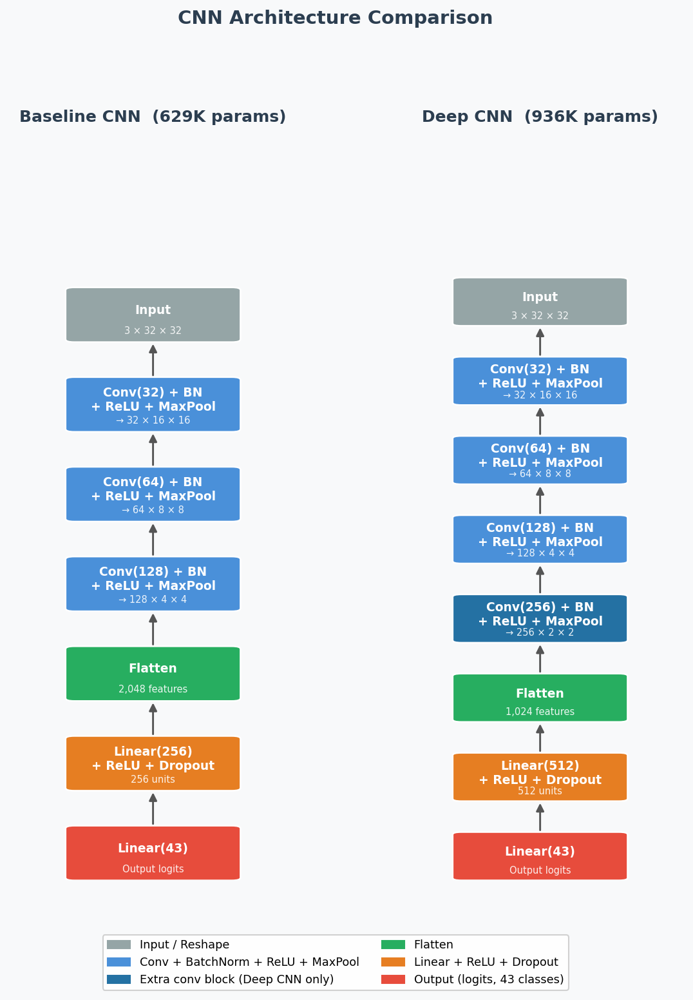

**Total trainable parameters: 629,291**

Each convolutional block applies a 3×3 convolution with padding=1 (preserving spatial dimensions), followed by Batch Normalization, ReLU activation, and 2×2 MaxPooling that halves the spatial dimensions. The classifier uses Dropout(0.5) during training and outputs raw logits — CrossEntropyLoss handles the softmax internally for numerical stability.

### 4.2 How Data Flows Through the Network

To make the architecture concrete, here is how a single 32×32 RGB image passes through the baseline CNN step by step:

**Input:** 3 × 32 × 32 — three color channels, 32×32 pixels each

**Block 1** — Conv(3→32 filters, 3×3) → BatchNorm → ReLU → MaxPool(2×2):
output shape `32 × 16 × 16`

**Block 2** — Conv(32→64 filters, 3×3) → BatchNorm → ReLU → MaxPool(2×2):
output shape `64 × 8 × 8`

**Block 3** — Conv(64→128 filters, 3×3) → BatchNorm → ReLU → MaxPool(2×2):
output shape `128 × 4 × 4`

**Flatten:** `128 × 4 × 4` → `2,048`-dimensional feature vector

**FC1** — Linear(2048→256) → ReLU → Dropout(0.5)

**FC2** — Linear(256→43) → 43 logits, one per class

Each MaxPool step halves the spatial resolution while each convolutional block doubles the number of feature maps. By the time the feature map reaches the classifier, the 2,048-dimensional vector encodes a rich summary of learned visual patterns from the original image. The final 43-dimensional output gives the model's confidence score for each traffic sign class before applying softmax.

### 4.3 Training Configuration and Parameter Rationale

| Hyperparameter | Value | Rationale |
|---------------|-------|-----------|
| Optimizer | Adam | Adapts learning rate per parameter; faster convergence than SGD on image tasks |
| Initial learning rate | 1×10⁻³ | Standard Adam default; confirmed by hyperparameter search |
| LR scheduler | ReduceLROnPlateau | Halves LR when validation plateaus; rescues stalled training |
| Loss function | CrossEntropyLoss | Standard for multi-class classification |
| Batch size | 64 | Balances gradient noise, memory, and training speed |
| Max epochs | 30 | Upper bound; early stopping engages before this |
| Early stopping patience | 5 | Prevents overfitting without stopping too early |
| Input size | 32×32 | Compact but sufficient resolution for sign recognition |

**Adam vs. SGD:** Standard Stochastic Gradient Descent (SGD) applies the same learning rate to every parameter. Adam (Adaptive Moment Estimation) tracks a running average of both gradients and squared gradients for each weight, effectively giving each parameter its own adaptive learning rate. This makes Adam significantly more robust to the choice of initial learning rate and typically converges faster on image classification tasks. For our architecture with hundreds of thousands of parameters, Adam was the natural choice.

**ReduceLROnPlateau:** Even with Adam, training sometimes stalls — the optimizer reaches a region of the loss surface where gradients are small and progress stops. ReduceLROnPlateau detects this automatically: if validation loss does not improve for three consecutive epochs, it halves the learning rate. This allows the optimizer to take finer steps and escape the plateau. We observed this behavior consistently mid-training: accuracy would plateau for a few epochs, the learning rate would drop, and training would resume progress.

**Why 3×3 filters:** The 3×3 convolution kernel is the standard choice in modern CNNs — it captures local spatial patterns with minimal parameters (only 9 weights per filter) and multiple stacked 3×3 layers achieve the same receptive field as a single large kernel at lower computational cost. Two stacked 3×3 convolutions cover a 5×5 region; three layers cover 7×7.

**Doubling filter counts:** Going from 32 to 64 to 128 filters per block follows the established convention that deeper layers should have more channels to represent increasingly complex, higher-dimensional feature spaces.

### 4.4 Results

Two runs were conducted with different random seeds to verify stability:

| Seed | Best Val Accuracy | Test Accuracy | Test Loss |
|------|------------------|--------------|-----------|
| 42   | 98.78%           | 98.55%       | 0.0621    |
| 123  | 99.15%           | 99.29%       | 0.0451    |

Results are consistent across both seeds. The small difference is attributable to random weight initialisation and mini-batch ordering — both seeds converge to the same quality solution.

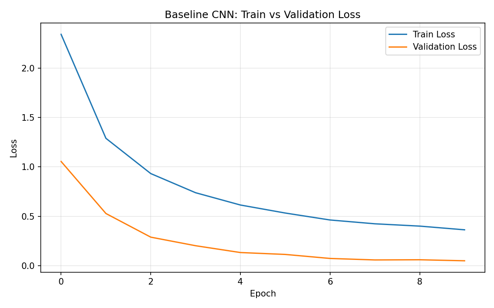

The loss curves show smooth convergence with no signs of severe overfitting — the training and validation curves track closely throughout, and early stopping engages after the validation plateau.

### 4.5 Why High Baseline Accuracy is Expected

The near-perfect baseline accuracy is not surprising when you consider the specific properties of GTSRB.

Traffic signs are explicitly **designed for human recognition** — they are standardized shapes (circles, triangles, octagons) with bold colors and unambiguous symbols. This means the dataset has very high inter-class variability (each of the 43 classes looks structurally distinct from all others) combined with very low intra-class variability (every instance of a class shares the same fundamental shape, color, and symbol). This is the ideal scenario for a classifier: the decision boundaries between classes are well-separated in feature space, which the t-SNE projection in Section 5.7 confirms visually.

GTSRB images are also **pre-cropped to the sign bounding box**, meaning the model only ever sees the sign itself — no distracting background, no need to localize the sign within a larger scene. This removes the hardest part of real-world recognition and frames the task as pure classification.

Finally, with approximately 900 training images per class on average and relatively simple visual structure, the dataset provides enough signal to train a reliable classifier without requiring massive model capacity.

For context: Stallkamp et al. (2012) measured the average human recognition rate on GTSRB at **98.84%** — already below the baseline CNN's 99.29%. This confirms that near-perfect CNN performance is not a sign of overfitting or data leakage, but is consistent with the established literature on this benchmark.

---

## 5. Model Improvements

### 5.1 Overview and Expectations

After establishing the baseline, we designed four architectural variants. Rather than testing arbitrary changes, each variant isolates exactly one design decision so that performance differences can be attributed clearly. Before training, our expectations were:

**Deep CNN** — most likely to improve. A fourth convolutional block gives the network capacity to learn more abstract features, helpful for fine symbolic differences between similar classes. We predicted a gain of roughly 0.2–0.5 pp.

**LeakyReLU CNN** — small effect expected. Dead neurons are a known ReLU issue, but BatchNorm already keeps activations healthy. We were not confident this would make a measurable difference.

**Stride CNN** — marginal change expected. Learned downsampling is theoretically more flexible than MaxPool, but MaxPool already works well on structured inputs. We expected similar accuracy with faster training.

**MobileNetV2** — competitive but not dominant. ImageNet features generalize broadly but GTSRB is a specialized domain. We expected it to excel on rare classes but lose out on parameter efficiency.

All variants were trained under identical conditions: Adam (lr=1×10⁻³), same scheduler, same augmentation, same data split, up to 20 epochs with early stopping.

| Model | Test Accuracy | Wrong / 5,881 | Parameters | Training Time |
|-------|-------------|:---:|-----------|:---:|
| Baseline CNN | 99.49% | 30 | 629,291 | 275.6 s |
| **Deep CNN** | **99.81%** | **11** | **936,235** | **284.0 s** |
| MobileNetV2 | 99.66% | 20 | 2,562,859 | 518.7 s |
| LeakyReLU CNN | 99.46% | 32 | 629,291 | 271.5 s |
| Stride CNN | 99.52% | 28 | 823,051 | 236.9 s |

Note: because the test set contains 5,881 samples, a difference of 0.1 percentage points corresponds to approximately six images. Differences below this threshold should not be overinterpreted as meaningful improvements.

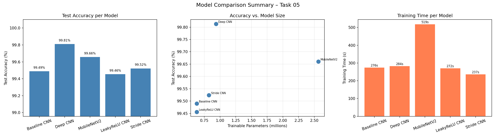

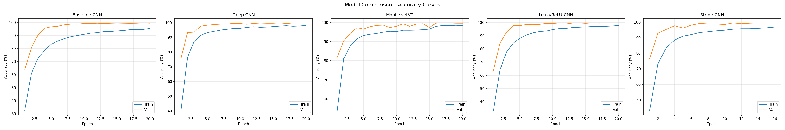

### 5.2 Variant A — Deep CNN

**What changed:** A fourth convolutional block was added (128→256 filters, 3×3 kernels, BatchNorm, ReLU, MaxPool), and the fully connected classifier was expanded from 256 to 512 hidden units. All other settings remain identical to the baseline.

**Why we expected this to help:** The baseline stops after three convolutional blocks, which gives the network a receptive field and feature hierarchy deep enough for simple patterns but potentially insufficient for the finer symbolic distinctions between sign types. A fourth block compresses the spatial resolution to 2×2 and pushes the number of feature channels to 256, forcing the network to learn more abstract, class-discriminative representations in the penultimate layer.

**Result:** The Deep CNN achieves **99.81% test accuracy** — only 11 wrong predictions out of 5,881. This confirms our prediction. With only a 49% increase in parameters and nearly identical training time (284 s vs. 276 s), it is the most cost-effective improvement we found.

### 5.3 Variant B — MobileNetV2 (Transfer Learning)

**What changed:** Instead of a custom CNN trained from scratch, we used MobileNetV2 (Sandler et al., 2018) pretrained on ImageNet — a general-purpose image dataset with 1.2 million images and 1,000 classes. A custom two-layer classifier head was attached and all weights including the backbone were fine-tuned on GTSRB. Inputs were resized to 32×32 and normalized using GTSRB channel statistics.

**Why we chose this:** Transfer learning is motivated by the insight that low-level visual features — edges, textures, color gradients — are shared across many image domains. The pretrained backbone provides a strong starting point, especially for the rarest GTSRB classes with fewer than 200 training images where learning from scratch may not converge well.

**Result:** MobileNetV2 achieves 99.66% — better than baseline, but at 4× the parameters (2.56M vs. 629K) and nearly 2× the training time (519 s vs. 276 s). For only a 0.17 pp gain, the additional cost is not justified on this dataset. The GTSRB training set is large enough for compact CNNs to learn excellent representations without ImageNet pretraining.

### 5.4 Variant C — LeakyReLU CNN

**What changed:** All ReLU activations were replaced with Leaky ReLU (negative slope = 0.01). Everything else is identical to the baseline.

**Why we considered this:** Standard ReLU outputs zero for any negative input, meaning its gradient is also zero. If a neuron's inputs are consistently negative — which can happen due to unlucky weight initialization or aggressive weight updates — it permanently stops learning. This is the "dead neuron" problem. Leaky ReLU prevents it by allowing a small gradient (0.01 × input) for negative values, keeping all neurons active.

**Result:** 99.46% — marginally below the baseline (99.49%). With BatchNorm normalizing activations before each ReLU, inputs are kept in a healthy range and dead neurons are not a significant problem at this scale. The theoretical advantage of Leaky ReLU does not materialize here.

### 5.5 Variant D — Stride CNN

**What changed:** MaxPool layers were replaced with strided convolutions (stride=2) for spatial downsampling. Instead of applying a fixed maximum rule, the network learns its own downsampling weights.

**Why we considered this:** MaxPool always selects the maximum value in each 2×2 window, which is a hand-designed rule that discards three out of four values. Strided convolutions learn how to optimally combine nearby values during downsampling, potentially preserving more task-relevant spatial information. The tradeoff is more parameters and less inductive bias.

**Result:** 99.52% and the **fastest training time** (236.9 s). The accuracy difference vs. baseline is within the noise threshold (0.03 pp). On a dataset where MaxPool already works well, the fixed rule is sufficient and the added flexibility of learned downsampling provides no measurable benefit.

### 5.6 Parameter Sensitivity

To understand how sensitive our results were to key hyperparameters, we ran a Bayesian hyperparameter search using Optuna (Akiba et al., 2019) with a Tree-structured Parzen Estimator (TPE) across learning rate (1×10⁻⁴ to 1×10⁻²), dropout (0.2–0.6), batch size (32/64/128), optimizer (Adam/SGD), and weight decay (1×10⁻⁵ to 1×10⁻³).

| Hyperparameter | Search Range | Most Effective Region |
|---------------|-------------|----------------------|
| Learning rate | 1×10⁻⁴ to 1×10⁻² | 5×10⁻⁴ to 2×10⁻³ |
| Dropout rate | 0.2 – 0.6 | 0.3 – 0.5 |
| Batch size | 32, 64, 128 | All similar |
| Optimizer | Adam, SGD | Adam consistently better |
| Weight decay | 1×10⁻⁵ to 1×10⁻³ | Low end (1×10⁻⁵ to 1×10⁻⁴) |

The key finding is that the dataset is relatively insensitive to hyperparameter choices within a reasonable range — all Adam trials with learning rate between 5×10⁻⁴ and 2×10⁻³ reached similar accuracy. SGD trials were more sensitive and required careful tuning. Batch size had almost no effect on final accuracy, only on training speed. Dropout below 0.3 led to marginally higher validation loss. This exploratory search confirmed that our manually chosen defaults sit in a well-performing region of the hyperparameter space and that the results are not an artifact of a lucky configuration.

### 5.7 Latent Space Visualisation

To understand what the network learned internally, feature vectors were extracted from the penultimate layer of the baseline CNN and projected to two dimensions using t-SNE (van der Maaten & Hinton, 2008) with perplexity 30. If the 43 classes form distinct clusters in the 2D projection, the network has learned a representation where similar signs are close together and different signs are far apart — providing interpretable evidence beyond accuracy numbers alone.

### 5.8 Autoencoder for Anomaly Detection

A key limitation of any classifier is that it always assigns an input to one of its known classes, even when the input is entirely outside the training distribution. We implemented a convolutional autoencoder as a complementary anomaly detection mechanism, applying the concept from Lecture 7.

The encoder compresses 3×32×32 images through three convolutional blocks down to a 128-dimensional latent vector; a mirrored decoder with transposed convolutions reconstructs the original image. Training is fully unsupervised and minimises the per-pixel MSE between input and reconstruction:

$$\mathcal{L}(\theta) = \frac{1}{n} \sum_{i=1}^{n} (\hat{a}_i - a_i)^2$$

After training, reconstruction error serves as an anomaly score — known signs are reconstructed accurately (low error), while degraded or unknown inputs produce high reconstruction error. A threshold at the 95th percentile of the validation error distribution flags such inputs as anomalous. This component was implemented as a proof-of-concept for Lecture 7; quantitative evaluation on out-of-distribution samples was beyond the scope of this project.

---

## 6. Model Evaluation

The Deep CNN was selected as the best model and evaluated in depth on the held-out test set.

### 6.1 Test Set Performance

| Metric | Value | Meaning |
|--------|-------|---------|
| Test Accuracy (Top-1) | **99.81%** | Share of test images where the model's first prediction is correct |
| Test Accuracy (Top-5) | **99.98%** | Share where the correct class appears in the top-5 predictions |
| Test Loss | 0.0061 | Average cross-entropy loss — lower is better, reflects prediction confidence |
| Wrong Classifications | 11 / 5,881 | Absolute number of incorrect predictions on the test set |

The Top-5 accuracy of 99.98% means the correct class appears among the model's five most confident predictions in all but two test cases — even when the top prediction is wrong, the model almost always assigns high probability to the correct class.

### 6.2 Confusion Matrix

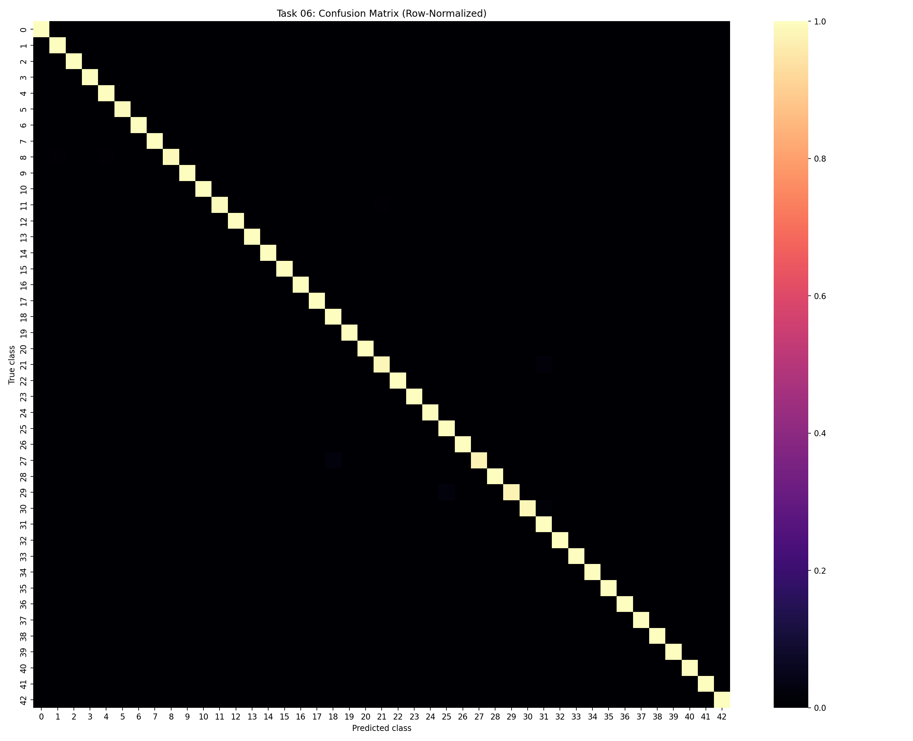

A confusion matrix shows, for each true class (rows), how the model distributed its predictions across all classes (columns). Each cell in row *i*, column *j* contains the fraction of images truly belonging to class *i* that were predicted as class *j*. A perfect classifier produces a pure diagonal matrix — every image is predicted as its true class.

Our confusion matrix is strongly diagonal, meaning the model is almost always correct. The few visible off-diagonal entries are concentrated among visually similar sign pairs — for example, different speed limit signs (30/50/80 km/h) that share circular shapes and differ only in the printed number, and warning signs with similar triangular layouts. These are precisely the hardest cases for any classifier operating at 32×32 resolution, where small numerical differences are difficult to resolve.

### 6.3 Per-Class Accuracy

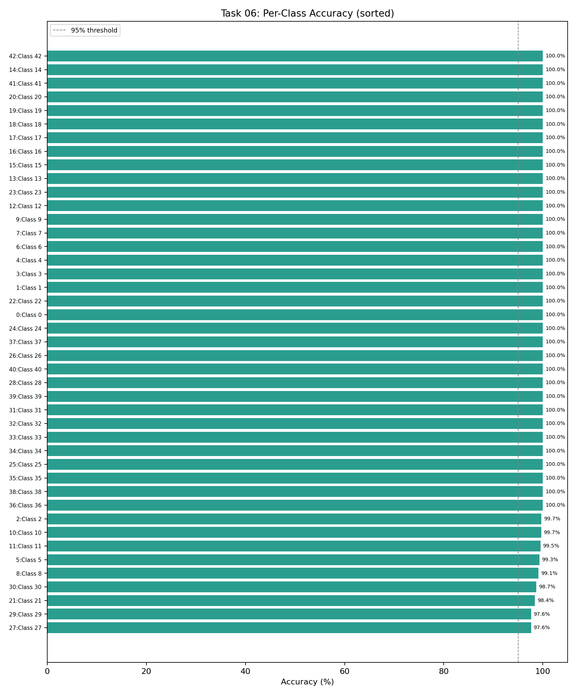

**Five best-performing classes (100% accuracy):** Stop, Dangerous curve left, Dangerous curve right, End of no passing, End of no passing by vehicles over 3.5t.

**Five worst-performing classes:**

| Class ID | Name | Test Accuracy | Likely Reason |
|----------|------|:---:|---------------|
| 27 | Pedestrians | 97.62% | Similar layout to class 18 (General caution) and class 26 (Traffic signals) |
| 29 | Bicycles crossing | 97.62% | Icon very similar to Pedestrians sign (class 27) |
| 21 | Double curve | 98.39% | Resembles single curve warning signs at low resolution |
| 30 | Beware of ice/snow | 98.67% | Snowflake detail difficult to resolve at 32×32 |
| 8  | Speed limit (120km/h) | 99.10% | "120" can be confused with "100" (class 7) at small sizes |

The pattern is clear: every underperforming class is visually similar to at least one neighbour. The Pedestrians and Bicycles crossing signs (classes 27 and 29) are particularly prone to confusion — both are triangular warning signs with a human silhouette icon. At 32×32 pixels, the difference between a pedestrian and a cyclist silhouette is only a handful of pixels. This is an inherent limitation of the 32×32 input resolution, not a fundamental failure of the model.

### 6.4 Precision and Recall

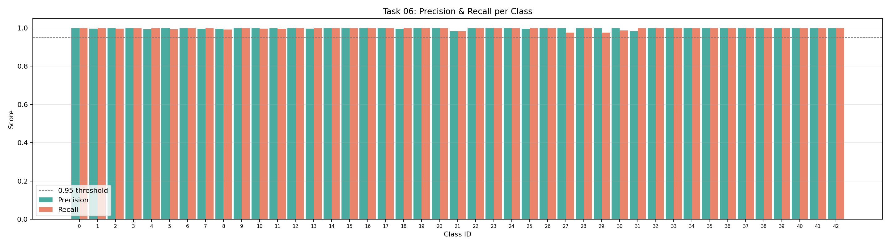

**Precision** measures how reliable the model is when it predicts a specific class: of all images the model labeled as class *X*, what fraction actually belongs to class *X*? Low precision means the model is generating many false positives for that class — confidently predicting signs that are actually something else.

**Recall** measures how complete the model's detection is: of all images that truly belong to class *X*, what fraction did the model correctly identify? Low recall means the model is missing many instances of that class — failing to recognize signs that were actually there.

Both metrics matter independently for traffic sign recognition. A model with high recall but low precision might correctly find all stop signs but also misclassify many other signs as stop signs — creating false alerts. A model with high precision but low recall might never raise a false alarm but miss real stop signs entirely — potentially dangerous in practice.

Our Deep CNN shows consistently high precision and recall across all 43 classes. The few classes with slightly reduced scores correspond exactly to the visually ambiguous categories identified in Section 6.3, confirming that the remaining errors are concentrated in genuinely hard cases rather than spread across all classes.

### 6.5 Misclassified Examples

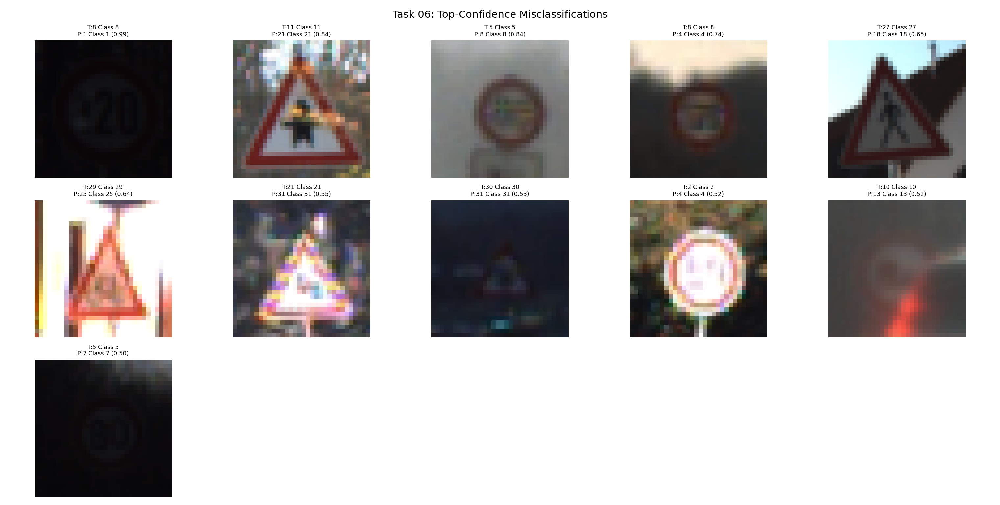

The misclassification grid shows the 11 incorrectly predicted test images, sorted by the model's (incorrect) confidence. In most cases the error is understandable: degraded image quality, partial occlusion, or strong visual similarity to another class. Errors are concentrated in genuinely hard cases, not systematic failures of an entire category.

### 6.6 Bias Analysis

A critical concern for deployment is whether the model performs disproportionately worse on underrepresented classes — a type of class frequency bias. We evaluated this by comparing the 10 most frequent and 10 least frequent classes by training count.

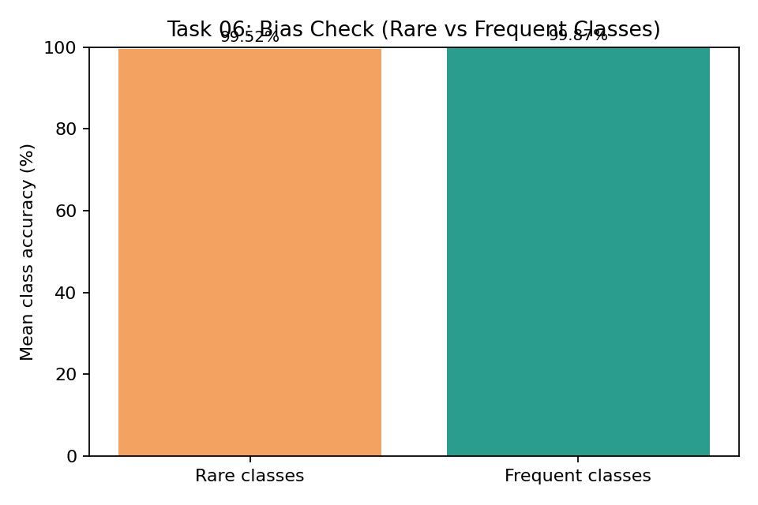

*Blue bars (left): the 10 most frequent classes, each with 1,000+ training images. Orange bars (right): the 10 rarest classes, each with fewer than 210 training images. The dashed lines show the mean accuracy for each group. Training counts (n=...) are shown inside each bar label.*

| Group | Training images (avg.) | Mean Test Accuracy |
|-------|----------------------|-------------------|
| Frequent classes (top 10) | ~1,374 per class | 99.87% |
| Rare classes (bottom 10) | ~169 per class | 99.52% |
| Gap | — | **0.34 percentage points** |

The 0.34 pp gap between the most and least represented classes is remarkably small. Notably, several of the rarest classes — Speed limit (20 km/h) with only 140 training images, Dangerous curve left with 145 — achieve 100% test accuracy. This suggests that the augmentation strategy and training procedure generalize well even for classes with very few examples, without requiring explicit oversampling or class weighting. These figures are based on a single training run and data split; the absolute gap may vary across runs. A model accurate on average but failing on rare classes would be unsuitable for deployment — rare signs require reliable recognition precisely because they appear infrequently in real traffic.

### 6.7 Robustness Testing

In real-world deployment, camera images are rarely as clean as the GTSRB training data. We evaluated the Deep CNN under two standard image perturbations applied at inference time — the model was not retrained with these distortions, so the test measures how well clean-trained features generalize to degraded inputs.

| Condition | Test Accuracy | Δ vs. Clean | What this simulates |
|-----------|-------------|:-----------:|---------------------|
| Clean | 99.81% | — | Ideal conditions |
| Gaussian Blur (kernel=5) | 97.01% | −2.80 pp | Motion blur, out-of-focus optics, fog |
| Gaussian Noise (σ=0.1) | 71.86% | **−27.95 pp** | Low-quality sensors, compression artifacts |

The model handles blur well — a 2.80 pp drop is minor and expected, since blurring mainly smooths fine details that may not be critical for sign recognition. The **Gaussian noise result is far more concerning**: a 27.95 pp accuracy drop from a moderate noise level (σ=0.1 applied to normalized [0,1] pixel values) reveals a significant vulnerability. CNNs trained exclusively on clean images learn to rely on precise pixel-level patterns that break down immediately when random noise distorts those patterns. This is the most critical gap between benchmark performance and real-world reliability. The practical fix is straightforward — adding noise augmentation during training — but was beyond the scope of this project.

### 6.8 Grad-CAM Interpretability

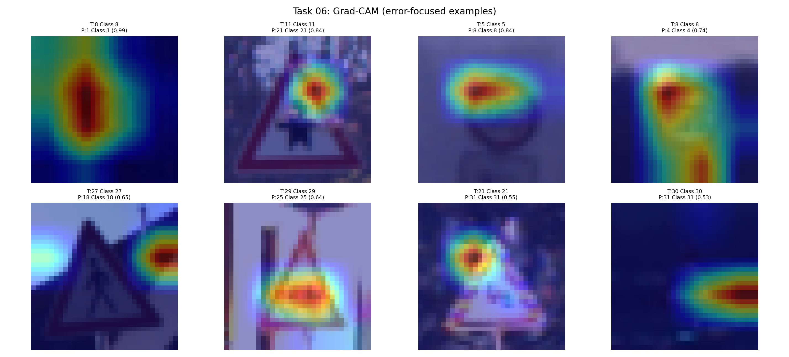

Gradient-weighted Class Activation Mapping (Grad-CAM; Selvaraju et al., 2017) is an interpretability technique that answers the question: *which parts of the input image did the model actually look at when making its prediction?* It works by computing the gradient of the predicted class score with respect to the activations of the final convolutional layer — regions with high gradient magnitude had the most influence on the prediction.

The visualizations provide evidence that the model consistently attends to the relevant sign regions — the shape, symbol, and color content — rather than background artifacts like sky, road, or surrounding objects. A model that relies on spurious correlations in the background would be fragile under any change of scene context. The Grad-CAM results suggest this is not the case here, giving us additional confidence that the model has learned meaningful visual representations.

---

## 7. Discussion

All five models exceed 99% test accuracy, which provides evidence that CNN-based classifiers are well-suited to the GTSRB task. The results largely matched our initial expectations. Adding a fourth convolutional block (Deep CNN) proved to be the most cost-effective improvement, gaining 0.32 percentage points over the baseline at nearly identical training time. The intuition was correct: additional depth allowed the network to learn more abstract feature representations that better separate visually similar classes. Transfer learning via MobileNetV2 delivered a smaller accuracy gain at four times the parameter count and twice the training time, confirming that the GTSRB training set is large enough for compact from-scratch CNNs to learn excellent representations without ImageNet pretraining. The results for Leaky ReLU and Stride CNN fell within the noise threshold, suggesting that BatchNorm is the dominant stabilizing factor and that the choice of activation function and downsampling method is secondary.

The bias analysis showed a 0.34 percentage point accuracy gap between the most and least frequent classes — a surprisingly small difference given the 11× class imbalance. The augmentation strategy and training procedure appear to generalize well even for the rarest classes. The Grad-CAM visualizations provide supporting evidence that predictions are based on sign-relevant features rather than background correlations. The noise robustness result was the one outcome that exceeded our expected severity — a 27.95 pp drop under moderate Gaussian noise is significant, and is the clearest gap between benchmark performance and real-world reliability. This is a well-known vulnerability of CNNs trained exclusively on clean data and would need to be addressed before any deployment in safety-critical scenarios.

Several limitations should be noted when interpreting the results. All improved model variants were trained once with a single random seed and a fixed data split; performance estimates would be statistically more reliable with multiple independent runs and cross-validation. The 32×32 input resolution discards spatial detail, which likely explains the reduced accuracy on visually similar classes like Pedestrians and Bicycles crossing. No noise or blur augmentation was applied during training, directly explaining the poor noise robustness. The dataset itself introduces additional biases: GTSRB was recorded exclusively on German roads, contains no damaged or vandalized signs, and was captured from a single camera system — all factors that limit generalisability to other real-world scenarios.

---

## 8. Future Work

The current system classifies pre-cropped traffic sign images under clean conditions, which is the right starting point for understanding the model's capabilities but leaves several important gaps for real-world applicability. The most impactful immediate improvement would be adding noise and blur augmentation during training, which would directly close the 27.95 pp robustness gap identified in Section 6.7 at minimal additional cost — this is a well-established technique and requires no architectural changes.

The more fundamental step toward deployment is integrating the classifier with an object detection stage. In real driving footage, signs must first be located within the full camera frame before they can be classified. A practical system would consist of three components: a detection module (e.g. YOLO) that identifies sign bounding boxes in the raw frame, the CNN classifier that processes each cropped sign, and the anomaly filter (autoencoder) that declines to classify inputs it has never seen before. This extended architecture is illustrated below:

```
┌─────────────────────────────────────────────────┐
│                Full Pipeline                     │
│                                                  │
│  CameraFrame → [Detector] → BoundingBoxes        │
│                                  │               │
│                             [Classifier]         │
│                                  │               │
│                          ClassLabel + Confidence │
│                                  │               │
│                          [AnomalyFilter]         │
│                                  │               │
│                        Accept / Reject           │
└─────────────────────────────────────────────────┘
```

The Detector and AnomalyFilter are the two missing components — the Classifier already exists in this project. Beyond detection, increasing the input resolution from 32×32 to 64×64 pixels would preserve more spatial detail and likely reduce confusion between visually similar classes such as Pedestrians and Bicycles crossing, at the cost of larger models and longer training. Cross-validation over multiple splits would also provide statistically more reliable performance estimates, particularly for the rarest classes. Finally, domain adaptation — fine-tuning on signs from other countries or adverse weather conditions — would reduce the selection bias introduced by GTSRB's exclusively German-roads origin and improve generalisability beyond this specific benchmark.

---

## 9. Conclusion

The central question was whether a compact from-scratch CNN can solve GTSRB reliably. It can: the Deep CNN reaches **99.81% test accuracy** with 936K parameters, misclassifying only 11 of 5,881 test images. Our structured comparison confirms that depth is the most cost-effective improvement, while transfer learning, alternative activations, and learned downsampling offer no meaningful advantage on a dataset of this size and structure. The pipeline handles class imbalance well (0.34 pp accuracy gap) and Grad-CAM provides evidence that the model learns sign-relevant features. The principal limitation is noise sensitivity (−27.95 pp at σ=0.1), which is the clearest remaining gap between benchmark performance and real-world reliability. Noise augmentation during training and integration with an object detector are the two most impactful next steps toward deployment.

---

## References

Stallkamp, J., Schlipsing, M., Salmen, J., & Igel, C. (2012). Man vs. computer: Benchmarking machine learning algorithms for traffic sign recognition. *Neural Networks*, 32, 323–332. https://doi.org/10.1016/j.neunet.2012.02.016

Sandler, M., Howard, A., Zhu, M., Zhmoginov, A., & Chen, L.-C. (2018). MobileNetV2: Inverted residuals and linear bottlenecks. *Proceedings of the IEEE Conference on Computer Vision and Pattern Recognition (CVPR)*, 4510–4520.

LeCun, Y., Bottou, L., Bengio, Y., & Haffner, P. (1998). Gradient-based learning applied to document recognition. *Proceedings of the IEEE*, 86(11), 2278–2324.

Akiba, T., Sano, S., Yanase, T., Ohta, T., & Koyama, M. (2019). Optuna: A next-generation hyperparameter optimization framework. *Proceedings of the 25th ACM SIGKDD International Conference on Knowledge Discovery & Data Mining*, 2623–2631.

Selvaraju, R. R., Cogswell, M., Das, A., Vedantam, R., Parikh, D., & Batra, D. (2017). Grad-CAM: Visual explanations from deep networks via gradient-based localization. *Proceedings of the IEEE International Conference on Computer Vision (ICCV)*, 618–626.

van der Maaten, L., & Hinton, G. (2008). Visualizing data using t-SNE. *Journal of Machine Learning Research*, 9, 2579–2605.

---

## Appendix: Generated Artifacts

| Task | Key Output Files |
|------|-----------------|
| Task 02 | `results/class_mapping.csv`, `results/task03/class_distribution.png` |
| Task 03 | `results/preprocessing_stats.json`, `results/preprocessing_sample_grid.png` |
| Task 04 | `models/baseline.pth`, `results/task04/baseline_history_seed-42.json`, `results/task04/baseline_loss_curve_seed-42.png` |
| Task 05 | `models/deep_cnn.pth`, `results/task05/model_comparison.json`, `results/task05/model_comparison_summary.png` |
| Task 06 | `results/task06/deep/evaluation_summary.json`, `results/task06/deep/gradcam_examples.png`, `results/task06/deep/confusion_matrix_normalized.png`, `results/task06/deep/bias_analysis_mean_accuracy.png` |
