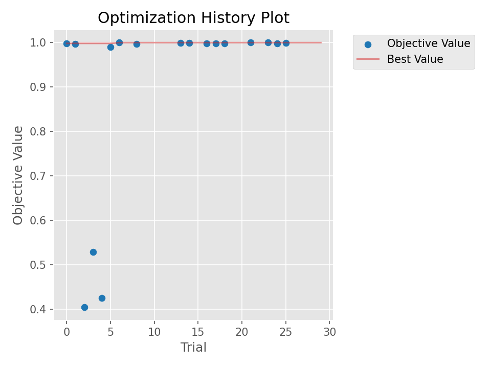
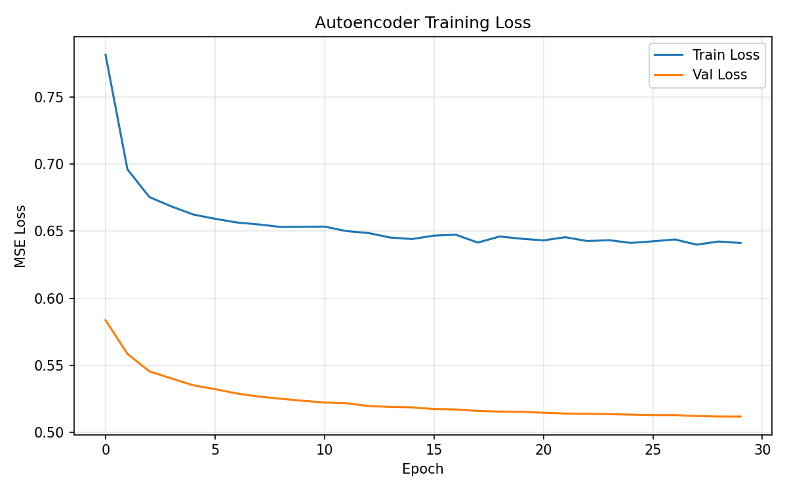
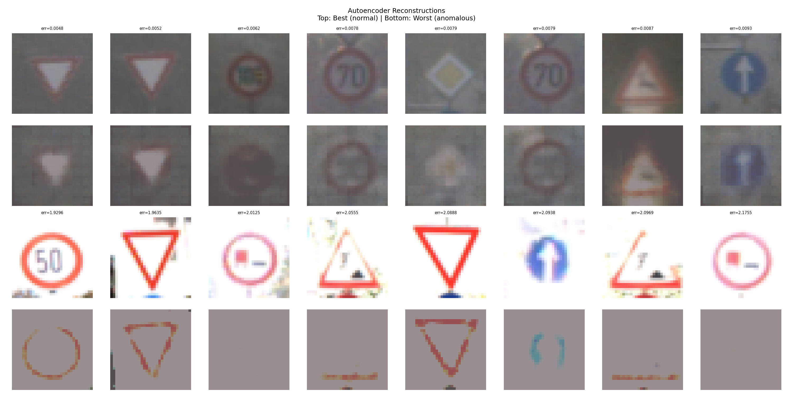
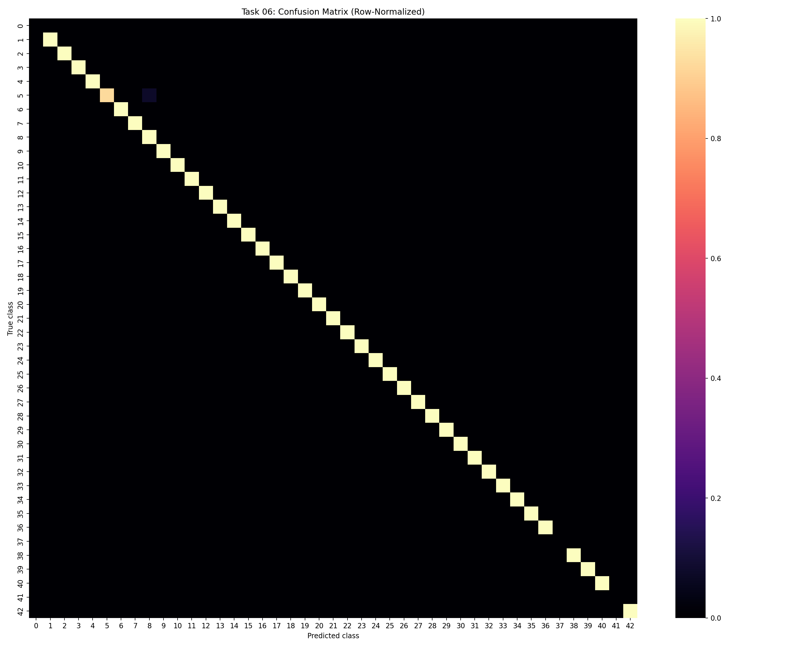
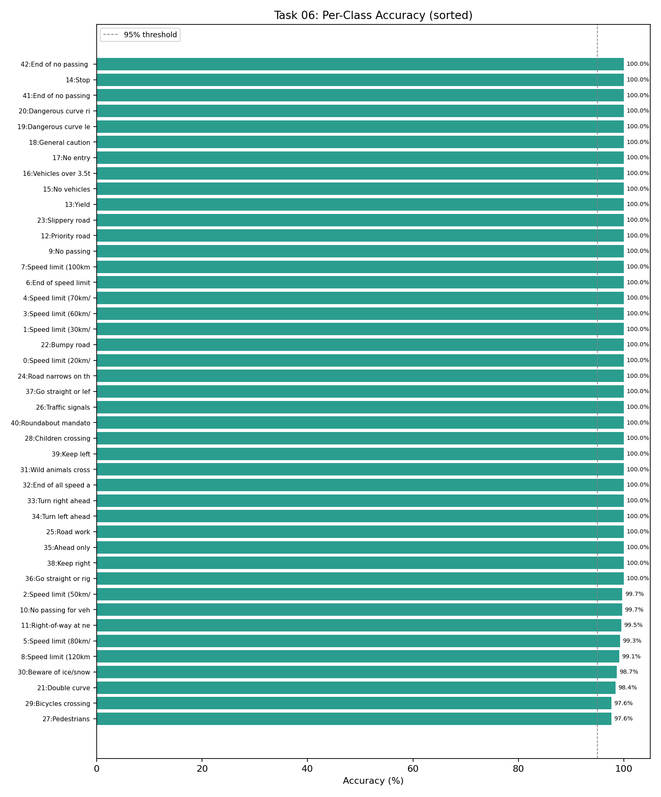
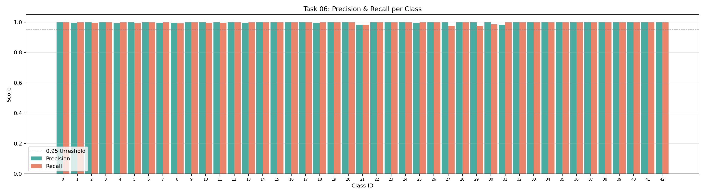
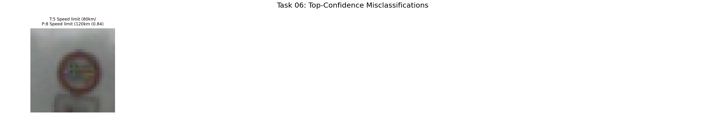
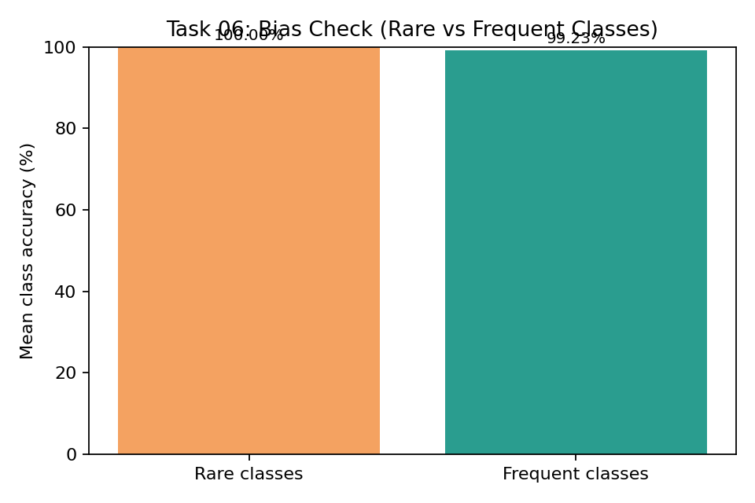

# CNN Traffic Sign Classification: Final Report

---

## Table of Contents

1. [Introduction](#1-introduction)
2. [Data and Preprocessing](#2-data-and-preprocessing)
3. [Baseline Model](#3-baseline-model)
4. [Architectural Comparison and Model Selection](#4-architectural-comparison-and-model-selection)
5. [Deep CNN Evaluation and Discussion](#5-deep-cnn-evaluation-and-discussion)
6. [Conclusion and Future Work](#6-conclusion-and-future-work)
7. [References](#references)
8. [Appendix](#appendix)

---

## 1. Introduction 

### 1.1 Problem Context, Approach, and Goal

Traffic sign recognition is a core component of driver assistance systems. Because traffic signs communicate safety-relevant instructions, misclassifying a speed limit or stop sign could lead to incorrect driving decisions. This project studies the problem using GTSRB — the German Traffic Sign Recognition Benchmark; the dataset is described in Section 2.

The project compares a compact baseline CNN with four model variants, each targeting one design decision: network depth, activation function, downsampling strategy, and transfer learning. CNNs are trained from scratch first because GTSRB images are pre-cropped to the sign bounding box, the visual domain is narrow, and classes follow standardised shapes and colours — conditions under which a purpose-built CNN may achieve strong performance at lower cost than transfer learning. The evaluation covers accuracy across all 43 classes, class-frequency bias, robustness to noise and blur, and Grad-CAM and latent space analysis for interpretability.

### 1.2 Assumptions

All accuracy figures are computed on an internal 15% hold-out split because the official GTSRB test labels were not available in our pipeline; results are not directly comparable to the competition leaderboard. The architectural comparison remains valid because all models are evaluated under identical conditions on the same split. Each image is assumed to contain exactly one sign with a correct label. The dataset was recorded exclusively on German roads under normal weather conditions, which constrains generalisation to other regions and scenarios.

---

## 2. Data and Preprocessing 

### 2.1 Dataset Overview

The GTSRB dataset (Stallkamp et al., 2012) was recorded from a car-mounted camera on German roads and contains **39,209 labelled images from the official training set** across **43 traffic sign classes** (IDs 0–42). Image dimensions vary widely, from 25×25 to 243×225 pixels, with a mean of approximately 50×50 pixels. The dataset covers speed limit signs, prohibitory signs, mandatory direction signs, warning signs, and right-of-way signs. Many classes share the same basic shape and differ only in a small internal detail, such as the numeral on a speed limit sign or the icon inside a warning triangle, making inter-class similarity one of the primary classification challenges.

### 2.2 Class Distribution and Visual Challenges

*The x-axis shows class IDs 0–42. The full class-ID-to-name mapping is provided in Appendix B.*

The dataset is not uniformly distributed. The most frequent class is Speed limit (50 km/h) (class ID 2) with **2,250 images**, while Speed limit (20 km/h) (class ID 0), Dangerous curve left (ID 19), and Go straight or left (ID 37) are the rarest, each with **210 images**, giving an imbalance ratio of approximately **10.7×**. After the 70% training split, the rarest classes contribute roughly 147 training images each. This imbalance risks weaker generalisation on underrepresented classes and motivates the per-class accuracy analysis in Section 5.

*IDs 0–42, left to right.*

The sample grid illustrates two complementary challenges. Within each class, images vary considerably in brightness, contrast, and viewing angle (intra-class variation the model must learn to ignore). Across classes, many signs share the same shape and differ only in one small detail (inter-class similarity that is the primary source of potential misclassification).

### 2.3 Benchmark Context and Evaluation Setup

GTSRB was used in the IJCNN 2011 competition, where participants were evaluated on a separate official test set of **12,630 images**. The best submitted system, a committee of CNNs, reached **99.46% accuracy**, surpassing the reported human recognition rate of **98.84%** (Stallkamp et al., 2012). Because the official test labels were not available in our pipeline, all accuracy figures in this report are computed on an internal 15% hold-out split and are not directly comparable to the competition leaderboard. They are valid for comparing the five evaluated models because all are evaluated under identical conditions on the same internal split.

### 2.4 Data Split

The 39,209 labelled images are divided into three non-overlapping subsets:

| Split | Fraction | Images |
|-------|----------|--------|
| Training | 70% | 27,447 |
| Validation | 15% | 5,881 |
| Test | 15% | 5,881 |

The training set is used to update model weights; the validation set monitors generalisation during training; the test set is reserved for final model evaluation. The split is performed with `torch.utils.data.random_split` and a fixed seed of 42, making it reproducible but not stratified. Exact class proportions across subsets are not guaranteed, but at this dataset size they are expected to remain close to the original distribution.

*The x-axis shows class IDs 0–42. Each bar group shows the image count per class per split.*

### 2.5 Preprocessing and Augmentation

All images are resized to **32×32 pixels** to provide a uniform input size. For the training set, random augmentations are applied on each pass; for validation and test, transforms are fully deterministic.

| Transform | Applied to | Parameters |
|-----------|------------|------------|
| Resize | All splits | 32×32 px |
| Random Rotation | Train only | ±15° |
| Color Jitter | Train only | brightness=0.4, contrast=0.4, saturation=0.3 |
| Random Affine | Train only | translate=±10% |
| ToTensor | All splits | Converts PIL image to float tensor |
| Normalize | All splits | mean=(0.3337, 0.3064, 0.3171), std=(0.2672, 0.2564, 0.2629) |

Augmentations are applied independently each epoch, acting as a regularisation mechanism that is especially beneficial for the rarest classes (~147 training images each). Normalisation statistics were computed from the GTSRB training set and applied identically to all splits; validation and test images receive only the deterministic transforms.

---

## 3. Baseline Model

### 3.1 Architecture and Design Decisions

Traffic signs are spatial visual objects, making a Convolutional Neural Network the appropriate model class. CNNs learn spatially local patterns through small filters and build up increasingly abstract representations layer by layer, making them more parameter-efficient and better suited to image classification than fully connected networks.

The baseline is a compact three-block CNN with **629,291 trainable parameters**.

Three convolutional blocks provide a compact and interpretable starting point for 32×32 inputs: after three 2×2 MaxPool operations the spatial dimensions reduce to 4×4, providing enough compression to capture global structure while retaining sufficient detail for classification. Each block follows the pattern: 3×3 convolution with padding 1 (to preserve spatial dimensions before pooling), Batch Normalization to stabilize activations, ReLU, and 2×2 MaxPooling to halve spatial resolution. The filter count increases from 32 in Block 1 to 64 in Block 2 and 128 in Block 3: later layers combine more primitive features into increasingly abstract representations and therefore require more channels as spatial dimensions shrink.

After the three blocks, the feature maps are flattened to a 2,048-dimensional vector and passed through a fully connected classifier: Linear(2,048 to 256), ReLU, Dropout(0.5), and Linear(256 to 43). Dropout regularizes the classifier by randomly zeroing half its activations during training. The final layer produces 43 raw logits, one per traffic sign class. CrossEntropyLoss handles the softmax conversion internally during training.

### 3.2 Forward Pass: From Image to Prediction

A single 32×32 RGB image enters as a 3×32×32 tensor and passes through the following stages:

| Stage | Output Shape | Representation |
|-------|-------------|----------------|
| Input | 3 × 32 × 32 | Raw pixel values |
| After Block 1 | 32 × 16 × 16 | Edges, colour gradients, simple textures |
| After Block 2 | 64 × 8 × 8 | Corners, curves, colour regions |
| After Block 3 | 128 × 4 × 4 | Shapes, symbols, structural patterns |
| After Flatten | 2,048 | Full feature summary |
| After FC1 | 256 | Compressed, class-discriminative representation |
| After FC2 | 43 | One confidence score per traffic sign class |

### 3.3 Training Configuration

| Hyperparameter | Value | Notes |
|---------------|-------|-------|
| Optimizer | Adam | Per-parameter adaptive learning rate; more stable than SGD |
| Initial learning rate | 1×10⁻³ | Close to the best value found in the hyperparameter search (Section 4.7) |
| LR scheduler | ReduceLROnPlateau (patience=3, factor=0.5) | Halves lr after 3 epochs without val loss improvement |
| Loss function | CrossEntropyLoss | Standard multi-class loss; handles softmax internally |
| Batch size | 64 | — |
| Max epochs | 20 | Stride CNN was the only model to trigger early stopping (epoch 16) |
| Early stopping patience | 5 | Restores best checkpoint when val accuracy does not improve for 5 epochs |

### 3.4 Baseline Results and Interpretation

**Why high accuracy is expected on GTSRB.** Traffic signs are designed for fast reliable recognition using standardized shapes, bold colors, and unambiguous symbols. All images are pre-cropped to the sign bounding box, so the model performs pure classification of well-framed images rather than detection. Under these conditions a compact CNN is expected to achieve strong performance.

**Seed stability runs.** The baseline was trained three times with different random seeds (42, 123, and 2026) to verify stability. All runs used a maximum of 10 epochs as a practical constraint for this exploratory phase:

| Seed | Best Val Accuracy | Test Accuracy | Test Loss |
|------|------------------|--------------|-----------|
| 42   | 98.78%           | 98.55%       | 0.0621    |
| 123  | 99.15%           | 99.29%       | 0.0451    |
| 2026 | 98.08%           | 98.16%       | 0.0642    |

All three runs produce high accuracy, but the spread of 1.13 pp across seeds confirms that 10-epoch runs had not yet fully converged. The more systematic multi-seed comparison in Section 4.6 uses 20 epochs.

The seed-42 curves show training and validation loss decreasing steadily without clear divergence, suggesting no strong overfitting.

**Canonical baseline for model comparison.** The model comparison in Section 4 uses a separate run in which all five evaluated models were trained under identical conditions with a maximum of 20 epochs. In that run the baseline reached **99.49% test accuracy** (30 wrong out of 5,881 test images). This is the canonical figure for all model comparisons. The three exploratory seed runs above serve only to confirm stability.

Stallkamp et al. (2012) report an average human recognition rate of 98.84% on the official GTSRB benchmark. Baseline accuracies around 99% on our internal split are therefore not surprising, although the figures are not directly comparable because they are based on different evaluation sets.

---

## 4. Architectural Comparison and Model Selection

### 4.1 Overview and Expectations

After establishing the baseline, we designed four architectural variants, each targeting one main design aspect. This controlled setup makes it easier to relate performance differences to the respective architectural change rather than to multiple changes at once. Beyond the four variants, this section also covers a hyperparameter sensitivity analysis, a latent space visualisation, and a convolutional autoencoder for anomaly detection.

We expected depth to help most and LeakyReLU to have little effect given that Batch Normalisation already mitigates dead neurons. MobileNetV2 was expected to perform competitively due to ImageNet pretraining but at higher cost.

All variants were trained under identical conditions: Adam (lr=1×10⁻³), ReduceLROnPlateau scheduler, identical data augmentation, and the same 70/15/15 split, capped at 20 epochs with early stopping (patience=5).

| Model | Test Accuracy | Wrong / 5,881 | Parameters | Training Time | Epochs |
|-------|-------------|:---:|-----------|:---:|:---:|
| Baseline CNN | 99.49% | 30 | 629,291 | 275.6 s | 20 |
| **Deep CNN** | **99.81%** | **11** | **936,235** | **284.0 s** | **20** |
| MobileNetV2 | 99.66% | 20 | 2,562,859 | 518.7 s | 20 |
| LeakyReLU CNN | 99.46% | 32 | 629,291 | 271.5 s | 20 |
| Stride CNN | 99.52% | 28 | 823,051 | 236.9 s | 16 |

The Stride CNN stopped at epoch 16 because early stopping triggered before the 20-epoch cap. Since the test set contains 5,881 images, a difference of 0.1 percentage points corresponds to approximately six samples; differences at or below this threshold should not be interpreted as meaningful.

### 4.2 Variant A: Deep CNN

The Deep CNN extends the baseline by adding a fourth convolutional block (128→256 channels) and expanding the fully connected hidden layer from 256 to 512 units. After four MaxPool operations on a 32×32 input, the spatial dimensions reduce to 2×2, giving a flattened size of 1,024 before the classifier. All other design choices remain identical to the baseline.

The additional depth allows the network to compress spatial information further and represent it in a higher-dimensional feature space, which can improve separability between classes that differ only in fine symbolic details. The Deep CNN achieves 99.81% test accuracy, reducing errors from 30 to 11. This gain is substantial relative to the small absolute error count and comes at only a modest increase in parameters (629K to 936K) and virtually unchanged training time. Among all tested variants, this is the most effective modification.

### 4.3 Variant B: MobileNetV2 (Transfer Learning)

This variant uses MobileNetV2 pretrained on ImageNet, with a custom two-layer classifier head replacing the original output layer. The full network is fine-tuned on GTSRB. The motivation is that low-level visual features such as edges, textures, and colour gradients are largely transferable across image domains, which could benefit classes with fewer training examples.

In practice, MobileNetV2 achieves 99.66% test accuracy, improving over the baseline but falling short of the Deep CNN. Compared with the baseline, it requires about four times as many parameters (2.56M vs. 629K) and nearly twice the training time (518.7 s vs. 275.6 s). GTSRB is sufficiently large and visually structured for compact CNNs to learn effectively from scratch, so transfer learning does not provide a clear efficiency advantage in this setting.

### 4.4 Variant C: LeakyReLU CNN

This variant replaces all ReLU activations with Leaky ReLU, which passes a small scaled gradient for negative inputs to prevent neurons from becoming permanently inactive. Standard ReLU sets all negative activations to zero, which can cause some neurons to stop contributing to learning. Leaky ReLU avoids this by allowing a small slope (0.01 by default) for negative values.

In this architecture, Batch Normalization already keeps activations well-scaled and centered, which largely mitigates the dead neuron problem. The single-run result (seed 42: 99.46%) suggested the change had no effect — marginally below the baseline and within noise range. However, multi-seed evaluation (Section 4.6) reveals this was a misleading outlier: across three seeds, the LeakyReLU CNN achieves a mean of 99.67% ± 0.03%, placing it second overall with the smallest variance of any model. The conclusion from the single run — that activation function choice is irrelevant when Batch Normalization is present — does not hold under more robust evaluation. The non-zero gradient for negative activations appears to improve training stability across different initialisations.

### 4.5 Variant D: Stride CNN

This variant replaces each MaxPool layer with a strided convolution (stride=2), making the downsampling operation learnable rather than fixed. In principle, this allows the network to retain more task-relevant spatial information during compression.

The Stride CNN achieves 99.52% test accuracy, which is within the noise threshold of the baseline (a difference of approximately 2 images on 5,881). It also has the fastest training time (236.9 s) and stopped at epoch 16 via early stopping. The accuracy difference relative to the baseline is not meaningful, suggesting that fixed MaxPool is already an effective downsampling strategy for this task and that learned downsampling provides no measurable benefit here.

### 4.6 Multi-Seed Stability Analysis

To assess whether the model comparison results from Section 4.1 generalise beyond a single training run, all five models — Baseline CNN, Deep CNN, LeakyReLU CNN, MobileNetV2, and Stride CNN — were each trained three times using seeds 42, 123, and 2026. All other training conditions (data split, augmentation, optimiser, 20-epoch budget) were held constant. Note that this experiment used a separate training script that seeds all four randomness sources (Python random, NumPy, PyTorch, and CUDA), whereas the Section 4.1 script seeds only PyTorch. The seed-42 entries in the table below therefore reflect a slightly different execution environment and are not intended to reproduce the Section 4.1 numbers exactly.

**Per-run results across all seeds:**

| Seed | Model | Test Acc | Test Loss | Train Time | Epochs |
|-----:|-------|--------:|--------:|-----------:|-------:|
| 42 | Baseline CNN | 99.20% | 0.0323 | 225 s | 16 |
| 42 | Deep CNN | 99.78% | 0.0077 | 293 s | 20 |
| 42 | LeakyReLU CNN | 99.63% | 0.0105 | 505 s | 20 |
| 42 | MobileNetV2 | 99.44% | 0.0197 | 530 s | 20 |
| 42 | Stride CNN | 99.46% | 0.0178 | 295 s | 20 |
| 123 | Baseline CNN | 99.64% | 0.0104 | 276 s | 20 |
| 123 | Deep CNN | 99.83% | 0.0075 | 289 s | 20 |
| 123 | LeakyReLU CNN | 99.69% | 0.0114 | 642 s | 20 |
| 123 | MobileNetV2 | 99.66% | 0.0105 | 529 s | 20 |
| 123 | Stride CNN | 99.30% | 0.0253 | 208 s | 14 |
| 2026 | Baseline CNN | 99.69% | 0.0118 | 281 s | 20 |
| 2026 | Deep CNN | 99.46% | 0.0190 | 216 s | 15 |
| 2026 | LeakyReLU CNN | 99.68% | 0.0124 | 645 s | 20 |
| 2026 | MobileNetV2 | 99.20% | 0.0299 | 529 s | 20 |
| 2026 | Stride CNN | 99.59% | 0.0120 | 300 s | 20 |

**Aggregated results (mean ± std over 3 seeds):**

| Rank | Model | Test Acc (mean ± std) | Parameters | Train Time (mean ± std) |
|-----:|-------|----------------------:|----------:|------------------------:|
| 1 | **Deep CNN** | **99.69% ± 0.17%** | 936,235 | 266 s ± 35 s |
| 2 | **LeakyReLU CNN** | **99.67% ± 0.03%** | 629,291 | 597 s ± 65 s |
| 3 | Baseline CNN | 99.51% ± 0.22% | 629,291 | 261 s ± 25 s |
| 4 | Stride CNN | 99.45% ± 0.12% | 823,051 | 268 s ± 43 s |
| 5 | MobileNetV2 | 99.43% ± 0.19% | 2,562,859 | 529 s ± 1 s |

The Deep CNN achieves the highest mean test accuracy (99.69%), although individual seed rankings still vary. The gap over the Baseline CNN in mean accuracy is 0.18 pp, which is small in absolute terms and should be interpreted as an average advantage rather than a consistent win in every seed.

The most notable finding from the multi-seed analysis concerns the LeakyReLU CNN. Its single-run result (99.46%, seed 42) placed it last among the CNN variants and appeared to suggest that replacing ReLU with Leaky ReLU had no benefit. The multi-seed data tells a different story: mean accuracy across three seeds is 99.67% ± 0.03%, placing it second overall and giving it the smallest variance of any model in the comparison. The seed-42 result was an outlier. This is a concrete illustration of why single-run comparisons can be misleading, particularly for differences smaller than 0.5 pp on this dataset.

Standard deviations vary substantially across models (0.03–0.22 pp). The LeakyReLU CNN's unusually low variance may be related to the non-zero gradient for negative activations, which prevents dead neurons and could promote more consistent convergence across different initialisations. This mechanism was not directly tested, however, and the low variance may also reflect other factors.

MobileNetV2 finishes last despite nearly twice the training time, corroborating the single-run conclusion that ImageNet pretraining offers no accuracy advantage in this setting. The within-model spread (Baseline CNN: 0.49 pp; Deep CNN: 0.37 pp) confirms that mean accuracy across seeds gives a substantially more reliable picture than any single run. Note that the LeakyReLU CNN's elevated training time despite identical parameter count likely reflects implementation or hardware factors rather than an inherent cost of the activation change.

### 4.7 Parameter Sensitivity

To assess whether our manually chosen hyperparameters fall in a robust region of the search space, we used Optuna (TPE sampler) to search over learning rate (1×10⁻⁴–1×10⁻², log scale), dropout (0.2–0.6), batch size (32/64/128), optimizer (Adam/SGD), and weight decay (1×10⁻⁵–1×10⁻³, log scale) on the Stride CNN architecture — 30 trials at 10 epochs each.

The best trial (trial 6) reached **99.91% validation accuracy** (note: 10-epoch trials reflect shorter training than the 20-epoch comparison runs):

| Hyperparameter | Best Value |
|---------------|-----------|
| Learning rate | 1.24×10⁻³ |
| Dropout | 0.274 |
| Batch size | 32 |
| Optimizer | Adam |
| Weight decay | 6.98×10⁻⁴ |

Adam appeared in all top-5 trials. The optimal learning rate (1.24×10⁻³) is close to our default (1×10⁻³), and the best dropout (0.274) is lower than our default (0.5), suggesting the Stride CNN requires less regularisation. These results support the view that our default settings are reasonable and the reported results are not the product of an especially lucky configuration.

### 4.8 Latent Space Visualisation

To examine what the Deep CNN has learned internally, 512-dimensional feature vectors were extracted from the penultimate fully connected layer for 2,000 validation samples and projected to two dimensions using t-SNE (perplexity 30).

The projection shows largely well-separated class clusters, indicating that the network has learned class-discriminative internal representations. Most of the 43 classes occupy distinct regions of the feature space. The remaining overlap appears mainly among visually similar sign groups, particularly speed limit signs (which share the same circular shape and differ only in the numeral) and warning signs with similar triangular layouts. This pattern is consistent with the confusion cases identified in the per-class accuracy analysis in Section 5.3.

### 4.9 Autoencoder for Anomaly Detection

Any classifier always assigns an input to one of its known classes, even when the input lies outside the training distribution. To provide a complementary mechanism for flagging such cases, we trained a convolutional autoencoder as an auxiliary anomaly detector.

The encoder compresses each 3×32×32 image through three convolutional blocks to a 128-dimensional latent vector; the decoder reconstructs the original image using transposed convolutions. Training minimises mean squared reconstruction error. The anomaly threshold is set at the 95th percentile of validation reconstruction errors, so approximately 5% of in-distribution images are flagged by construction.

The model trained for all 30 epochs without early stopping. Both losses decreased steadily, with the final validation loss converging to **0.5118**.

| Metric | Value |
|--------|-------|
| Mean reconstruction error | 0.5118 |
| Std deviation | 0.3220 |
| Min / Max error | 0.0048 / 2.1755 |
| Anomaly threshold (95th percentile) | 1.0910 |
| Flagged as anomalous (validation set) | 294 / 5,881 (5.0%) |

The reconstruction grid shows that the autoencoder captures the general structure of traffic signs: shapes, colors, and boundaries are reproduced reasonably well. Fine details such as numerals and symbols are blurred, which is expected at 128-dimensional compression. Because no true out-of-distribution test set was available, the anomaly detection capability was not validated beyond the in-distribution false-positive rate. This component should be understood as a proof of concept rather than a validated deployment-ready anomaly filter.

---

## 5. Deep CNN Evaluation and Discussion

The model comparison in Section 4 identified the Deep CNN as the best-performing architecture: it achieves the highest mean test accuracy across three seeds (99.69% ± 0.17%) and, in the single-run evaluation (seed 42), reduced errors from 30 to 11 relative to the baseline — all at near-baseline training cost. This section does not revisit the model comparison. Instead, it evaluates the selected Deep CNN in detail on the held-out test set, examining prediction quality (Sections 5.1–5.5), class-frequency bias (Section 5.6), robustness to image degradation (Section 5.7), and gradient-based interpretability (Section 5.8). The discussion in Section 5.9 synthesises these findings.

### 5.1 Test Set Performance

| Metric | Value | Meaning |
|--------|-------|---------|
| Test Accuracy (Top-1) | **99.81%** | Share of test images where the model's first prediction is correct |
| Test Accuracy (Top-5) | **99.98%** | Share where the correct class appears in the top-5 predictions |
| Test Loss | 0.0061 | Average cross-entropy loss (lower is better; reflects prediction confidence) |
| Wrong Classifications | 11 / 5,881 | Absolute number of incorrect predictions on the test set |

The Top-5 accuracy of 99.98% means that the correct class appears among the model's five most confident predictions in all but one test case. This helps distinguish serious mistakes from near-misses. Still, Top-1 accuracy is the more important metric for a real traffic sign classifier because the system ultimately has to make one final decision.

### 5.2 Confusion Matrix

The confusion matrix is strongly diagonal, so the model is correct in almost all cases. The few visible errors mostly happen between visually similar signs, for example different speed limits that share the same circular shape and differ only in the number, or warning signs with similar triangular layouts. This is expected at 32×32 resolution, where small symbols or numbers may only cover a few pixels.

### 5.3 Per-Class Accuracy

**Five best-performing classes (100% accuracy):** Stop, Dangerous curve left, Dangerous curve right, End of no passing, End of no passing by vehicles over 3.5t.

**Five worst-performing classes:**

| Class ID | Name | Test Accuracy | Likely Reason |
|----------|------|:---:|---------------|
| 27 | Pedestrians | 97.62% | Similar layout to class 18 (General caution) and class 26 (Traffic signals) |
| 29 | Bicycles crossing | 97.62% | Icon very similar to Pedestrians sign (class 27) |
| 21 | Double curve | 98.39% | Resembles single curve warning signs at low resolution |
| 30 | Beware of ice/snow | 98.67% | Snowflake detail difficult to resolve at 32×32 |
| 8  | Speed limit (120 km/h) | 99.10% | "120" can be confused with "100" (class 7) at small sizes |

All five worst-performing classes share near-identical shapes with neighbouring classes — a resolution constraint rather than a general model failure.

### 5.4 Precision and Recall

The Deep CNN shows high precision and recall across all 43 classes. The few weaker scores match the visually ambiguous classes from Section 5.3. This means the remaining errors are concentrated in genuinely difficult cases rather than spread randomly across the dataset.

### 5.5 Misclassified Examples

The misclassification grid shows the 11 wrongly predicted test images, sorted by the model's confidence in the wrong class. Most errors are understandable: the images are degraded, partially occluded, or very similar to another class. The errors do not suggest that the model completely fails on any one category.

### 5.6 Class Frequency Bias Analysis

To test whether the 10.7× class imbalance leads to lower accuracy on rare classes, we compare the 10 most frequent with the 10 rarest classes.

| Group | Training images (avg.) | Mean Test Accuracy |
|-------|----------------------|-------------------|
| Frequent classes (top 10) | ~1,374 per class | 99.87% |
| Rare classes (bottom 10) | ~169 per class | 99.52% |
| Gap | N/A | **0.34 percentage points** |

The gap is only 0.34 pp despite the 11-fold imbalance, and several rare classes reach 100% accuracy, suggesting the model generalised well to rare classes. Whether augmentation was the primary compensating factor was not isolated in this analysis. This result should be interpreted cautiously: rare classes have fewer test images, so a single mistake shifts their accuracy significantly, and repeated runs would be needed for a robust estimate.

### 5.7 Robustness Testing

In real-world use, camera images are rarely as clean as the GTSRB images. We tested the Deep CNN with two common image distortions at inference time. The model was not retrained with these distortions, so this test shows how well a clean-trained model handles degraded inputs.

| Condition | Test Accuracy | Δ vs. Clean | What this simulates |
|-----------|-------------|:-----------:|---------------------|
| Clean | 99.81% | baseline | Ideal conditions |
| Gaussian Blur (kernel=5) | 97.01% | −2.81 pp | Motion blur, out-of-focus optics, reduced sharpness |
| Gaussian Noise (σ=0.1) | 72.01% | **−27.80 pp** | Low-quality sensors, compression artifacts |

The model handles blur well (−2.81 pp), suggesting it does not depend on perfectly sharp edges. Gaussian noise is far more damaging: accuracy falls by 27.80 pp under σ=0.1 on normalised pixel values. This is a distribution shift failure — the model was trained exclusively on clean images and never encountered noisy inputs.

### 5.8 Grad-CAM Interpretability

Gradient-weighted Class Activation Mapping (Grad-CAM) highlights which image regions contributed most to the model's prediction. The visualisations show that the model mainly focuses on the sign shape and internal symbol rather than background elements such as sky or road. Grad-CAM does not prove the full reasoning process, but it supports the interpretation that the model learned sign-relevant features rather than background shortcuts.

### 5.9 Discussion

Most of the remaining errors involve class pairs where the distinguishing feature occupies only a few pixels after resizing — a resolution constraint rather than a systematic model failure. Precision and recall remain high across nearly all classes, and the 0.34 pp frequency-bias gap is small. Grad-CAM supports that predictions rely on sign-relevant regions. The single practical weakness is robustness: the 27.80 pp noise drop reveals that clean benchmark accuracy does not generalise to degraded inputs, which matters more than the small differences between architectures on the clean test set.

### 5.10 Limitations

There are several limitations. First, all five models were evaluated across three random seeds (42, 123, 2026), which provides a more reliable average comparison but does not substitute for cross-validation or evaluation on multiple independent data splits. Since the number of mistakes is very small, even a few images can change the reported accuracy significantly for a single run, which the seed spread of 0.37–0.49 pp per model illustrates. Second, the 32×32 input resolution removes some visual detail, which likely contributes to confusion between similar classes such as Pedestrians and Bicycles crossing. Third, the model was not trained with noise or blur augmentation, which explains the robustness problem in Section 5.7. Finally, GTSRB itself is limited: it was recorded on German roads with one camera system and does not include many damaged signs, vandalised signs, unusual weather conditions, or non-German sign designs. These factors limit how well the results generalise to real-world deployment.

---

## 6. Conclusion and Future Work

### 6.1 Conclusion

This project evaluated five CNN architectures on the GTSRB traffic sign classification task. Three main findings emerged.

First, a compact CNN trained from scratch is already strong enough for this task. The 629K-parameter baseline reaches 99.49% test accuracy on our internal split — in the same broad range as the human recognition rate of 98.84% reported by Stallkamp et al. (2012) on the official test set.

Second, additional depth produced the strongest single-run improvement and the highest mean accuracy across seeds, while LeakyReLU showed the most stable multi-seed performance. Adding a fourth convolutional block raised test accuracy to 99.81% and reduced errors from 30 to 11 at near-baseline training cost. The multi-seed analysis revised two initial rankings: LeakyReLU CNN, which appeared last in the single run, achieved the second-highest mean accuracy (99.67% ± 0.03%) and the lowest variance across seeds. MobileNetV2 showed no stable advantage on average despite requiring nearly twice the training time, confirming that ImageNet pretraining offers no clear benefit when the target domain is narrow and well represented in the training data.

Third, clean benchmark accuracy does not reflect robustness to input degradation. Accuracy drops by 27.80 pp under moderate Gaussian noise — a direct consequence of training exclusively on clean images. This distribution shift problem is the main unresolved challenge; class-frequency bias was small (0.34 pp gap), and Grad-CAM indicates predictions are driven by sign-relevant regions.

### 6.2 Future Work

The most important next step is adding noise and blur augmentation during training to close the robustness gap. Increasing the input resolution to 64×64 px would address the visual ambiguity problems identified in Section 5.3. Validation across independent data splits (rather than multiple seeds of a fixed split) would further confirm the model ranking. In the longer term, adding an object detection stage is necessary to move from cropped benchmark classification to a full road-scene recognition pipeline; testing on data from other countries and weather conditions would then give a more realistic view of generalisation.

---

## References

Stallkamp, J., Schlipsing, M., Salmen, J., & Igel, C. (2012). Man vs. computer: Benchmarking machine learning algorithms for traffic sign recognition. *Neural Networks*, 32, 323–332. https://doi.org/10.1016/j.neunet.2012.02.016

---

## Appendix

### Appendix A: Generated Artifacts

| Task | Key Output Files |
|------|-----------------|
| Task 02 | `results/task02/class_mapping.csv`, `results/task02/class_distribution.png` |
| Task 03 | `results/task03/preprocessing_stats.json`, `results/task03/preprocessing_sample_grid.png` |
| Task 04 | `models/baseline.pth`, `results/task04/baseline_history_seed-42.json`, `results/task04/baseline_loss_curve_seed-42.png` |
| Task 05 | `models/deep_cnn.pth`, `results/task05/model_comparison.json`, `results/task05/model_comparison_summary.png`, `results/task05/multiple_run_models/multiseed_summary.json`, `results/task05/multiple_run_models/multiseed_per_run.json` |
| Task 06 | `results/task06/evaluation_summary.json`, `results/task06/gradcam_examples.png`, `results/task06/confusion_matrix_normalized.png`, `results/task06/bias_analysis_mean_accuracy.png` |

---

### Appendix B: GTSRB Class ID Legend

| ID | Class Name | ID | Class Name | ID | Class Name | ID | Class Name |
|----|------------|----|------------|----|------------|----|------------|
| 0 | Speed limit (20 km/h) | 11 | Right-of-way at next intersection | 22 | Bumpy road | 33 | Turn right ahead |
| 1 | Speed limit (30 km/h) | 12 | Priority road | 23 | Slippery road | 34 | Turn left ahead |
| 2 | Speed limit (50 km/h) | 13 | Yield | 24 | Road narrows on the right | 35 | Ahead only |
| 3 | Speed limit (60 km/h) | 14 | Stop | 25 | Road work | 36 | Go straight or right |
| 4 | Speed limit (70 km/h) | 15 | No vehicles | 26 | Traffic signals | 37 | Go straight or left |
| 5 | Speed limit (80 km/h) | 16 | Vehicles over 3.5t prohibited | 27 | Pedestrians | 38 | Keep right |
| 6 | End of speed limit (80 km/h) | 17 | No entry | 28 | Children crossing | 39 | Keep left |
| 7 | Speed limit (100 km/h) | 18 | General caution | 29 | Bicycles crossing | 40 | Roundabout mandatory |
| 8 | Speed limit (120 km/h) | 19 | Dangerous curve left | 30 | Beware of ice/snow | 41 | End of no passing |
| 9 | No passing | 20 | Dangerous curve right | 31 | Wild animals crossing | 42 | End of no passing by vehicles over 3.5t |
| 10 | No passing for vehicles over 3.5t | 21 | Double curve | 32 | End of all speed and passing limits | | |

---

### Appendix C: Current Class Structure and Extension Points

All five classifier models share a common design: they inherit from PyTorch's `nn.Module` base class and expose a `features` extractor and a `classifier` head. The autoencoder follows the same base class but uses an encoder-decoder structure. The diagram below shows the current class hierarchy and marks the three components not yet implemented (tagged `future extension`):

```mermaid
classDiagram
    class nn_Module {
        <<PyTorch Base>>
        +forward(x) Tensor
    }

    class BaselineCNN {
        +features: Sequential
        +classifier: Sequential
        +forward(x) Tensor
    }

    class DeepCNN {
        +features: Sequential
        +classifier: Sequential
        +forward(x) Tensor
    }

    class LeakyReLUCNN {
        +features: Sequential
        +classifier: Sequential
        +forward(x) Tensor
    }

    class StrideCNN {
        +features: Sequential
        +classifier: Sequential
        +forward(x) Tensor
    }

    class MobileNetTransfer {
        +features: Sequential
        +classifier: Sequential
        +pool: AdaptiveAvgPool2d
        +forward(x) Tensor
    }

    class ConvAutoencoder {
        +encoder: Sequential
        +decoder: Sequential
        +threshold: float
        +forward(x) Tensor
        +is_anomaly(x) bool
    }

    class ObjectDetector {
        <<future extension>>
        +detect(frame) BoundingBoxes
    }

    class SignClassifier {
        <<future extension>>
        +model: nn_Module
        +classify(crop) ClassLabel
    }

    class FullPipeline {
        <<future extension>>
        +detector: ObjectDetector
        +classifier: SignClassifier
        +anomaly_filter: ConvAutoencoder
        +run(frame) Result
    }

    nn_Module <|-- BaselineCNN
    nn_Module <|-- DeepCNN
    nn_Module <|-- LeakyReLUCNN
    nn_Module <|-- StrideCNN
    nn_Module <|-- MobileNetTransfer
    nn_Module <|-- ConvAutoencoder
    nn_Module <|-- ObjectDetector
    FullPipeline o-- ObjectDetector
    FullPipeline o-- SignClassifier
    FullPipeline o-- ConvAutoencoder
    SignClassifier o-- nn_Module
```

`ObjectDetector` would wrap a detection model such as YOLO and locate sign bounding boxes in raw camera frames. `SignClassifier` would wrap any existing classifier and apply it to each detected crop. `FullPipeline` would compose all three components into a deployable system. Because all classifiers already share the same `forward(x)` interface, any of the five existing models can be plugged into `SignClassifier` without changes to the surrounding pipeline code.
