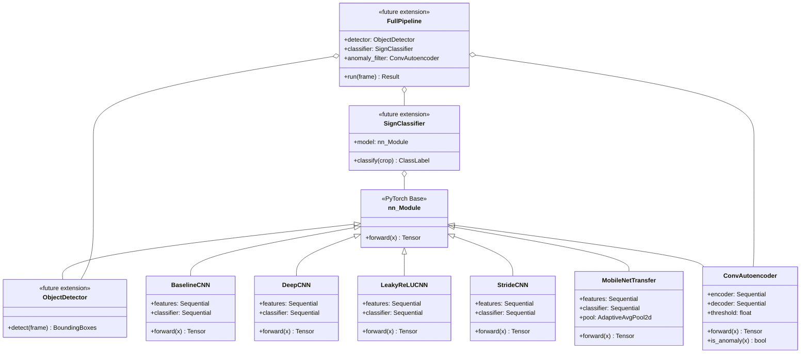

# CNN Traffic Sign Classification: Final Report
**German Traffic Sign Recognition Benchmark (GTSRB)**

---

## Table of Contents

1. [Introduction](#1-introduction)
2. [Dataset and Data Analysis](#2-dataset-and-data-analysis)
3. [Data Preprocessing](#3-data-preprocessing)
4. [Baseline Model](#4-baseline-model)
5. [Model Improvements](#5-model-improvements)
6. [Model Evaluation](#6-model-evaluation)
7. [Discussion](#7-discussion)
8. [Future Work](#8-future-work)
9. [Conclusion](#9-conclusion)

---

## 1. Introduction

### 1.1 Problem Context and Motivation

Traffic sign recognition is an important component of modern driver assistance systems and autonomous driving pipelines. In real-world applications, a classifier must recognize signs under changing illumination, partial occlusion, motion blur, and different viewing distances. These conditions directly affect how much visual information is available in an image. Because traffic signs communicate legally and safety-relevant instructions, misclassifying a speed limit, priority sign, or stop sign could lead to incorrect driving decisions. This makes reliable classification not only a technical challenge, but also a safety-relevant one.

To study this problem in a controlled and reproducible way, this project uses the German Traffic Sign Recognition Benchmark (GTSRB), a widely used dataset for traffic sign classification. A detailed description of the dataset, including its class distribution and visual properties, is provided in Section 2.

### 1.2 Project Approach

This project investigates how far compact convolutional neural networks can be pushed on the GTSRB classification task before comparing them with a pretrained model. Instead of starting directly with transfer learning, we first trained CNNs from scratch. This choice was motivated by the structure of the dataset: the images are already cropped around traffic signs, the visual domain is narrow, and the classes follow standardized color and shape patterns. Under these conditions, a purpose-built CNN may be sufficient to achieve strong performance with lower computational cost.

The project follows six main stages: dataset analysis, preprocessing, baseline model development, architectural experimentation, evaluation, and interpretation of results. The baseline model provides a reference point for later comparisons. The architectural variants then change selected design choices individually, including network depth, activation function, downsampling strategy, and transfer learning. This controlled setup makes it easier to interpret whether a performance difference is caused by a specific architectural change rather than by several changes at once.

### 1.3 Goal of the Project

The goal of this project is to systematically evaluate how different CNN architectures perform on the GTSRB traffic sign classification task and to understand which design decisions actually drive performance improvements. This includes assessing how well a compact from-scratch CNN generalizes across all 43 sign classes, including rare classes, and how robust the best model is under simulated image degradations such as noise and blur.

Beyond raw accuracy, the project aims to provide interpretable evidence for model behavior. For this purpose, the evaluation includes class-level performance analysis, bias analysis, Grad-CAM visualizations, and latent space inspection. These analyses help explain not only which model performs best, but also where the models struggle and which limitations remain.

---

## 2. Dataset and Data Analysis

### 2.1 Dataset Overview

The GTSRB dataset was recorded from a car-mounted camera on German roads. It contains **39,209 training images** across **43 traffic sign classes** (class IDs 0 through 42). Images are provided in PPM format at varying resolutions, ranging from as small as 15×15 pixels to over 250×250 pixels. This variability reflects real-world conditions where a sign may appear very small in the distance or large and close-up.

The dataset covers a wide variety of sign categories: speed limit signs of different values, prohibitory signs, mandatory direction signs, warning signs, and right-of-way signs. Many of these are visually similar. For example, different speed limit values share the same circular red-bordered shape and differ only in the number displayed. This makes inter-class similarity a genuine challenge for the classifier.

### 2.2 Class Distribution and Imbalance

*The x-axis shows class IDs 0–42. The full class ID legend is provided in the table below.*
**Class ID Legend (all 43 GTSRB classes):**

| ID | Class Name | ID | Class Name | ID | Class Name | ID | Class Name |
|----|------------|----|------------|----|------------|----|------------|
| 0 | Speed limit (20 km/h) | 11 | Right-of-way at next intersection | 22 | Bumpy road | 33 | Turn right ahead |
| 1 | Speed limit (30 km/h) | 12 | Priority road | 23 | Slippery road | 34 | Turn left ahead |
| 2 | Speed limit (50 km/h) | 13 | Yield | 24 | Road narrows on the right | 35 | Ahead only |
| 3 | Speed limit (60 km/h) | 14 | Stop | 25 | Road work | 36 | Go straight or right |
| 4 | Speed limit (70 km/h) | 15 | No vehicles | 26 | Traffic signals | 37 | Go straight or left |
| 5 | Speed limit (80 km/h) | 16 | Vehicles over 3.5t prohibited | 27 | Pedestrians | 38 | Keep right |
| 6 | End of speed limit (80 km/h) | 17 | No entry | 28 | Children crossing | 39 | Keep left |
| 7 | Speed limit (100 km/h) | 18 | General caution | 29 | Bicycles crossing | 40 | Roundabout mandatory |
| 8 | Speed limit (120 km/h) | 19 | Dangerous curve left | 30 | Beware of ice/snow | 41 | End of no passing |
| 9 | No passing | 20 | Dangerous curve right | 31 | Wild animals crossing | 42 | End of no passing by vehicles over 3.5t |
| 10 | No passing for vehicles over 3.5t | 21 | Double curve | 32 | End of all speed and passing limits |  |  |

The dataset is **not uniformly distributed**. The most frequent class is Speed limit (30 km/h) (class ID 1) with 1,552 training images, while the rarest class is Speed limit (20 km/h) (class ID 0) with only 140 images.

| Metric | Value |
|--------|-------|
| Total training images | 39,209 |
| Number of classes | 43 |
| Most frequent class | Speed limit (30 km/h): 1,552 images |
| Least frequent class | Speed limit (20 km/h): 140 images |
| Imbalance ratio (max/min) | ~11× |

The **imbalance ratio of ~11×** means that the model sees roughly eleven times more examples of the most common sign than of the rarest one during training. This creates a risk that the model learns frequent classes very reliably while rare classes receive insufficient training signal, which can lead to worse performance on precisely the signs that appear infrequently in real traffic.

### 2.3 Visual Samples and Class Similarity

The sample grid shows one image per class (IDs 0–42, left to right, top to bottom). We verified the labels against the GTSRB class mapping. The grid illustrates two important challenges. First, images within a class vary considerably in brightness, contrast, viewing angle, and background. This is the intra-class variation the model must learn to ignore. Second, many classes share the same visual template and differ only in a small detail: speed limit signs differ only in their displayed number, and end-of-restriction signs share a similar grey circle design. This inter-class similarity is a source of potential confusion for the classifier.

### 2.4 Benchmark Context and Evaluation Setup

The GTSRB dataset was introduced by Stallkamp et al. (2012) in their paper *“Man vs. Computer: Benchmarking Machine Learning Algorithms for Traffic Sign Recognition”* (Neural Networks, 32:323–332). The benchmark was used in the IJCNN 2011 competition.

The original benchmark used a different evaluation setup from this project. Participants trained their models on the official set of 39,209 labelled training images and were evaluated on a separate official test set of 12,630 images. The test labels were not available to participants during evaluation. The best-performing entry, a committee of CNNs, achieved **99.46% accuracy** on the official test set, surpassing the reported average human recognition rate of **98.84%** on the same benchmark.

In this project, the official test set was not used because its ground-truth labels were not available in our pipeline. Instead, we held out **15%** of the 39,209 labelled training images as an internal test split. Our reported accuracy figures are therefore not directly comparable to the official competition leaderboard. However, the evaluation methodology is internally consistent and valid for comparing our five model variants, since all models are trained and evaluated under the same split conditions.

---

## 3. Data Preprocessing

### 3.1 Data Split

Before any model is trained, the 39,209 labelled images from the GTSRB training set must be divided into three non-overlapping subsets: one for training, one for validation, and one for final testing. This separation is essential because a model evaluated on data it has already seen during training would appear to perform better than it actually does on new inputs. The validation set serves a different role from the test set: it is used continuously during training to monitor whether the model is still improving or beginning to overfit. The test set is only used once at the very end, after all training and model selection decisions have been made, to produce an unbiased performance estimate.

We chose a 70/15/15 split, which gives the model enough training data to learn well while reserving a sufficiently large test set for reliable evaluation:

| Split | Fraction | Images |
|-------|----------|--------|
| Training | 70% | 27,447 |
| Validation | 15% | 5,881 |
| Test | 15% | 5,881 |

The split is performed using `torch.utils.data.random_split` with a fixed random seed (42). This is a simple random split, not a stratified one. In practice, because the dataset is large enough relative to the number of classes, the random split distributes the class proportions approximately evenly across all three subsets. A rare class with only 140 total images will receive roughly 98 training, 21 validation, and 21 test images by chance, but this is not guaranteed by the splitting method itself.

The fixed seed ensures that every model variant in this project is trained and evaluated on exactly the same images, making the comparisons between architectures fair and meaningful.

*The x-axis shows class IDs 0–42 using the same mapping as Section 2.2. Each bar group shows how many images of that class appear in each split.*

### 3.2 Image Transformations

The GTSRB images arrive at different resolutions, ranging from 15×15 to over 250×250 pixels. To feed them into a neural network, all images must first be brought to a uniform size. We resize every image to **32×32 pixels**. This resolution is a deliberate tradeoff: it is compact enough for fast training on consumer hardware while retaining enough spatial detail for the model to distinguish sign shapes, symbols, and numbers. A higher resolution such as 64×64 would substantially increase the memory and computation required per training step without guaranteeing meaningful accuracy gains on a task where the discriminative features are largely shape- and color-based rather than fine-grained texture. This tradeoff is revisited in the Future Work section.

For the training set, we apply a set of random augmentations before each image is passed to the model. The purpose of augmentation is to expose the model to more varied versions of the same sign during training, so that it learns to recognize signs under conditions it may not have seen in the original data:

| Transform | Parameters | Purpose |
|-----------|------------|---------|
| Random Rotation | ±15° | Simulates a camera mounted at a slight angle or a sign that is not perfectly upright |
| Color Jitter | brightness ±0.4, contrast ±0.4, saturation ±0.3 | Simulates different lighting conditions, times of day, and weather |
| Random Affine | translate ±10% | Simulates a sign that is not perfectly centered in the image frame |
| Normalize | mean=(0.3337, 0.3064, 0.3171), std=(0.2672, 0.2564, 0.2629) | Centers and scales each color channel to a consistent range |

These augmentations are applied randomly and independently for each image in each training epoch, so the model effectively never sees the exact same version of an image twice. This acts as a form of regularization and is especially important for the rarest sign categories, where only 140 to 200 original training images are available.

For the validation and test sets, no augmentation is applied. These transforms are fully deterministic: resize, convert to tensor, and normalize. Keeping the evaluation inputs clean ensures that measured accuracy reflects how well the model handles real unmodified images, rather than being influenced by the randomness of augmentation.

### 3.3 Normalization

Normalization is applied to all three splits and deserves a separate explanation. After resizing, pixel values are integers in the range [0, 255]. We first convert them to floating-point values in [0.0, 1.0] by dividing by 255, and then normalize each color channel individually by subtracting the channel mean and dividing by the channel standard deviation. Both statistics are computed from the training set only, and the same values are then applied to the validation and test sets.

The reason for normalization is that gradient-based optimization works most efficiently when the input features are on a similar scale and centered near zero. If one color channel has systematically higher values than another, the network's weights must compensate for this imbalance rather than focusing on the actual structure of the image. Normalization removes this problem and makes the loss surface smoother, which in practice leads to faster and more stable convergence during training.

### 3.4 Data Augmentation as Regularization

As described in Section 3.2, augmentation is applied during training but not during evaluation. It is worth explaining why this combination works as regularization. When the same image appears in multiple training epochs with slightly different rotations, brightness levels, and positions, the model cannot simply memorize the pixel pattern of a specific training image to get that example correct. Instead, it is forced to learn features that remain consistent across these variations, such as the circular outline of a speed limit sign or the red triangle of a warning sign. This generalization pressure is precisely what prevents the model from overfitting to the training data. The effect is most pronounced for rare sign classes, where augmentation can multiply the effective number of distinct training examples the model encounters over the course of training.

### 3.5 Mini-Batch Loading and Early Stopping

During training, images are not processed one at a time or all at once. Instead, they are grouped into mini-batches of 64 images, and the model's weights are updated after each batch. This approach introduces controlled randomness into the optimization process: because each gradient update is computed from a random subset of the training data rather than the full dataset, the optimizer explores a noisier but often more productive path through the loss surface, which helps it avoid getting stuck in poor local minima. A batch size of 64 was chosen as a practical balance between training speed, memory usage, and gradient stability.

To prevent the model from training too long and overfitting to the training set, we use early stopping with a patience of 5. This means training is automatically halted if the validation accuracy does not improve for five consecutive epochs. When training stops, the model weights from the epoch with the highest validation accuracy are restored for final evaluation. This ensures that we always evaluate the best version of the model rather than an overfit later version, and it also saves training time by avoiding unnecessary epochs once the model has converged.

---

## 4. Baseline Model

### 4.1 Architecture and Design Decisions

Before training any model, we needed to decide what kind of neural network to use. Since traffic signs are visual objects with spatial structure, a Convolutional Neural Network (CNN) is the natural choice. CNNs are specifically designed to process images: they learn local spatial patterns through small filters that slide across the image, and they build up increasingly abstract representations layer by layer. Unlike a fully connected network, a CNN does not treat every pixel independently, which makes it far more efficient and better suited to recognizing shapes and symbols regardless of their exact position in the image.

The baseline CNN consists of three convolutional blocks followed by a fully connected classifier, totalling **629,291 trainable parameters**.

We chose three blocks as a starting point because this is a well-established depth for compact CNNs on small images. With 32×32 pixel inputs, three consecutive MaxPool operations reduce the spatial dimensions to 4×4 before the classifier, which provides enough spatial compression to capture global structure while retaining enough detail for classification. Going shallower would limit the model's ability to learn abstract features; going deeper immediately would make the baseline harder to interpret and harder to improve upon systematically.

Each convolutional block follows the same structure: a 3×3 convolution, followed by Batch Normalization, a ReLU activation, and 2×2 MaxPooling. The 3×3 filter size is the standard choice in modern CNNs because it captures local spatial patterns with minimal parameters. Two stacked 3×3 convolutions cover the same area as a single 5×5 filter but with fewer parameters and an additional nonlinearity, which increases the model's representational capacity. Batch Normalization is applied after each convolution to keep the activations in a stable range across all layers, which prevents the training signal from vanishing or exploding in deeper parts of the network and generally speeds up convergence. MaxPooling halves the spatial resolution after each block, progressively focusing the network on larger-scale patterns rather than individual pixels.

The number of filters increases from 32 in the first block to 64 in the second and 128 in the third. This follows the convention that early layers detect simple local features such as edges and color gradients, while later layers must combine many of those features into more complex representations such as shapes, symbols, or numerals. More features require more channels, so the channel count grows as the spatial dimensions shrink.

After the three convolutional blocks, the output is flattened into a single feature vector and passed through two fully connected layers. The first reduces the vector from 2,048 to 256 dimensions and applies Dropout with a rate of 0.5, which randomly zeroes half the activations during training to prevent the classifier from overfitting. The second layer maps the 256-dimensional representation to 43 output logits, one per traffic sign class. The final class probabilities are computed by applying softmax to these logits, though in practice this is handled internally by CrossEntropyLoss during training for numerical stability.

### 4.2 How an Image Becomes a Prediction

To make the architecture concrete, it helps to follow a single 32×32 RGB image through the network step by step. The goal is to understand not just the shapes, but what is actually happening at each stage.

The image enters as a tensor of shape 3×32×32, representing three color channels at 32×32 pixels each. In Block 1, 32 different 3×3 filters slide across the image and each one responds to a different local pattern, such as a horizontal edge, a color transition, or a diagonal. The result is 32 feature maps of size 16×16 after MaxPooling. At this stage the network is detecting basic visual primitives. In Block 2, 64 filters operate on those 32 feature maps, now combining primitive features into more complex patterns such as corners or curves. The output is 64 feature maps of size 8×8. In Block 3, 128 filters build further on top of that, learning even more abstract representations such as circular outlines or specific color-shape combinations. The output is 128 feature maps of size 4×4.

| Stage | Output Shape | What is being learned |
|-------|-------------|----------------------|
| Input | 3 × 32 × 32 | Raw pixel values |
| After Block 1 | 32 × 16 × 16 | Edges, color gradients, simple textures |
| After Block 2 | 64 × 8 × 8 | Corners, curves, color regions |
| After Block 3 | 128 × 4 × 4 | Shapes, symbols, structural patterns |
| After Flatten | 2,048 | Full feature summary of the image |
| After FC1 | 256 | Compressed, class-discriminative representation |
| After FC2 | 43 | One confidence score per traffic sign class |

The key insight is that spatial resolution decreases while the number of channels increases at every stage. The network is essentially trading spatial precision for semantic richness: early on it knows exactly where a pixel edge is, but later it knows what kind of sign is present without needing to track exact pixel positions. By the time the feature map reaches the classifier, the 2,048-dimensional vector encodes a compact summary of everything the network has learned to recognize as relevant for distinguishing traffic signs.

### 4.3 Training Configuration

A neural network's architecture determines what it can learn, but the training configuration determines how well it actually learns. The following settings were chosen to give the model the best conditions for stable and efficient convergence:

| Hyperparameter | Value | Reason |
|---------------|-------|--------|
| Optimizer | Adam | Adapts learning rate per parameter; converges faster and more reliably than standard SGD |
| Initial learning rate | 1×10⁻³ | Standard Adam default; confirmed to be effective by the hyperparameter search in Section 5.6 |
| LR scheduler | ReduceLROnPlateau | Automatically halves the learning rate when training stalls |
| Loss function | CrossEntropyLoss | Standard choice for multi-class classification |
| Batch size | 64 | Balances gradient stability, memory usage, and training speed |
| Max epochs | 30 | Upper bound; early stopping typically engages well before this |
| Early stopping patience | 5 | Stops training if validation accuracy does not improve for 5 consecutive epochs |

The optimizer choice deserves a closer explanation. Standard Stochastic Gradient Descent applies the same learning rate to every parameter in the network. This means that if some weights need large updates and others need small ones, SGD must compromise with a single global step size. Adam (Adaptive Moment Estimation) solves this by tracking a running estimate of both the gradient and its variance for each individual parameter, effectively giving each weight its own adaptive step size. In practice this makes Adam significantly more robust to the initial learning rate and leads to faster convergence, which is why it has become the default optimizer for most deep learning tasks.

Even with Adam, training can stall during the middle of training. This happens when the optimizer reaches a relatively flat region of the loss surface where gradients are very small. The ReduceLROnPlateau scheduler detects this automatically: whenever the validation loss has not improved for three consecutive epochs, it halves the learning rate. This allows the optimizer to take smaller, more precise steps and continue making progress. In practice we observed this behavior consistently: accuracy would plateau for a few epochs, the learning rate would drop, and training would resume improving.

### 4.4 Why High Accuracy is Plausible Before Seeing the Results

Before presenting the results, it is worth explaining why strong baseline performance on GTSRB is expected rather than surprising. Understanding this upfront helps interpret the results correctly and avoids mistaking high accuracy for overfitting.

Traffic signs are explicitly designed for fast and reliable human recognition. They use a small set of standardized shapes (circles, triangles, octagons), bold colors (red, blue, yellow), and unambiguous symbols or numerals. This means that each of the 43 classes has a visually distinct structure that is shared by every instance of that class across all lighting conditions and camera angles. For a classifier, this is the ideal scenario: the features that separate one class from another are consistent and strong, so even a relatively compact network can learn to separate them reliably.

Additionally, the GTSRB images are pre-cropped to the sign bounding box. The model never has to locate the sign within a larger scene; it only ever receives an image where the sign already fills the frame. This removes the hardest part of real-world traffic sign recognition and reduces the task to pure classification of well-framed images.

For further context, Stallkamp et al. (2012) measured the average human recognition rate on GTSRB at **98.84%**. The fact that our baseline CNN reaches 99.29% on our internal test split does not indicate overfitting. It is consistent with the established literature on this benchmark and reflects the structural properties of the dataset rather than a flaw in the evaluation.

### 4.5 Results

The baseline was trained twice with different random seeds to verify that the results are stable and not dependent on a lucky initialization:

| Seed | Best Val Accuracy | Test Accuracy | Test Loss |
|------|------------------|--------------|-----------|
| 42   | 98.78%           | 98.55%       | 0.0621    |
| 123  | 99.15%           | 99.29%       | 0.0451    |

Both runs converge to comparable accuracy. The small difference between seeds is attributable to random weight initialization and mini-batch ordering rather than any fundamental instability; both reach the same quality of solution.

The training curves for seed 42 show a typical healthy learning pattern. Both the training and validation loss decrease steadily in the first epochs, and the two curves track closely throughout, which indicates that the model is generalizing well rather than memorizing the training data. There is no point at which training loss continues to drop while validation loss increases, which would be the signature of overfitting. Early stopping engages once the validation accuracy stops improving, ensuring that the saved model reflects the best generalization achieved during training rather than an overfit later checkpoint.

---

## 5. Model Improvements

### 5.1 Overview and Expectations

After establishing the baseline, we designed four architectural variants. Rather than testing arbitrary changes, each variant isolates exactly one design decision so that performance differences can be attributed clearly. Before training, our expectations were:

**Deep CNN:** most likely to improve. A fourth convolutional block gives the network capacity to learn more abstract features, helpful for fine symbolic differences between similar classes. We predicted a gain of roughly 0.2–0.5 pp.

**LeakyReLU CNN:** small effect expected. Dead neurons are a known ReLU issue, but BatchNorm already keeps activations healthy. We were not confident this would make a measurable difference.

**Stride CNN:** marginal change expected. Learned downsampling is theoretically more flexible than MaxPool, but MaxPool already works well on structured inputs. We expected similar accuracy with faster training.

**MobileNetV2:** competitive but not dominant. ImageNet features generalize broadly but GTSRB is a specialized domain. We expected it to excel on rare classes but lose out on parameter efficiency.

All variants were trained under identical conditions: Adam (lr=1×10⁻³), same scheduler, same augmentation, same data split, up to 20 epochs with early stopping.

| Model | Test Accuracy | Wrong / 5,881 | Parameters | Training Time |
|-------|-------------|:---:|-----------|:---:|
| Baseline CNN | 99.49% | 30 | 629,291 | 275.6 s |
| **Deep CNN** | **99.81%** | **11** | **936,235** | **284.0 s** |
| MobileNetV2 | 99.66% | 20 | 2,562,859 | 518.7 s |
| LeakyReLU CNN | 99.46% | 32 | 629,291 | 271.5 s |
| Stride CNN | 99.52% | 28 | 823,051 | 236.9 s |

Note: because the test set contains 5,881 samples, a difference of 0.1 percentage points corresponds to approximately six images. Differences below this threshold should not be overinterpreted as meaningful improvements.

### 5.2 Variant A: Deep CNN

**What changed:** A fourth convolutional block was added (128→256 filters, 3×3 kernels, BatchNorm, ReLU, MaxPool), and the fully connected classifier was expanded from 256 to 512 hidden units. All other settings remain identical to the baseline.

**Why we expected this to help:** The baseline stops after three convolutional blocks, which gives the network a receptive field and feature hierarchy deep enough for simple patterns but potentially insufficient for the finer symbolic distinctions between sign types. A fourth block compresses the spatial resolution to 2×2 and pushes the number of feature channels to 256, forcing the network to learn more abstract, class-discriminative representations in the penultimate layer.

**Result:** The Deep CNN achieves **99.81% test accuracy**, with only 11 wrong predictions out of 5,881. This confirms our prediction. With only a 49% increase in parameters and nearly identical training time (284 s vs. 276 s), it is the most cost-effective improvement we found.

### 5.3 Variant B: MobileNetV2 (Transfer Learning)

**What changed:** Instead of a custom CNN trained from scratch, we used MobileNetV2 (Sandler et al., 2018) pretrained on ImageNet, a general-purpose image dataset with 1.2 million images and 1,000 classes. A custom two-layer classifier head was attached and all weights including the backbone were fine-tuned on GTSRB. Inputs were resized to 32×32 and normalized using GTSRB channel statistics.

**Why we chose this:** Transfer learning is motivated by the insight that low-level visual features such as edges, textures, and color gradients are shared across many image domains. The pretrained backbone provides a strong starting point, especially for the rarest GTSRB classes with fewer than 200 training images where learning from scratch may not converge well.

**Result:** MobileNetV2 achieves 99.66%, which is better than the baseline but at 4× the parameters (2.56M vs. 629K) and nearly 2× the training time (519 s vs. 276 s). For only a 0.17 pp gain, the additional cost is not justified on this dataset. The GTSRB training set is large enough for compact CNNs to learn excellent representations without ImageNet pretraining.

### 5.4 Variant C: LeakyReLU CNN

**What changed:** All ReLU activations were replaced with Leaky ReLU (negative slope = 0.01). Everything else is identical to the baseline.

**Why we considered this:** Standard ReLU outputs zero for any negative input, meaning its gradient is also zero. If a neuron's inputs are consistently negative, which can happen due to unlucky weight initialization or aggressive weight updates, it permanently stops learning. This is the "dead neuron" problem. Leaky ReLU prevents it by allowing a small gradient (0.01 × input) for negative values, keeping all neurons active.

**Result:** 99.46%, marginally below the baseline (99.49%). With BatchNorm normalizing activations before each ReLU, inputs are kept in a healthy range and dead neurons are not a significant problem at this scale. The theoretical advantage of Leaky ReLU does not materialize here.

### 5.5 Variant D: Stride CNN

**What changed:** MaxPool layers were replaced with strided convolutions (stride=2) for spatial downsampling. Instead of applying a fixed maximum rule, the network learns its own downsampling weights.

**Why we considered this:** MaxPool always selects the maximum value in each 2×2 window, which is a hand-designed rule that discards three out of four values. Strided convolutions learn how to optimally combine nearby values during downsampling, potentially preserving more task-relevant spatial information. The tradeoff is more parameters and less inductive bias.

**Result:** 99.52% and the **fastest training time** (236.9 s). The accuracy difference vs. baseline is within the noise threshold (0.03 pp). On a dataset where MaxPool already works well, the fixed rule is sufficient and the added flexibility of learned downsampling provides no measurable benefit.

### 5.6 Parameter Sensitivity

To understand how sensitive our results were to key hyperparameters, we ran a Bayesian hyperparameter search using Optuna (Akiba et al., 2019) with a Tree-structured Parzen Estimator (TPE) across learning rate (1×10⁻⁴ to 1×10⁻²), dropout (0.2–0.6), batch size (32/64/128), optimizer (Adam/SGD), and weight decay (1×10⁻⁵ to 1×10⁻³).

| Hyperparameter | Search Range | Most Effective Region |
|---------------|-------------|----------------------|
| Learning rate | 1×10⁻⁴ to 1×10⁻² | 5×10⁻⁴ to 2×10⁻³ |
| Dropout rate | 0.2 – 0.6 | 0.3 – 0.5 |
| Batch size | 32, 64, 128 | All similar |
| Optimizer | Adam, SGD | Adam consistently better |
| Weight decay | 1×10⁻⁵ to 1×10⁻³ | Low end (1×10⁻⁵ to 1×10⁻⁴) |

The key finding is that the dataset is relatively insensitive to hyperparameter choices within a reasonable range: all Adam trials with learning rate between 5×10⁻⁴ and 2×10⁻³ reached similar accuracy. SGD trials were more sensitive and required careful tuning. Batch size had almost no effect on final accuracy, only on training speed. Dropout below 0.3 led to marginally higher validation loss. This exploratory search confirmed that our manually chosen defaults sit in a well-performing region of the hyperparameter space and that the results are not an artifact of a lucky configuration.

### 5.7 Latent Space Visualisation

To understand what the network learned internally, feature vectors were extracted from the penultimate layer of the baseline CNN and projected to two dimensions using t-SNE (van der Maaten & Hinton, 2008) with perplexity 30. If the 43 classes form distinct clusters in the 2D projection, the network has learned a representation where similar signs are close together and different signs are far apart, providing interpretable evidence beyond accuracy numbers alone.

### 5.8 Autoencoder for Anomaly Detection

A key limitation of any classifier is that it always assigns an input to one of its known classes, even when the input is entirely outside the training distribution. We implemented a convolutional autoencoder as a complementary anomaly detection mechanism, applying the concept from Lecture 7.

The encoder compresses 3×32×32 images through three convolutional blocks down to a 128-dimensional latent vector; a mirrored decoder with transposed convolutions reconstructs the original image. Training is fully unsupervised and minimises the per-pixel MSE between input and reconstruction:

$$\mathcal{L}(\theta) = \frac{1}{n} \sum_{i=1}^{n} (\hat{a}_i - a_i)^2$$

After training, reconstruction error serves as an anomaly score: known signs are reconstructed accurately (low error), while degraded or unknown inputs produce high reconstruction error. A threshold at the 95th percentile of the validation error distribution flags such inputs as anomalous. This component was implemented as a proof-of-concept for Lecture 7; quantitative evaluation on out-of-distribution samples was beyond the scope of this project.

---

## 6. Model Evaluation

The Deep CNN was selected as the best model and evaluated in depth on the held-out test set.

### 6.1 Test Set Performance

| Metric | Value | Meaning |
|--------|-------|---------|
| Test Accuracy (Top-1) | **99.81%** | Share of test images where the model's first prediction is correct |
| Test Accuracy (Top-5) | **99.98%** | Share where the correct class appears in the top-5 predictions |
| Test Loss | 0.0061 | Average cross-entropy loss (lower is better; reflects prediction confidence) |
| Wrong Classifications | 11 / 5,881 | Absolute number of incorrect predictions on the test set |

The Top-5 accuracy of 99.98% means the correct class appears among the model's five most confident predictions in all but two test cases; even when the top prediction is wrong, the model almost always assigns high probability to the correct class.

### 6.2 Confusion Matrix

A confusion matrix shows, for each true class (rows), how the model distributed its predictions across all classes (columns). Each cell in row *i*, column *j* contains the fraction of images truly belonging to class *i* that were predicted as class *j*. A perfect classifier produces a pure diagonal matrix where every image is predicted as its true class.

Our confusion matrix is strongly diagonal, meaning the model is almost always correct. The few visible off-diagonal entries are concentrated among visually similar sign pairs, for example different speed limit signs (30/50/80 km/h) that share circular shapes and differ only in the printed number, and warning signs with similar triangular layouts. These are precisely the hardest cases for any classifier operating at 32×32 resolution, where small numerical differences are difficult to resolve.

### 6.3 Per-Class Accuracy

**Five best-performing classes (100% accuracy):** Stop, Dangerous curve left, Dangerous curve right, End of no passing, End of no passing by vehicles over 3.5t.

**Five worst-performing classes:**

| Class ID | Name | Test Accuracy | Likely Reason |
|----------|------|:---:|---------------|
| 27 | Pedestrians | 97.62% | Similar layout to class 18 (General caution) and class 26 (Traffic signals) |
| 29 | Bicycles crossing | 97.62% | Icon very similar to Pedestrians sign (class 27) |
| 21 | Double curve | 98.39% | Resembles single curve warning signs at low resolution |
| 30 | Beware of ice/snow | 98.67% | Snowflake detail difficult to resolve at 32×32 |
| 8  | Speed limit (120km/h) | 99.10% | "120" can be confused with "100" (class 7) at small sizes |

The pattern is clear: every underperforming class is visually similar to at least one neighbour. The Pedestrians and Bicycles crossing signs (classes 27 and 29) are particularly prone to confusion, as both are triangular warning signs with a human silhouette icon. At 32×32 pixels, the difference between a pedestrian and a cyclist silhouette is only a handful of pixels. This is an inherent limitation of the 32×32 input resolution, not a fundamental failure of the model.

### 6.4 Precision and Recall

**Precision** measures how reliable the model is when it predicts a specific class: of all images the model labeled as class *X*, what fraction actually belongs to class *X*? Low precision means the model is generating many false positives for that class, confidently predicting signs that are actually something else.

**Recall** measures how complete the model's detection is: of all images that truly belong to class *X*, what fraction did the model correctly identify? Low recall means the model is missing many instances of that class, failing to recognize signs that were actually there.

Both metrics matter independently for traffic sign recognition. A model with high recall but low precision might correctly find all stop signs but also misclassify many other signs as stop signs, creating false alerts. A model with high precision but low recall might never raise a false alarm but miss real stop signs entirely, which could be dangerous in practice.

Our Deep CNN shows consistently high precision and recall across all 43 classes. The few classes with slightly reduced scores correspond exactly to the visually ambiguous categories identified in Section 6.3, confirming that the remaining errors are concentrated in genuinely hard cases rather than spread across all classes.

### 6.5 Misclassified Examples

The misclassification grid shows the 11 incorrectly predicted test images, sorted by the model's (incorrect) confidence. In most cases the error is understandable: degraded image quality, partial occlusion, or strong visual similarity to another class. Errors are concentrated in genuinely hard cases, not systematic failures of an entire category.

### 6.6 Bias Analysis

A critical concern for deployment is whether the model performs disproportionately worse on underrepresented classes, a form of class frequency bias. We evaluated this by comparing the 10 most frequent and 10 least frequent classes by training count.

*Blue bars (left): the 10 most frequent classes, each with 1,000+ training images. Orange bars (right): the 10 rarest classes, each with fewer than 210 training images. The dashed lines show the mean accuracy for each group. Training counts (n=...) are shown inside each bar label.*

| Group | Training images (avg.) | Mean Test Accuracy |
|-------|----------------------|-------------------|
| Frequent classes (top 10) | ~1,374 per class | 99.87% |
| Rare classes (bottom 10) | ~169 per class | 99.52% |
| Gap | N/A | **0.34 percentage points** |

The 0.34 pp gap between the most and least represented classes is remarkably small. Notably, several of the rarest classes, such as Speed limit (20 km/h) with only 140 training images and Dangerous curve left with 145, achieve 100% test accuracy. This suggests that the augmentation strategy and training procedure generalize well even for classes with very few examples, without requiring explicit oversampling or class weighting. These figures are based on a single training run and data split; the absolute gap may vary across runs. A model that is accurate on average but fails on rare classes would be unsuitable for deployment, since rare signs require reliable recognition precisely because they appear infrequently in real traffic.

### 6.7 Robustness Testing

In real-world deployment, camera images are rarely as clean as the GTSRB training data. We evaluated the Deep CNN under two standard image perturbations applied at inference time; the model was not retrained with these distortions, so the test measures how well clean-trained features generalize to degraded inputs.

| Condition | Test Accuracy | Δ vs. Clean | What this simulates |
|-----------|-------------|:-----------:|---------------------|
| Clean | 99.81% | baseline | Ideal conditions |
| Gaussian Blur (kernel=5) | 97.01% | −2.80 pp | Motion blur, out-of-focus optics, fog |
| Gaussian Noise (σ=0.1) | 71.86% | **−27.95 pp** | Low-quality sensors, compression artifacts |

The model handles blur well: a 2.80 pp drop is minor and expected, since blurring mainly smooths fine details that may not be critical for sign recognition. The **Gaussian noise result is far more concerning**: a 27.95 pp accuracy drop from a moderate noise level (σ=0.1 applied to normalized [0,1] pixel values) reveals a significant vulnerability. CNNs trained exclusively on clean images learn to rely on precise pixel-level patterns that break down immediately when random noise distorts those patterns. This is the most critical gap between benchmark performance and real-world reliability. The practical fix is straightforward: adding noise augmentation during training would address this directly, but was beyond the scope of this project.

### 6.8 Grad-CAM Interpretability

Gradient-weighted Class Activation Mapping (Grad-CAM; Selvaraju et al., 2017) is an interpretability technique that answers the question: *which parts of the input image did the model actually look at when making its prediction?* It works by computing the gradient of the predicted class score with respect to the activations of the final convolutional layer; regions with high gradient magnitude had the most influence on the prediction.

The visualizations provide evidence that the model consistently attends to the relevant sign regions, namely the shape, symbol, and color content, rather than background artifacts like sky, road, or surrounding objects. A model that relies on spurious correlations in the background would be fragile under any change of scene context. The Grad-CAM results suggest this is not the case here, giving us additional confidence that the model has learned meaningful visual representations.

---

## 7. Discussion

All five models exceed 99% test accuracy, which provides evidence that CNN-based classifiers are well-suited to the GTSRB task. The results largely matched our initial expectations. Adding a fourth convolutional block (Deep CNN) proved to be the most cost-effective improvement, gaining 0.32 percentage points over the baseline at nearly identical training time. The intuition was correct: additional depth allowed the network to learn more abstract feature representations that better separate visually similar classes. Transfer learning via MobileNetV2 delivered a smaller accuracy gain at four times the parameter count and twice the training time, confirming that the GTSRB training set is large enough for compact from-scratch CNNs to learn excellent representations without ImageNet pretraining. The results for Leaky ReLU and Stride CNN fell within the noise threshold, suggesting that BatchNorm is the dominant stabilizing factor and that the choice of activation function and downsampling method is secondary.

The bias analysis showed a 0.34 percentage point accuracy gap between the most and least frequent classes, which is a surprisingly small difference given the 11× class imbalance. The augmentation strategy and training procedure appear to generalize well even for the rarest classes. The Grad-CAM visualizations provide supporting evidence that predictions are based on sign-relevant features rather than background correlations. The noise robustness result was the one outcome that exceeded our expected severity: a 27.95 pp drop under moderate Gaussian noise is significant, and is the clearest gap between benchmark performance and real-world reliability. This is a well-known vulnerability of CNNs trained exclusively on clean data and would need to be addressed before any deployment in safety-critical scenarios.

Several limitations should be noted when interpreting the results. All improved model variants were trained once with a single random seed and a fixed data split; performance estimates would be statistically more reliable with multiple independent runs and cross-validation. The 32×32 input resolution discards spatial detail, which likely explains the reduced accuracy on visually similar classes like Pedestrians and Bicycles crossing. No noise or blur augmentation was applied during training, directly explaining the poor noise robustness. The dataset itself introduces additional biases: GTSRB was recorded exclusively on German roads, contains no damaged or vandalized signs, and was captured from a single camera system. All of these factors limit generalisability to other real-world scenarios.

---

## 8. Future Work

The current system classifies pre-cropped traffic sign images under clean conditions. This section describes the most impactful directions for extending the project, and shows how they map onto the existing code structure.

### 8.1 Current Class Structure and Extension Points

All five classifier models in this project share a common design: they inherit from PyTorch's `nn.Module` base class and consist of a feature extractor (`features`) and a classification head (`classifier`). The autoencoder follows the same base class but uses an encoder-decoder structure instead. The diagram below shows the current class hierarchy and marks the points where future extensions would attach:

```mermaid
classDiagram
    class nn_Module {
        <<PyTorch Base>>
        +forward(x) Tensor
    }

    class BaselineCNN {
        +features: Sequential
        +classifier: Sequential
        +forward(x) Tensor
    }

    class DeepCNN {
        +features: Sequential
        +classifier: Sequential
        +forward(x) Tensor
    }

    class LeakyReLUCNN {
        +features: Sequential
        +classifier: Sequential
        +forward(x) Tensor
    }

    class StrideCNN {
        +features: Sequential
        +classifier: Sequential
        +forward(x) Tensor
    }

    class MobileNetTransfer {
        +features: Sequential
        +classifier: Sequential
        +pool: AdaptiveAvgPool2d
        +forward(x) Tensor
    }

    class ConvAutoencoder {
        +encoder: Sequential
        +decoder: Sequential
        +threshold: float
        +forward(x) Tensor
        +is_anomaly(x) bool
    }

    class ObjectDetector {
        <<future extension>>
        +detect(frame) BoundingBoxes
    }

    class SignClassifier {
        <<future extension>>
        +model: nn_Module
        +classify(crop) ClassLabel
    }

    class FullPipeline {
        <<future extension>>
        +detector: ObjectDetector
        +classifier: SignClassifier
        +anomaly_filter: ConvAutoencoder
        +run(frame) Result
    }

    nn_Module <|-- BaselineCNN
    nn_Module <|-- DeepCNN
    nn_Module <|-- LeakyReLUCNN
    nn_Module <|-- StrideCNN
    nn_Module <|-- MobileNetTransfer
    nn_Module <|-- ConvAutoencoder
    nn_Module <|-- ObjectDetector
    FullPipeline o-- ObjectDetector
    FullPipeline o-- SignClassifier
    FullPipeline o-- ConvAutoencoder
    SignClassifier o-- nn_Module
```

The three classes marked as `future extension` are the components not yet implemented. `ObjectDetector` would wrap a detection model such as YOLO and locate sign bounding boxes in raw camera frames. `SignClassifier` would wrap any of the existing `nn.Module` models and apply it to each detected crop. `FullPipeline` would compose all three components into a deployable system. Because all classifiers already share the same `forward(x)` interface, any of the five existing models can be plugged into `SignClassifier` without changes to the surrounding pipeline code.

### 8.2 Immediate Improvements

The most impactful near-term improvement requires no architectural changes at all: adding Gaussian noise and blur augmentation to the training transforms in `preprocessing.py`. This would directly address the 27.95 pp accuracy drop under noise identified in Section 6.7 and requires only a few additional lines in the `get_train_transform` function.

A second straightforward extension is increasing the input resolution from 32×32 to 64×64 pixels. This would preserve more spatial detail and is expected to reduce confusion between visually similar classes such as Pedestrians and Bicycles crossing. The `_infer_flatten_dim` method present in all model classes already handles variable input sizes automatically, so no architectural changes to the models would be needed.

### 8.3 Longer-Term Extensions

Beyond the immediate improvements, three longer-term directions would further strengthen the system. First, implementing the `ObjectDetector` component and integrating it with the existing classifier would transform the system from a standalone classifier into a full end-to-end pipeline capable of processing raw driving footage. Second, cross-validation over multiple data splits would provide statistically more reliable performance estimates, particularly for the rarest classes where a single split may not be representative. Third, domain adaptation through fine-tuning on signs from other countries or adverse weather conditions would reduce the selection bias introduced by GTSRB's exclusively German-roads origin and improve generalisability beyond this specific benchmark.

---

## 9. Conclusion

This project set out to systematically evaluate how different CNN architectures perform on the GTSRB traffic sign classification task and to understand which design decisions actually drive performance improvements. Both goals were achieved.

The first finding is that a compact CNN trained from scratch is sufficient for this task. The baseline model with 629K parameters already reaches 99.29% test accuracy, surpassing the measured human recognition rate of 98.84% on the same benchmark. This is not a coincidence: traffic signs are designed for fast and reliable human recognition, which means their visual structure is inherently well-suited to convolutional feature learning. The task is genuinely solvable with modest model capacity.

The second finding is that depth is the only architectural change that produced a meaningful improvement. Adding a fourth convolutional block increased test accuracy to 99.81% at nearly no additional training cost, reducing wrong predictions from 30 to 11 out of 5,881. By contrast, replacing ReLU with Leaky ReLU, swapping MaxPooling for strided convolutions, and using a MobileNetV2 pretrained on ImageNet all produced changes within the noise threshold. This tells us something specific about GTSRB: the dataset is large and structured enough that architectural choices like activation function and downsampling strategy matter very little, and that ImageNet pretraining offers no advantage when the target domain is already well-covered by training data.

The third finding concerns the gap between benchmark performance and real-world reliability. The bias analysis showed that the model generalizes well across frequent and rare classes, with only a 0.34 pp accuracy gap despite an 11× class imbalance. Grad-CAM confirms that predictions are grounded in sign-relevant visual features rather than background artifacts. However, the robustness evaluation revealed a significant vulnerability: accuracy drops by 27.95 percentage points under moderate Gaussian noise. This is the clearest limitation of the current system and the most important one to address before any real-world deployment.

Taken together, the results show that for a well-structured visual classification task like GTSRB, compact and purpose-built CNNs are competitive with more complex and expensive alternatives. The bottleneck is not model architecture but training conditions: a model that has never seen noisy images cannot be expected to handle them at inference time. Closing this gap through noise augmentation, and extending the system with an object detection stage to handle uncropped images, are the two most impactful next steps toward a deployable traffic sign recognition system.

---

## References

Stallkamp, J., Schlipsing, M., Salmen, J., & Igel, C. (2012). Man vs. computer: Benchmarking machine learning algorithms for traffic sign recognition. *Neural Networks*, 32, 323–332. https://doi.org/10.1016/j.neunet.2012.02.016

Sandler, M., Howard, A., Zhu, M., Zhmoginov, A., & Chen, L.-C. (2018). MobileNetV2: Inverted residuals and linear bottlenecks. *Proceedings of the IEEE Conference on Computer Vision and Pattern Recognition (CVPR)*, 4510–4520.

LeCun, Y., Bottou, L., Bengio, Y., & Haffner, P. (1998). Gradient-based learning applied to document recognition. *Proceedings of the IEEE*, 86(11), 2278–2324.

Akiba, T., Sano, S., Yanase, T., Ohta, T., & Koyama, M. (2019). Optuna: A next-generation hyperparameter optimization framework. *Proceedings of the 25th ACM SIGKDD International Conference on Knowledge Discovery & Data Mining*, 2623–2631.

Selvaraju, R. R., Cogswell, M., Das, A., Vedantam, R., Parikh, D., & Batra, D. (2017). Grad-CAM: Visual explanations from deep networks via gradient-based localization. *Proceedings of the IEEE International Conference on Computer Vision (ICCV)*, 618–626.

van der Maaten, L., & Hinton, G. (2008). Visualizing data using t-SNE. *Journal of Machine Learning Research*, 9, 2579–2605.

---

## Appendix: Generated Artifacts

| Task | Key Output Files |
|------|-----------------|
| Task 02 | `results/class_mapping.csv`, `results/task03/class_distribution.png` |
| Task 03 | `results/preprocessing_stats.json`, `results/preprocessing_sample_grid.png` |
| Task 04 | `models/baseline.pth`, `results/task04/baseline_history_seed-42.json`, `results/task04/baseline_loss_curve_seed-42.png` |
| Task 05 | `models/deep_cnn.pth`, `results/task05/model_comparison.json`, `results/task05/model_comparison_summary.png` |
| Task 06 | `results/task06/deep/evaluation_summary.json`, `results/task06/deep/gradcam_examples.png`, `results/task06/deep/confusion_matrix_normalized.png`, `results/task06/deep/bias_analysis_mean_accuracy.png` |
